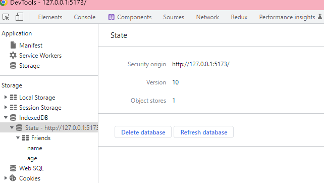
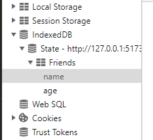
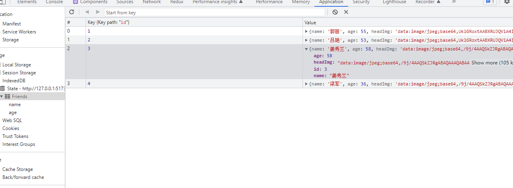
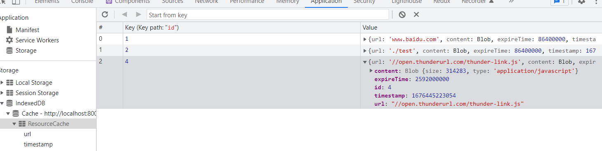

# 使用 IndexedDB 优化资源二次加载速度及状态持久化

## IndexedDB 是什么?

IndexedDB 是一个基于键值对的数据库，可以用来存储大量结构化数据。它可以用来缓存资
源，以便在离线时使用
。[mdn 介绍](https://developer.mozilla.org/zh-CN/docs/Web/API/IndexedDB_API)

## 为什么使用 IndexedDB

对比 localStorage,sessionStorage,cookie 等存储方式 IndexedDB 有以下优势:

- IndexedDB 是异步的，不会阻塞主线程
- IndexedDB 可以存储大量数据，而且可以存
  储[结构化克隆算法](https://developer.mozilla.org/zh-CN/docs/Web/API/Web_Workers_API/Structured_clone_algorithm)支
  持的任何对象
- IndexedDB 可以用来缓存资源，以便在离线时使用
- IndexedDB 可以用来存储用户的状态，以便在下次打开页面时恢复

|                  | localStorage       | sessionStorage     | cookie                  | IndexedDB                                                                                                                       |
| ---------------- | ------------------ | ------------------ | ----------------------- | ------------------------------------------------------------------------------------------------------------------------------- |
| 有效期           | 永久有效           | 关闭浏览器清除     | 非持久化,刷新页面则刷新 | 永久有效                                                                                                                        |
| 存储容量         | 一般 5MB           | 一般 5MB           | 一般 4KB                | 无上限                                                                                                                          |
| 存储类型限制     | 可 JSON 序列化的值 | 可 JSON 序列化的值 | 可 JSON 序列化的值      | 存储[结构化克隆算法](https://developer.mozilla.org/zh-CN/docs/Web/API/Web_Workers_API/Structured_clone_algorithm)支持的任何对象 |
| 存取数据任务类型 | 同步               | 同步               | 同步                    | 异步,同步                                                                                                                       |
| 同域限制         | 是                 | 是                 | 是                      | 是                                                                                                                              |

### 兼容性

基本上所有现代浏览器都支持 IndexedDB 

## IndexedDB 基本概念

### 数据库

数据库是一个逻辑容器，用于存储数据。一个数据库可以包含多个对象存储空间（object
store）。每个数据库都有一个名称，用于唯一标识它。

打开 f12 可以在 Application 中看到 IndexedDB 中的数据库, 也可以在浏览器的控制台
中输入`indexedDB`查看

- State 为数据库名称
- Security origin 为域名
- Version 为版本号(每次修改表结构需更改版本号)
- Object store 为表名



### 对象存储空间（object store）

对象存储空间是一个逻辑容器，用于存储对象。对象存储空间中的对象都有一个键，用于唯
一标识它们。对象存储空间中的对象都有一个键，用于唯一标识它们。

### 索引

索引是一个逻辑容器，用于存储对象的键。索引允许你快速访问对象，而不用遍历整个对象
存储空间。 key 为 model 中声明的主键(如:Friends: '++id, name, age',),注意不要将
文件,大字符串存储在索引中. 

### 事务

事务是一组操作的集合，这些操作要么全部成功，要么全部失败。

## IndexedDb 框架

mdn 备注:IndexedDB API 是强大的，但对于简单的情况可能看起来太复杂。如果你更喜欢
一个简单的 API，请尝试 localForage、dexie.js、PouchDB、idb、idb-keyval、JsStore
或者 lovefield 之类的库，这些库使 IndexedDB 对开发者来说更加友好。 这里我们采用
dexie.js 进行开发

## dexie.js

[dexie.js](https://dexie.org/docs/Tutorial/Getting-started)是一个轻量级的
IndexedDB 封装库，它提供了一个简单的 API 来操作 IndexedDB。dexie.js 的 API 设计
参考了 jQuery 的 API 设计，因此非常容易上手。

### 安装

yarn

```bash
yarn add dexie
```

npm

```bash
npm install dexie
```

### 创建数据库模型

在 src/models 目录下创建 State.ts 文件

```ts
import Dexie, { Table } from 'dexie';

export interface Friend {
  id?: number;
  name: string;
  age: number;
  headImg: string;
}

export class State extends Dexie {
  // friends 表类型声明
  Friends!: Table<Friend>;
  constructor() {
    super('State');
    // 若表结构改变需更改版本号
    this.version(1).stores({
      // 主键 id 自增, name,age作为索引 不要将文件,大字符串存储在索引中.如Friend.headImg
      Friends: '++id, name, age',
    });
  }
}

export const { Friends } = new State();
```

### 创建控制器

在 src/controllers 目录下创建 State.ts 文件

```ts
import { Friend, Friends } from '../models/State';

/**
 * @description 查询
 */
export async function getFriend(id: string) {
  const friend = await Friends.get(id);
  return friend;
}

/**
 * @description 查询年龄为age的所有朋友
 */
export async function getFriendsByAge(age: number) {
  const friends = await Friends.where('age').equals(age).toArray();
  return friends;
}

/**
 * @description 获取所有朋友
 */
export async function getAllFriends() {
  const friends = await Friends.toArray();
  return friends;
}

/**
 * @description 添加朋友
 */
export async function addFriend(data: Friend) {
  const id = await Friends.add(data);
  return id;
}

/**
 * @description 更新朋友
 */
export async function updateFriend(data: Friend) {
  const id = await Friends.put(data);
  return id;
}

/**
 * @description 删除朋友
 */
export async function deleteFriend(id: string) {
  return await Friends.delete(id);
}
```

## 使用

### react

```tsx
import React, { useEffect, useState } from 'react';
import mock from 'mockjs';
import './App.css';
import { Button, Table, TableProps } from 'antd';
import { Friend } from './models/State';
import { addFriend, getAllFriends } from './controllers/State';
import img1 from './img/缓存/1.jpg';
import img2 from './img/缓存/2.jpg';

const App: React.FC<AppProps> = () => {
  const [dataSource, setDataSource] = useState<Friend[]>([]);
  const columns = [
    {
      title: 'id',
      dataIndex: 'id',
    },
    {
      title: '姓名',
      dataIndex: 'name',
    },
    {
      title: '年龄',
      dataIndex: 'age',
    },
    {
      title: '头像',
      dataIndex: 'headImg',
      render: (text: string) => (
        
      ),
    },
  ];
  useEffect(() => {
    request();
  }, []);
  async function request() {
    const res = await getAllFriends();
    setDataSource(res);
  }
  const tableConfig: TableProps<Friend> = {
    columns,
    dataSource,
    rowKey: 'id',
  };
  return (
    <div>
      <Table {...tableConfig}></Table>
      <Button
        onClick={async () => {
          const headImg = await imgToBase64(Math.random() > 0.5 ? img1 : img2);
          const data = mock.mock({
            name: '@cname',
            age: '@integer(18, 60)',
            headImg,
          });
          await addFriend(data);
          await request();
        }}
      >
        添加随机朋友
      </Button>
    </div>
  );
};

interface AppProps {}
export default App;
App.displayName = 'App';

async function imgToBase64(url: string) {
  const res = await fetch(url, {});
  const blob = await res.blob();
  return await blobToBase64(blob);
}
function blobToBase64(blob: Blob): Promise<string> {
  const reader = new FileReader();
  reader.readAsDataURL(blob);
  return new Promise((resolve) => {
    reader.onloadend = () => {
      resolve(reader.result as string);
    };
  });
}
```

### vue

```vue
<script setup lang="ts">
import { addFriend, getAllFriends } from './controllers/State';
import mock from 'mockjs';
import img1 from './img/缓存/1.jpg';
import img2 from './img/缓存/2.jpg';
import { Friend } from './models/State';
import { Button, Table, TableProps } from 'ant-design-vue';
import { h, reactive } from 'vue';
import 'ant-design-vue/dist/antd.css';
const dataSource = reactive<Friend[]>([]);
const columns = [
  {
    title: 'id',
    dataIndex: 'id',
  },
  {
    title: '姓名',
    dataIndex: 'name',
  },
  {
    title: '年龄',
    dataIndex: 'age',
  },
  {
    title: '头像',
    dataIndex: 'headImg',
    customRender: ({ text, index }: { text: string; index: number }) => {
      return h('img', { src: text, width: 50, height: 50 });
    },
  },
];

request();
async function add() {
  const headImg = await imgToBase64(Math.random() > 0.5 ? img1 : img2);
  const data = mock.mock({
    name: '@cname',
    age: '@integer(18, 60)',
    headImg,
  });
  await addFriend(data);
  await request();
}
async function request() {
  const res = await getAllFriends();
  dataSource.splice(0, dataSource.length, ...res);
  return res;
}

async function imgToBase64(url: string) {
  const res = await fetch(url, {});
  const blob = await res.blob();
  return await blobToBase64(blob);
}
function blobToBase64(blob: Blob): Promise<string> {
  const reader = new FileReader();
  reader.readAsDataURL(blob);
  return new Promise((resolve) => {
    reader.onloadend = () => {
      resolve(reader.result as string);
    };
  });
}
</script>

<template>
  <div>
    <Table :data-source="dataSource" :row-key="'id'" :columns="columns" />
    <Button @click="add">添加好友</Button>
  </div>
</template>
```

效果图 

每次点击添加按钮都会向数据库中添加一条数据,并且会重新渲染，存入数据库中的值是永
久有效的。 

## 缓存工具

使用我们已经基本了解，那么我们就可以开始创建缓存工具类了，我们需要实现的功能有：

1. 缓存数据
2. 获取缓存数据
3. 清除缓存数据
4. 缓存数据过期清除

### 数据库模型

/src/models/Cache.ts

```ts
// db.ts
import Dexie, { Table } from 'dexie';

/** 资源缓存 */
export type ResourceCacheType = {
  id?: number;
  /** 资源路径 */
  url: string;
  /** 资源内容 */
  content: Blob;
  /** 资源最后修改时间 */
  timestamp: number;
  /** 过期时间 */
  expireTime?: number;
};

// 若数据结构改变应当修改版本号
class Cache extends Dexie {
  ResourceCache!: Table<ResourceCacheType>;
  constructor() {
    super('Cache');
    this.version(1).stores({
      // Primary key and indexed props 索引 不要索引文件
      ResourceCache: '++id, url,timestamp',
    });
  }
}
export const { ResourceCache } = new Cache();
```

### 控制器

/src/controllers/ResourceCache.ts

```ts
import { ResourceCache } from '../models/Cache';

export async function getCache(url: string) {
  try {
    return await ResourceCache.where('url').equals(url).first();
  } catch (error) {
    console.error(error);
    return;
  }
}

export async function setCache(data: {
  url: string;
  content: Blob;
  expireTime?: number;
}) {
  try {
    const cache = await getCache(data.url);
    if (cache?.id) {
      // 更新缓存
      return await ResourceCache.update(cache.id, {
        ...data,
        timestamp: Date.now(),
      });
    }
    return await ResourceCache.add({
      ...data,
      timestamp: Date.now(),
    });
  } catch (error) {
    console.error(error);
    return;
  }
}

// 将所有过期的缓存清除
export async function clearCache() {
  const caches = await ResourceCache.toArray();
  caches.forEach((cache) => {
    if (cache.expireTime) {
      const now = Date.now();
      const timestamp = cache.timestamp;
      if (now - timestamp > cache.expireTime) {
        ResourceCache.delete(cache.id!);
      }
    }
  });
}
```

### 工具类

/src/util/ResourceCache.ts

```ts
import { clearCache, getCache, setCache } from '../controllers/ResourceCache';

/**
 * @description 通用缓存策略
 */
export class ResourceCache {
  private url: string;
  /** 过期时间 */
  private expireTime?: number;
  /**
   * @param url 资源路径
   * @param expireTime 过期时间
   */
  constructor(url: string, expireTime?: number | string) {
    this.url = url;
    let time: number | undefined;
    if (typeof expireTime === 'string') {
      const unit = (expireTime as string).slice(-1) as keyof typeof Time;
      time = Number(Time[unit]) * Number(expireTime.slice(0, -1));
    } else {
      time = expireTime;
    }
    this.expireTime = time;
  }
  private async fetch() {
    try {
      const response = await fetch(this.url);
      const blob = await response.blob();
      // 写入缓存
      await setCache({
        url: this.url,
        content: blob,
        expireTime: this.expireTime,
      });
      return blob;
    } catch (error) {
      console.error(error);
      return;
    }
  }
  async get() {
    try {
      const cache = await getCache(this.url);
      // 未击中缓存
      if (!cache) {
        return await this.fetch();
      }
      // 设置了过期时间
      else if (this.expireTime) {
        // 过期
        if (Date.now() - cache.timestamp > this.expireTime) {
          return await this.fetch();
        }
      }
      // 击中缓存切未过期
      return cache.content;
    } catch (error) {
      console.error(error);
      return;
    }
  }
  /**
   * @description 清除缓存
   */
  static async clear() {
    try {
      await clearCache();
    } catch (error) {
      console.error(error);
      return;
    }
  }
}

/**
 * time to  ms
 */
enum Time {
  /** hour */
  h = 60 * 60 * 1000,
  /** day */
  d = 24 * 60 * 60 * 1000,
  /** week */
  w = 7 * 24 * 60 * 60 * 1000,
  /** month */
  m = 30 * 24 * 60 * 60 * 1000,
  /** year */
  y = 365 * 24 * 60 * 60 * 1000,
}
```

### 使用

#### 例使用迅雷下载 js-sdk

一般的 js-sdk 更新频率很低且向下兼容，我们可以将它缓存再 indexedDB 中，当下次再
次加载时，我们可以直接从缓存中获取，而不需要再次请求远端 js-sdk

```ts
/**
 * @description 加载远端js-sdk
 * @param url 远端js脚本地址
 * @param id 创建script标签的id
 */
export async function remoteJsToScript(
  url: string,
  id: string = 'fetch-script',
  expireTime?: string | number,
) {
  const script =
    document.getElementById(id) ?? document.createElement('script');
  script.id = id;
  const cache = new ResourceCache(url, expireTime);
  script.innerHTML = (await (await cache.get())?.text()) ?? '';
  document.body.appendChild(script);
}
```

```ts
/**
 * @description 调用迅雷下载
 */
export async function thunderDownload(
  /** 指定任务组名称，可将批量任务合并成类似BT任务的【任务组】，迅雷将在下载目录中创建同名子文件夹保存所有下载文件。【推荐填写。若不填此项，迅雷下载列表会显示所有本次创建的下载任务，可能会使用户的下载列表显得杂乱】 */
  taskGroupName: string,
  tasks: {
    url: string; // 指定下载地址【必填项】
    /** 指定文件的下载目录,相对于当前的downloadDir目录【一般不必填写，除非某些文件的下载地址的路径不符合你的需求】 */
    dir: string;
  }[],
) {
  await remoteJsToScript(
    '//open.thunderurl.com/thunder-link.js',
    'thunder',
    '1m',
  );
  const thunderLink = (window as any).thunderLink;
  thunderLink.newTask({
    taskGroupName,
    hideInfo: '1', // 是否隐藏下载任务信息
    hideYunPan: '1', // 是否隐藏云盘
    hideWin: '1', // 是否隐藏下载窗口
    downloadDir: taskGroupName.length === 1 ? '' : taskGroupName, // 指定当前任务的下载目录名称，迅雷会在用户剩余空间最大的磁盘根目录中创建这个目录。【若不填此项，会下载到用户默认下载目录】
    tasks,
  });
}
```

效果图  成功的将 js 以 blob 的形式存储在
indexedDB 中，当下次再次加载时，我们可以直接从缓存中获取。不仅是 js，我们还可以
缓存 css、图片、3D 模型、音频、视频等资源。

# 总结

本文介绍了如何使用 indexedDB 来缓存资源，当下次再次加载时，我们可以直接从缓存中
获取，而不需要再次请求远端资源，从而提升用户体验，减少请求次数，减少服务器压力，
减少带宽消耗。
