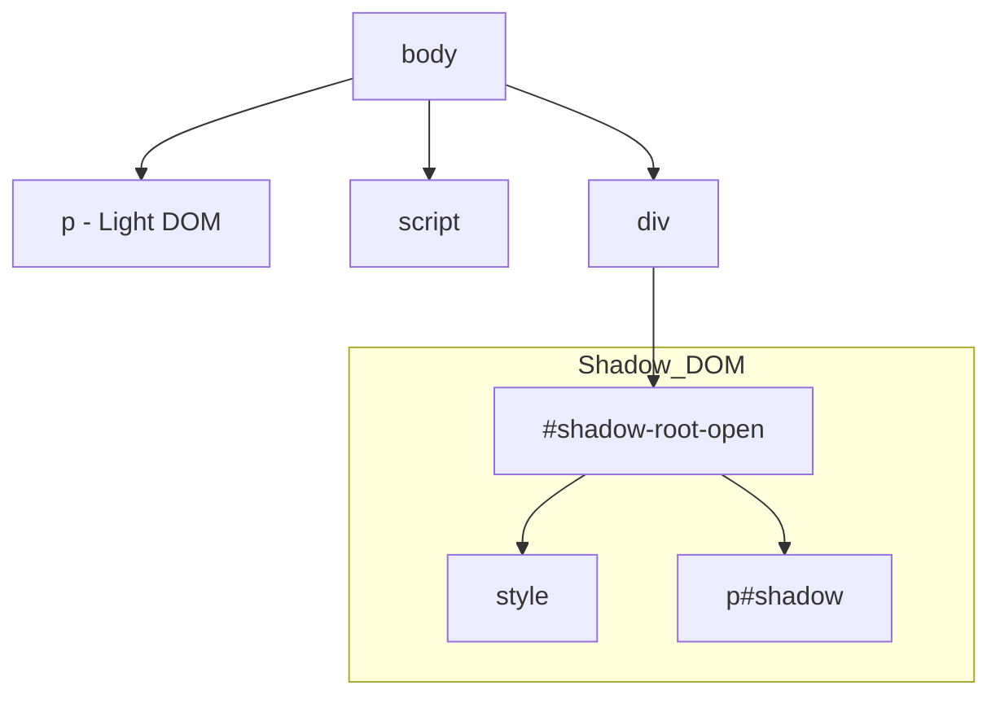
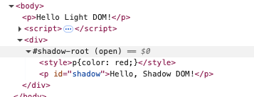
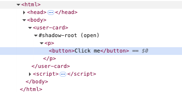
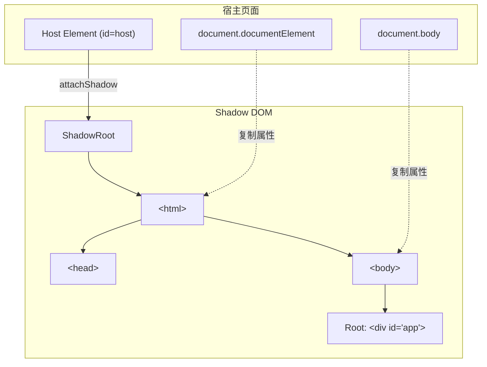
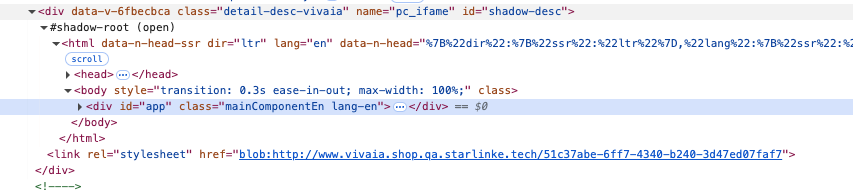
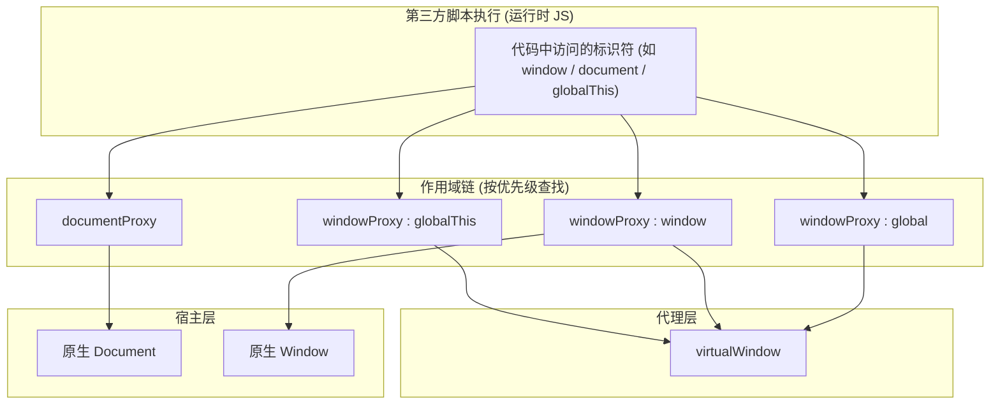
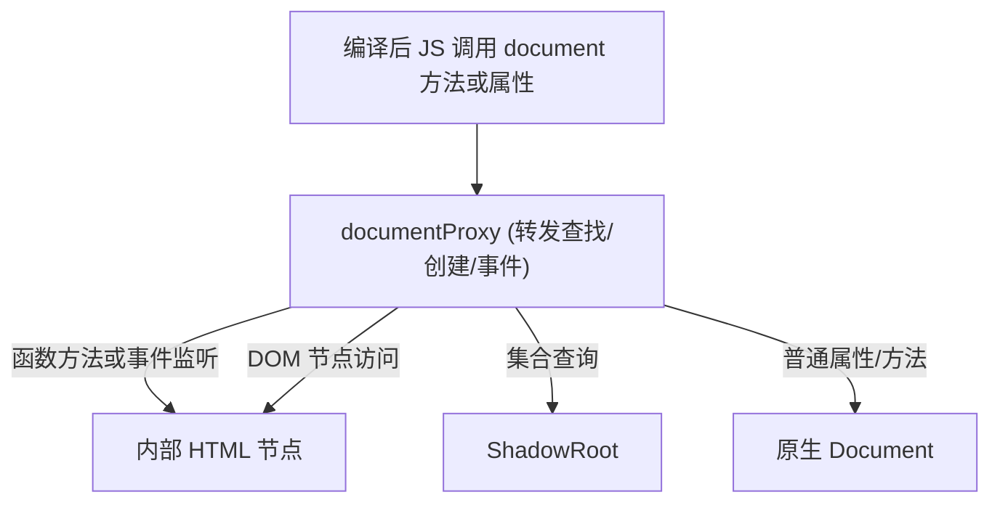
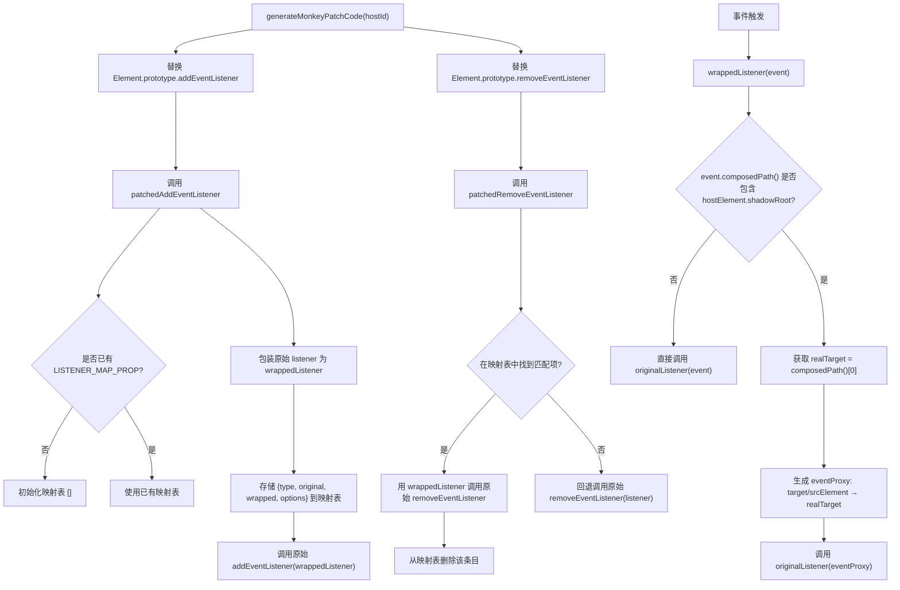

# Vue 渲染隔离：在 Shadow DOM 内挂载编译产物

## 引言

- 为什么需要Shadow DOM？
  - 样式污染问题（全局 CSS 冲突、第三方组件样式覆盖）。
  - 多应用/微前端场景下的 DOM 污染风险。
  - 性能对比iframe：Shadow DOM 更轻量，性能更好。
- Shadow DOM 的优势：样式封闭性、DOM 隔离性、事件机制。

## Web Components

Web 组件的一个关键特性是创建自定义元素：即由 Web 开发人员定义行为的 HTML 元素，扩展了浏览器中可用的元素集。

如下有个最简示例

```javascript
class MainBanner extends HTMLElement {
  constructor() {
    super();
    this.attachShadow({ mode: 'open' });
    this.shadowRoot.innerHTML = html`
          <style>
        * {
          margin: 0;
          padding: 0;
          box-sizing: border-box;
        }
        .banner {
          width: 100%;
          margin-bottom: 4.17vw;
          position: relative;
        }
        img {
          width: 100%;
          aspect-ratio: 1920/650;
          display: block;
        }
        .title {
          position: absolute;
          top: 50%;
          left: 8.33vw;
          transform: translateY(-50%);
          color: rgba(255, 255, 255, 1);
          display: flex;
          flex-direction: column;
          gap: 0.83vw;
        }
        .title h1 {
          font-family: Montserrat;
          font-weight: 700;
          font-style: Bold;
          font-size: 1.67vw;
          line-height: 2.03vw;
          letter-spacing: 0%;
        }
        .title span {
          font-family: Montserrat;
          font-weight: 500;
          font-style: Medium;
          font-size: 0.83vw;
          line-height: 1.04vw;
          letter-spacing: 0%;
        }

        @media (max-width: 1280px) and (min-width: 769px) {
          .banner {
            margin-bottom: 6.255vw;
          }
          .title {
            left: 6.26vw;
            gap: 1.245vw;
          }
          .title h1 {
            font-size: 2.505vw;
            line-height: 3.045vw;
          }
          .title span {
            font-size: 1.245vw;
            line-height: 1.56vw;
          }
        }
      </style>
      <div class="banner">
        <picture>
          <source
            srcset="
              https://cdn.shopify.com/s/files/1/0619/5265/5591/files/m_8aca2146-ea01-469f-ae20-ee08fca16049.jpg?v=1754463434
            "
            media="(max-width: 768px)"
          />
          
        </picture>
        <div class="title">
          <h1>
            Your Questions, <br class="show-m" />Answered by
            <br class="show-pc" />Wellness Experts
          </h1>
          <span
            >See what others are asking — and find advice that speaks to your
            journey.</span
          >
        </div>
      </div>
        `;
  }
}
customElements.define('main-banner', MainBanner);
```

```iframe
/demo/web-components.html
```

## Shadow DOM 基础

自定义元素的一个重要方面是封装，因为自定义元素从定义上来说是一种可重用功能：它可以被放置在任何网页中，并且期望它能够正常工作。因此，很重要的一点是，运行在页面中的代码不应该能够通过修改自定义元素的内部实现而意外地破坏它。Shadow
DOM 允许你将一个 DOM 树附加到一个元素上，并且使该树的内部对于在页面中运行的 JavaScript 和 CSS 是隐藏的。

一个 DOM 元素可以有以下两类 DOM 子树：

1. Light tree
   —— 一个常规 DOM 子树，由 HTML 子元素组成。我们在之前章节看到的所有子树都是直接可见。
2. Shadow tree —— 一个隐藏的 DOM 子树，不在 HTML 中反映，无法被察觉。

如果一个元素同时有以上两种子树，那么浏览器只渲染 shadow tree。

**见最简示例**

### 渲染





### 封装

可以看到Shadow DOM 被非常明显地和主文档分开：

1. Shadow DOM 元素对于 light DOM 中的 `querySelector` 不可见。
2. Shadow DOM 有自己的样式。外部样式规则在 shadow DOM 中不产生作用。
3. CSS变量能够从Light DOM传递到Shadow DOM。方便了样式的定制。

```html-box
<style>
body{
  --b-r: 10px;
}
p{
  color: blue;
}
p{
  background: yellow !important;
}
</style>
<body>
 <p>Hello Light DOM!</p>
</body>
<script>
const element = document.createElement('div');
const shadowRoot = element.attachShadow({ mode: 'open' });
shadowRoot.innerHTML = `
  <style>
  p{
    color: red;
    border-radius: var(--b-r,0);
    background: green;
  }
  </style>
  <p id="shadow">Hello, Shadow DOM!</p>
`;
document.body.appendChild(element);
console.log("是否能查到内部的元素",document.querySelector('#shadow'));
</script>
```

## Shadow DOM 事件

Shadow tree 背后的思想是封装组件的内部实现细节。

假设，在 `<user-card>` 组件的 shadow
DOM 内触发一个点击事件。但是主文档内部的脚本并不了解 shadow
DOM 内部，尤其是当组件来自于第三方库。

所以，为了保持细节简单，浏览器会重新定位（retarget）事件。

来看如下例子



```html-box
<user-card></user-card>

<script>
customElements.define('user-card', class extends HTMLElement {
  connectedCallback() {
    this.attachShadow({mode: 'open'});
    this.shadowRoot.innerHTML = `<p>
      <button>Click me</button>
    </p>`;
    this.shadowRoot.firstElementChild.onclick =
      e => alert("Inner target: " + e.target.tagName);
  }
});

document.onclick =
  e => alert("Outer target: " + e.target.tagName);
</script>
```

如果你点击了 button，就会出现以下信息：

1. Inner target: `BUTTON` —— 内部事件处理程序获取了正确的目标，即 shadow
   DOM 中的元素。
2. Outer target: `USER-CARD` —— 文档事件处理程序以 shadow host 作为目标。

事件重定向是一件很棒的事情，因为外部文档并不需要知道组件的内部情况。从它的角度来看，事件是发生在
`<user-card>`。

**如果事件发生在 slotted 元素上，实际存在于 light
DOM 上，则不会发生重定向。(如果学习过Vue，应该知道Vue的插槽原理，slot 元素实际存在于父组件上，所有的事件绑定等处理都是在父组件中进行的)**

例如，在下面的例子中，如果用户点击了
`<span slot="username">`，那么对于 shadow 和 light 处理程序来说，事件目标就是当前这个
`span` 元素。

```xml
<user-card id="userCard">
  #shadow-root
    <div>
      <b>Name:</b>
      <slot name="username">
        <span slot="username">John Smith</span>
      </slot>
    </div>
</user-card>
```

```html-box
<user-card id="userCard">
  <span slot="username">John Smith</span>
</user-card>

<script>
customElements.define('user-card', class extends HTMLElement {
  connectedCallback() {
    this.attachShadow({mode: 'open'});
    this.shadowRoot.innerHTML = `<div>
      <b>Name:</b> <slot name="username"></slot>
    </div>`;

    this.shadowRoot.firstElementChild.onclick =
      e => alert("Inner target: " + e.target.tagName);
  }
});

userCard.onclick = e => alert(`Outer target: ${e.target.tagName}`);
</script>

```

### event.composedPath()

**`composedPath()`** 是
[`Event`](https://developer.mozilla.org/zh-CN/docs/Web/API/Event)
接口的一个方法，当对象数组调用该侦听器时返回事件路径。如果影子根节点被创建并且[`ShadowRoot.mode`](https://developer.mozilla.org/zh-CN/docs/Web/API/ShadowRoot/mode)是关闭的，那么该路径不包括影子树中的节点。

因此，对于 `<span slot="username">` 上的点击事件，会调用
`event.composedPath()`并返回一个数组：[`span`, `slot`, `div`, `shadow-root`,
`user-card`, `body`,`html`, `document`,
`window`]。在组合之后，这正是扁平 DOM 中目标元素的父链。

> **Shadow 树详细信息仅提供给 `{mode:'open'}` 树**
>
> 如果 shadow 树是用 `{mode: 'closed'}`
> 创建的，那么组合路径就从 host 开始：`user-card` 及其更上层。
>
> 这与使用 shadow DOM 的其他方法的原理类似。closed 树内部是完全隐藏的。

### event.composed

大多数事件能成功冒泡到 shadow DOM 边界。很少有事件不能冒泡到 shadow DOM 边界。

这由 `composed` 事件对象属性控制。如果 `composed` 是
`true`，那么事件就能穿过边界。否则它仅能在 shadow DOM 内部捕获。

如果你浏览一下 [UI 事件规范](https://www.w3.org/TR/uievents)
就知道，大部分事件都是 `composed: true`：

- `blur`，`focus`，`focusin`，`focusout`，
- `click`，`dblclick`，
- `mousedown`，`mouseup` `mousemove`，`mouseout`，`mouseover`，
- `wheel`，
- `beforeinput`，`input`，`keydown`，`keyup`。

所有触摸事件（touch events）及指针事件（pointer events）都是 `composed: true`。

但也有些事件是 `composed: false` 的：

- `mouseenter`，`mouseleave`（它们根本不会冒泡），
- `load`，`unload`，`abort`，`error`，
- `select`，
- `slotchange`。

这些事件仅能在事件目标所在的同一 DOM 中的元素上捕获，

## 技术难点

接下来我们将一一解决这些技术难点

1. 如何在最小影响下，将编译产物挂载到 Shadow
   DOM 中,在不对商详入口进行大规模修改的情况下，实现渲染隔离。

```javascript
import Vue from 'vue';
import App from './App.vue';
import VueLazyLoad from 'vue-lazyload';
import 'swiper/css/swiper.css';
import './main.css';
import { getTextFunction } from './common.js';

Vue.config.productionTip = false;

Vue.prototype.$text = getTextFunction;

new Vue({
  render: (h) => h(App),
}).$mount('#app');
```

2. 如何在模版内，实现基本无感Vue，Swiper等三方事件绑定，比如点击事件，鼠标事件等。同时需要兼容异步防抖等

```javascript
const handleClick = debounce(function (index, e) {
  const targetParent = e.target.parentElement;
  const targetGrandparent = targetParent.parentElement;
  if (
    targetParent.classList.contains('front') &&
    !targetGrandparent.classList.contains('cover-back')
  ) {
    this.nextPage(index);
  } else if (
    targetParent.classList.contains('back') &&
    !targetGrandparent.classList.contains('cover')
  ) {
    this.prevPage(index);
  }
}, 100);
```

3. font-face 在Shadow DOM 中无法生效 见
   1. [chrome-bug](https://bugs.chromium.org/p/chromium/issues/detail?id=336876)
   2. [firefox-bug](https://github.com/mdn/interactive-examples/issues/887)

## 方案确定

### 挂载转发和微前端的殊途同归

无界的介绍

> 微前端已经是一个非常成熟的领域了，但开发者不管采用哪个现有方案，在适配成本、样式隔离、运行性能、页面白屏、子应用通信、子应用保活、多应用激活、vite 框架支持、应用共享等用户核心诉求都或存在问题、或无法提供支持。Web
> Components 是一个浏览器原生支持的组件封装技术，可以有效隔离元素之间的样式，iframe 可以给子应用提供一个原生隔离的运行环境，相比自行构造的沙箱 iframe 提供了独立的 window、document、history、location，可以更好的和外部解耦。无界微前端采用 webcomponent +
> iframe 的沙箱模式，在实现原生隔离的前提下比较完善的解决了上述问题。

虽然wujie的方案非常优秀，但是对于我来说，性能敏感度较高，且JS隔离并不需要完全隔离，所以最终选择了渲染隔离方案。主要原因有如下几点：

1. 无界方案需要将编译产物挂载到iframe中，而iframe的初始化耗时较长。**通过最简代码iframe初始化需要耗时14ms**

```html
<!DOCTYPE html>
<html lang="en">
  <head>
    <meta charset="UTF-8" />
    <meta name="viewport" content="width=device-width, initial-scale=1.0" />
    <title>Document</title>
  </head>

  <body>
    <iframe srcdoc="<div></div>" frameborder="0"></iframe>
    <script>
      const iframe = document.querySelector('iframe');
      const start = performance.now();
      iframe.onload = () => {
        console.log(performance.now() - start);
      };
    </script>
  </body>
</html>
```

2. 同时对于iframe方案，因为我们存在对父应用的交互以及可能存在的调用， 在iframe和主应用进行数据公用的成本非常大，所以最终采用了IIFE结合ShadowDOM 渲染隔离方案。由于，对于Light
   DOM来说，Shadow
   DOM是不可见的，所以需要对编译产物内部DOM查找的方法等处理，我们这里通过IIFE将DOM查找方法转发到Shadow
   Root 上，这样就可以在Shadow DOM 中进行DOM查找，同时不会影响到主应用。
3. IIFE 方案，只需要对编译产物进行包装，不需要对主应用进行任何修改，同时性能开销非常小，不需要创建额外的window

### 事件处理

对于事件处理，由于事件重定向的机制，对于内部的点击事件，如果为防抖节流等异步包装，拿到的事件对象，会丢失target，导致无法获取到正确的元素，所以需要将事件对象缓存起来，在事件处理函数中，通过缓存的事件对象，获取到正确的元素。所以，需要在不影响外部代码的情况下，通过对事件进行包装处理

### 字体处理

由于Shadow DOM 内无法直接使用font-face，所以在编译时，需要将产物中的font face
style 进行单独抽离，然后在主应用中进行字体注入。

## 具体实现

### 1. 环境模拟

首先，我们需要在shadow
DOM 内完全模拟一个html环境，包括body，head等，同时需要将编译产物挂载到shadow
DOM 中，同时需要将编译产物中的DOM查找方法转发到Shadow，Root 上，这样就可以在Shadow
DOM 中进行DOM查找，同时不会影响到主应用。



可以得到如下DOM 树



```javascript
export function runWrapperShadow(options) {
  const {
    hostId = 'host',
    injectJSPackages = [],
    injectCSSPackages = [],
    cssCode,
    font,
    root,
  } = options;

  // 创建 shadow DOM
  const host = document.getElementById(hostId);
  const shadowHost = host.shadowRoot ?? host?.attachShadow({ mode: 'open' });
  if (!shadowHost) throw new Error('host not found');
  // 多次渲染的时候，先清空
  shadowHost.innerHTML = '';
  const commonCSS = `*{margin:0;padding:0;box-sizing:border-box;} :host{position:relative;}`;
  const htmlShadow = document.createElement('html');
  const bodyShadow = document.createElement('body');
  // 获取html上的所有属性,然后拷贝到内部
  for (const attribute of document.documentElement.attributes) {
    htmlShadow.setAttribute(attribute.name, attribute.value);
  }
  // 获取body上的所有属性,然后拷贝到内部
  for (const attribute of document.body.attributes) {
    bodyShadow.setAttribute(attribute.name, attribute.value);
  }
  const headShadow = document.createElement('head');
  // innerHTML 在chrome有长度限制10KB
  const [linkStyleShadow, rejectUrl] = createStyleLinkByCode(
    `${commonCSS}\n${cssCode}\n${injectCSSPackages.join('\n')}`,
  );
  const [fontStyleShadow, rejectFontUrl] = createStyleLinkByCode(font || '');
  uninstallFns.push(rejectUrl, rejectFontUrl);

  headShadow.appendChild(linkStyleShadow);

  bodyShadow.innerHTML = root ?? `<div id="app"></div>`;
  [headShadow, bodyShadow].forEach((el) => htmlShadow.appendChild(el));
  shadowHost.appendChild(htmlShadow);
  host.appendChild(fontStyleShadow);
}

/**
 * 将字符串内容转换为一个临时的 Blob URL。
 * @param {string} content - 需要转换的字符串内容。
 * @param {string} [mimeType='text/css'] - Blob 的 MIME 类型。
 * @returns {string} - 生成的 Blob URL。
 */
function stringToUrl(content, mimeType = 'text/css') {
  const blob = new Blob([content], { type: mimeType });
  const blobUrl = URL.createObjectURL(blob);
  return blobUrl;
}

function createStyleLinkByCode(code) {
  const link = document.createElement('link');
  link.rel = 'stylesheet';
  const url = stringToUrl(code);
  link.href = url;
  return [
    link,
    () => {
      URL.revokeObjectURL(url);
    },
  ];
}
```

### 2. DOM转发和沙箱处理

1. **全局对象 (`window`, `global`, `globalThis`)** → 统一被代理成
   **`windowProxy`**。
2. **`document`** → 被代理成 **`documentProxy`**，所有 DOM 操作被转发到
   `ShadowRoot`。
3. **代理层**：
   - `documentProxy` 控制 DOM 查询和事件绑定范围。
   - `windowProxy` 拦截全局变量的访问与赋值。
   - `virtualWindow`
     存储沙箱脚本定义的变量，避免污染宿主。同时也为了方便在子应用卸载时，能够正确GC。细节见[内存管理](https://developer.mozilla.org/zh-CN/docs/Web/JavaScript/Guide/Memory_management#%E5%9E%83%E5%9C%BE%E5%9B%9E%E6%94%B6)
     。

     > [标记清除算法](https://developer.mozilla.org/zh-CN/docs/Web/JavaScript/Guide/Memory_management#标记清除算法)
     >
     > 这个算法将“对象不再需要”这个定义简化为“对象不可达”。
     >
     > 这个算法假定有一组叫做*根*的对象。在 JavaScript 中，根是全局对象。垃圾回收器将定期从这些根开始，找到从这些根能引用到的所有对象，然后找到从这些对象能引用到的所有对象，等等。从根开始，垃圾回收器将找到所有*可到达*的对象并收集所有不能到达的对象。
     >
     > 这个算法是对上一个算法的改进。因为对于引用计数算法，有零引用的对象实际上是不可达的，但是有引用的对象却不一定，就像在循环引用中看到的那样。
     >
     > 当前，所有现代的引擎搭载的是标记清除垃圾回收器。过去几年中，在 JavaScript 垃圾回收领域做出的改进（分代/增量/并发/并行垃圾回收）都是这个算法的实现改进，而不是垃圾回收算法本身的改进，也不是何时“对象不再需要”这个定义的简化。
     >
     > 这个方法的直接好处就是循环不再是一个问题。在上面的示例中，在函数调用返回之后，从全局对象可达的任何资源都将不再引用这两个对象。因此，垃圾回收器会认为它们不可达并回收为它们分配的内存。
     >
     > 然而，手动控制垃圾回收的能力仍不存在。有时候手动决定何时释放内存以及释放哪块内存会很方便。为了释放对象的内存，需要显式地变成不可达。在 JavaScript 中，编程式地触发垃圾回收也不可能——永不可能出现在核心语言中，尽管引擎可能在可选的标志中暴露了相关的 API。

4. **作用域链**：第三方脚本运行时使用 `[documentProxy, windowProxy, ...]`
   作为上下文。

#### 作用域链



#### DOM方法转发



```javascript
export function runWrapperShadow(options) {
  const {
    hostId = 'host',
    injectJSPackages = [],
    injectCSSPackages = [],
    cssCode,
    font,
    root,
  } = options;

  // 省略接上
  const needHandle = ['document', 'window', 'global', 'globalThis'];
  const proxyGlobalVar = removeRepeat([
    'webpackJsonp',
    ...injectJSPackages.map((item) => item.name),
  ]);
  const injectJSCode = injectJSPackages.map((item) => item.code).join('\n');

  const generateScope = (hostId, proxyGlobalVar) => {
    function isConstructable(fn) {
      if (typeof fn !== 'function') return false;
      try {
        // eslint-disable-next-line no-new
        new new Proxy(fn, { construct: () => ({}) })();
        return true;
      } catch {
        return false;
      }
    }

    const shadowRoot = document.getElementById(hostId)?.shadowRoot;
    if (!shadowRoot) return [document, window];

    const forwardFnKeys = [
      'querySelector',
      'querySelectorAll',
      'getElementsByTagName',
      'getElementsByClassName',
      'getElementsByName',
      'getElementById',
      //! 为什么要转发? 因为可能在外部去查找内部的dom,且如果不卸载,会导致内存泄漏
      'addEventListener',
      'removeEventListener',
    ];

    const forwardDOMKeys = ['body', 'head'];
    const forwardDOMCollectionKeys = [
      'forms',
      'images',
      'links',
      'scripts',
      'styleSheets',
      'embeds',
    ];
    const forwardCollectionKeyMap = {
      forms: 'form',
      images: 'img',
      links: 'a[href]',
      scripts: 'script',
      styleSheets: 'style, link[rel="stylesheet"]',
      embeds: 'embed',
    };

    const documentProxy = new Proxy(document, {
      get(target, key) {
        const originData = Reflect.get(target, key);
        if (forwardFnKeys.includes(key))
          return (...args) => shadowRoot.querySelector('html')[key](...args);
        if (forwardDOMKeys.includes(key)) return shadowRoot.querySelector(key);
        if (key === 'documentElement') return shadowRoot.querySelector('html');
        if (typeof originData === 'function') return originData.bind(target);
        if (forwardDOMCollectionKeys.includes(key))
          return shadowRoot.querySelectorAll(forwardCollectionKeyMap[key]);
        return Reflect.get(target, key, document);
      },
    });

    //! 方便GC 和防止污染外部window
    const virtualWindow = {};

    const windowProxy = new Proxy(window, {
      get(target, key) {
        if (key === 'document') return documentProxy;
        if (proxyGlobalVar.includes(key)) return virtualWindow[key];
        const originData = Reflect.get(target, key);
        if (isConstructable(originData)) return originData;
        if (typeof originData === 'function') {
          const fn = originData.bind(window);
          fn.prototype = originData.prototype;
          return fn;
        }
        return Reflect.get(target, key, window);
      },
      set(target, key, value) {
        if (proxyGlobalVar.includes(key)) {
          virtualWindow[key] = value;
          return true;
        }
        return Reflect.set(target, key, value);
      },
    });

    return {
      getVirtualWindow: () => virtualWindow,
      scope: [documentProxy, windowProxy, windowProxy, windowProxy],
    };
  };
}
```

### 3. 事件处理

通过`monkey patch` 对`addEventListener` 和 `removeEventListener`
进行代理，实现事件处理。 对于注册的事件，在触发时，判断事件是否在 Shadow
DOM 内，如果是，则代理事件，将事件源从 Shadow
DOM 内部暴露，同时保证异步可见性。解决事件重定向机制带来的问题。



```javascript
function generateMonkeyPatchCode(hostId) {
  const LISTENER_MAP_PROP = Symbol('__patchedListeners');

  const createPatchedAddEventListener = function (originalAddEventListener) {
    return function (type, listener, options) {
      const eventTarget = this;

      if (!eventTarget[LISTENER_MAP_PROP]) {
        eventTarget[LISTENER_MAP_PROP] = [];
      }

      const wrappedListener = function (event) {
        const hostElement = document.getElementById(hostId);

        if (
          !hostElement ||
          typeof event.composedPath !== 'function' ||
          !event.composedPath().includes(hostElement.shadowRoot)
        ) {
          return listener.apply(this, arguments);
        }
        const realTarget = event.composedPath()[0];
        const eventProxy = new Proxy(event, {
          get(target, key) {
            if (key === 'target' || key === 'srcElement') return realTarget;
            const value = Reflect.get(target, key);
            if (typeof value === 'function') return value.bind(target);
            return value;
          },
        });
        return listener.call(this, eventProxy);
      };

      // 存储原始监听器和包裹后的监听器的映射关系
      eventTarget[LISTENER_MAP_PROP].push({
        type: type,
        original: listener,
        wrapped: wrappedListener,
        options: options,
      });

      return originalAddEventListener.call(
        eventTarget,
        type,
        wrappedListener,
        options,
      );
    };
  };

  const createPatchedRemoveEventListener = function (
    originalRemoveEventListener,
  ) {
    return function (type, listener, options) {
      const eventTarget = this;
      const listenerMap = eventTarget[LISTENER_MAP_PROP];

      // 如果没有映射表或者映射表为空，直接调用原始方法
      if (!listenerMap || listenerMap.length === 0) {
        return originalRemoveEventListener.call(
          eventTarget,
          type,
          listener,
          options,
        );
      }

      // 统一 options 格式，方便比较 参照原生remove和add的处理方式
      const capture =
        typeof options === 'boolean' ? options : !!(options && options.capture);

      for (let i = listenerMap.length - 1; i >= 0; i--) {
        const entry = listenerMap[i];

        // 统一 entry.options 的 capture 格式
        const entryCapture =
          typeof entry.options === 'boolean'
            ? entry.options
            : !!(entry.options && entry.options.capture);

        // 检查事件类型、原始监听器和捕获阶段是否匹配
        if (
          entry.type === type &&
          entry.original === listener &&
          entryCapture === capture
        ) {
          // 找到了匹配项，使用包裹后的监听器去移除
          originalRemoveEventListener.call(
            eventTarget,
            type,
            entry.wrapped,
            options,
          );

          listenerMap.splice(i, 1);

          return;
        }
      }
      // 如果映射表中找不到，也尝试用原始监听器调用一次
      originalRemoveEventListener.call(eventTarget, type, listener, options);
    };
  };
  let uninstallFn = () => {};

  // 应用补丁
  if (
    Element.prototype.addEventListener &&
    Element.prototype.removeEventListener
  ) {
    const originalAdd = Element.prototype.addEventListener;
    const patchedAdd = createPatchedAddEventListener(originalAdd);
    Element.prototype.addEventListener = patchedAdd;
    const originalRemove = Element.prototype.removeEventListener;
    const patchedRemove = createPatchedRemoveEventListener(originalRemove);
    Element.prototype.removeEventListener = patchedRemove;
    uninstallFn = () => {
      Element.prototype.addEventListener = originalAdd;
      Element.prototype.removeEventListener = originalRemove;
    };
  }
  return uninstallFn;
}
```

### 4. 组装产物

```javascript
const finalCode = js(`
    ;(function () {
      const hostId = "${hostId}";
      const getScope = ${generateScope};
      setTimeout(() => {
        const {scope, getVirtualWindow} = getScope(hostId,[${proxyGlobalVar.reduce(
          (prev, cur) => {
            return prev + `"${cur}"` + ',';
          },
          '',
        )}]);
        const windowProxy = scope[1];
        const handleFn = function (getVirtualWindow, ${needHandle.join(',')}) {
          ${injectJSCode};
          const loadWebpack =${loadWebpackJsonp};
          loadWebpack(${JSON.stringify(
            injectJSPackages
              .filter(({ isCDN }) => !isCDN)
              .map(({ name, path }) => {
                return {
                  name,
                  path,
                };
              }),
          )});
          const {${proxyGlobalVar.join(',')}} = getVirtualWindow();
          ${jsCode};
        };
        handleFn.call(windowProxy, getVirtualWindow, ...scope);
      }, 0);
    })();
  `);

// eslint-disable-next-line no-new-func
new Function(finalCode)();
```

#### finalCode

```javascript
(function () {
  const hostId = 'shadow-desc';
  const getScope = function (hostId, proxyGlobalVar) {
    // 省略
  };
  setTimeout(() => {
    const { scope, getVirtualWindow } = getScope(hostId, [
      'webpackJsonp',
      'Vue',
      'Swiper',
    ]);
    const windowProxy = scope[1];
    const handleFn = function (
      getVirtualWindow,
      document,
      window,
      global,
      globalThis,
    ) {
      const loadWebpack = function (e) {
        // 省略
      };
      loadWebpack([{ name: 'Swiper', path: 'f9b8b56.js' }]);
      const { webpackJsonp, Vue, Swiper } = getVirtualWindow();
      // 编译后业务代码所在位置
    };
    handleFn.call(windowProxy, getVirtualWindow, ...scope);
  }, 0);
})();
```
