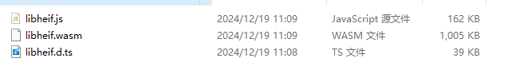

# 如何纯前端处理heic格式图片

## HEIC是什么?

**高效率图像文件格式**（英语：**H**igh **E**fficiency **I**mage **F**ile Format， **HEIF**，也称**高效图像文件格式**，是一个用于单张图像或图像序列的文件格式 ,HEIC是HEIF格式文件的扩展名.作为HEVC编码的容器，HEIF文件格式旨在提供比JPEG更好的压缩率，同时保持相同的图像质量。HEIF文件格式是苹果公司在其iOS设备上使用的格式，并且是苹果公司为iOS设备开发的HEVC编码器的容器格式。但是浏览器并不支持HEIC格式，因此需要使用一些方法来处理HEIC格式的图片。

## 如何处理HEIC格式图片
浏览器无法直接处理HEIC格式图片，因此需要使用一些方法来处理HEIC格式的图片。一种方法是使用JavaScript库来处理HEIC格式的图片，例如heic2any库。另一种方法是使用c++库libheif将HEIC格式的图片转换为JPEG,PNG等能直接在浏览器显示的格式图片。 heic2any库已经不在维护状态,同时存在许多问题,因此推荐使用libheif库。这里选择使用c++库libheif https://github.com/strukturag/libheif 将其编译为wasm.

## 编译libheif

强烈建议在类unix环境下编译

1. 修改编译脚本

仓库自带脚本位于 libheif/build-emscripten.sh.

字太多不看,直接看最后

```bash
#!/bin/bash
emcc -Wl,--whole-archive "$LIBHEIFA" -Wl,--no-whole-archive \
    -sEXPORTED_FUNCTIONS="$EXPORTED_FUNCTIONS,_free,_malloc,_memcpy" \
    -sMODULARIZE \
    -sEXPORT_NAME="libheif" \
    -sWASM_ASYNC_COMPILATION=0 \
    -sALLOW_MEMORY_GROWTH \
    -std=c++11 \
    $LIBRARY_INCLUDE_FLAGS \
    $LIBRARY_LINKER_FLAGS \
    $BUILD_FLAGS \
    $RELEASE_BUILD_FLAGS
```


2. 拉取依赖,开始编译

```bash
# 使用wsl ubuntu编译
#!/bin/bash
# Get the emsdk repo
git clone https://github.com/emscripten-core/emsdk.git

# Enter that directory
cd emsdk
# Fetch the latest version of the emsdk (not needed the first time you clone)
git pull

# Download and install the latest SDK tools.
./emsdk install latest

# Make the "latest" SDK "active" for the current user. (writes .emscripten file)
./emsdk activate latest

# Activate PATH and other environment variables in the current terminal
source ./emsdk_env.sh

# 安装工具链
sudo apt install build-essential cmake

# 编译libheif
git clone https://github.com/strukturag/libheif
cd libheif
mkdir buildjs
cd buildjs
# 使用目录下的脚本支持es6导出
USE_WASM=1 ../build-emscripten.sh ..
```
3. 使用编译产物

编译产物位于 libheif/buildjs/libheif.js


## 简易封装通用方法

```ts
import type {
  MainModule,
  heif_context,
} from '../lib/libheif';
import loadModule from '../lib/libheif';

/**
 * @description heif reader
 */
export class HEIFReader {
  /**
   * @description heif解码器
   */
  static heifModule?: MainModule | null;
  #heifDecoder?: heif_context | null;
  /**
   * 初始化heif解码器
   */
  static async initHeif() {
    HEIFReader.heifModule = await loadModule();
  }
  #blobToUnit8Array(blob: Blob) {
    return new Promise<Uint8Array>((resolve, reject) => {
      const reader = new FileReader();
      reader.onload = () => {
        resolve(
          new Uint8Array(reader.result as ArrayBuffer),
        );
      };
      reader.onerror = reject;
      reader.readAsArrayBuffer(blob);
    });
  }
  /**
   * @description heif解码以流式方式解码
   * @param imgFile Uint8Array | Blob | File
   */
  async heifDecode(imgFile: Uint8Array | Blob | File) {
    if (!HEIFReader.heifModule)
      throw new Error('heif未初始化');
    if (this.#heifDecoder) {
      HEIFReader.heifModule.heif_context_free(
        this.#heifDecoder,
      );
    }
    const start = Date.now();
    console.log(
      new Date().toLocaleTimeString(),
      '开始heif解码',
    );
    let data = imgFile as Uint8Array;
    if (imgFile instanceof Blob) {
      data = await this.#blobToUnit8Array(imgFile);
    }
    this.#heifDecoder =
      HEIFReader.heifModule.heif_context_alloc();
    if (!this.#heifDecoder) {
      throw new Error('heif解码器初始化失败');
    }
    const error =
      HEIFReader.heifModule.heif_context_read_from_memory(
        this.#heifDecoder,
        data,
      );
    if (
      error.code !==
      HEIFReader.heifModule.heif_error_code.heif_error_Ok
    ) {
      throw new Error('heif解码失败');
    }
    const ids =
      HEIFReader.heifModule.heif_js_context_get_list_of_top_level_image_IDs(
        this.#heifDecoder,
      );
    if (!ids || ids.code) {
      throw new Error('加载图片ids失败');
    }
    if (!ids.length) {
      throw new Error('heif容器内没有图片');
    }
    const result: Promise<DecodeResult | undefined>[] = [];
    const handleTo = async (id: number) => {
      const heifModule = HEIFReader.heifModule!;
      const handle =
        heifModule.heif_js_context_get_image_handle(
          this.#heifDecoder!,
          id,
        );
      if (!handle || handle.code) {
        console.log('没有获取到图片句柄', id, handle);
        return;
      }
      const width =
        heifModule.heif_image_handle_get_width(handle);
      const height =
        heifModule.heif_image_handle_get_height(handle);
      const isPrimary =
        heifModule.heif_image_handle_is_primary_image(
          handle,
        );
      // 以RGB格式解码
      const img = heifModule.heif_js_decode_image2(
        handle,
        heifModule.heif_colorspace.heif_colorspace_RGB,
        heifModule.heif_chroma.heif_chroma_interleaved_RGBA,
      );
      if (!img || img.code) {
        throw new Error('heif handle解码失败');
      }
      const imageData = new ImageData(width, height);
      for (const c of img.channels) {
        if (
          c.id ===
          heifModule.heif_channel.heif_channel_interleaved
        ) {
          // 复制值
          if (c.stride === c.width * 4) {
            imageData.data.set(c.data);
          } else {
            for (let y = 0; y < c.height; y++) {
              imageData.data.set(
                // slice
                c.data.slice(
                  y * c.stride,
                  y * c.stride + c.width * 4,
                ),
                y * c.width * 4,
              );
            }
          }
        }
      }
      heifModule.heif_image_handle_release(handle);
      const blob = await this.#imageDataToBlob(imageData);
      return {
        data: blob,
        width,
        height,
        isPrimary: Boolean(isPrimary),
      };
    };
    for (let i = 0; i < ids.length; i++) {
      result.push(handleTo(ids[i]));
    }
    const imgs = (await Promise.all(result)).filter(
      (item) => item,
    ) as DecodeResult[];
    console.log(`heif解码:耗时${Date.now() - start}ms`);
    return imgs;
  }
  /**
   * 释放解码器
   */
  free() {
    if (this.#heifDecoder) {
      if (HEIFReader.heifModule) {
        HEIFReader.heifModule.heif_context_free(
          this.#heifDecoder,
        );
      }
      this.#heifDecoder = null;
    }
  }
  /**
   * 释放导入的模块
   */
  static freeModule() {
    if (HEIFReader.heifModule) {
      HEIFReader.heifModule = null;
    }
  }
  #imageDataToBlob(imageData: ImageData): Promise<Blob> {
    // 1. 创建临时canvas
    const canvas = document.createElement('canvas');
    const ctx = canvas.getContext('2d');
    canvas.width = imageData.width;
    canvas.height = imageData.height;

    // 2. 将ImageData绘制到canvas上
    ctx!.putImageData(imageData, 0, 0);

    // 3. 将canvas转换为blob
    return new Promise((resolve) => {
      canvas.toBlob((blob) => {
        resolve(blob!);
      }, 'image/png');
    });
  }
}

export interface DecodeResult {
  /**
   * 以二进制形式存储的图片数据
   */
  data: Blob;
  width: number;
  height: number;
  /**
   * 是否是主图
   */
  isPrimary: boolean;
}
``

## 优化
可以将图片解析放到web worker中。同时使用OffscreenCanvas 来绘制图片，提升性能。