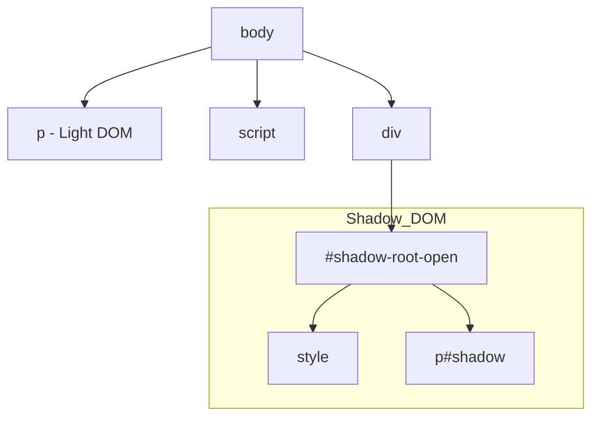
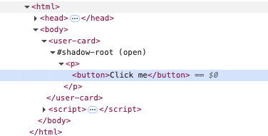
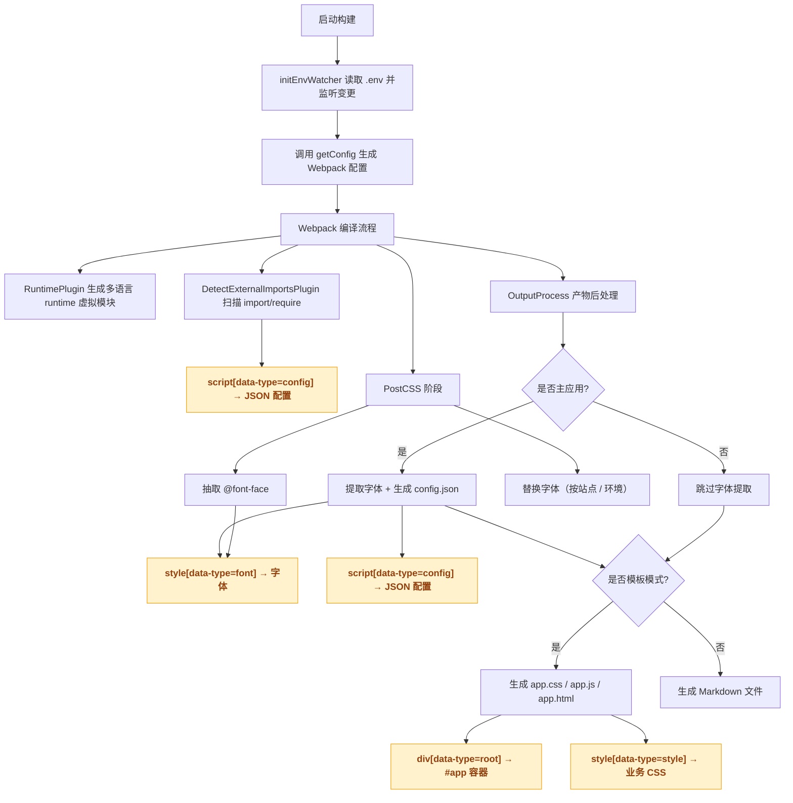
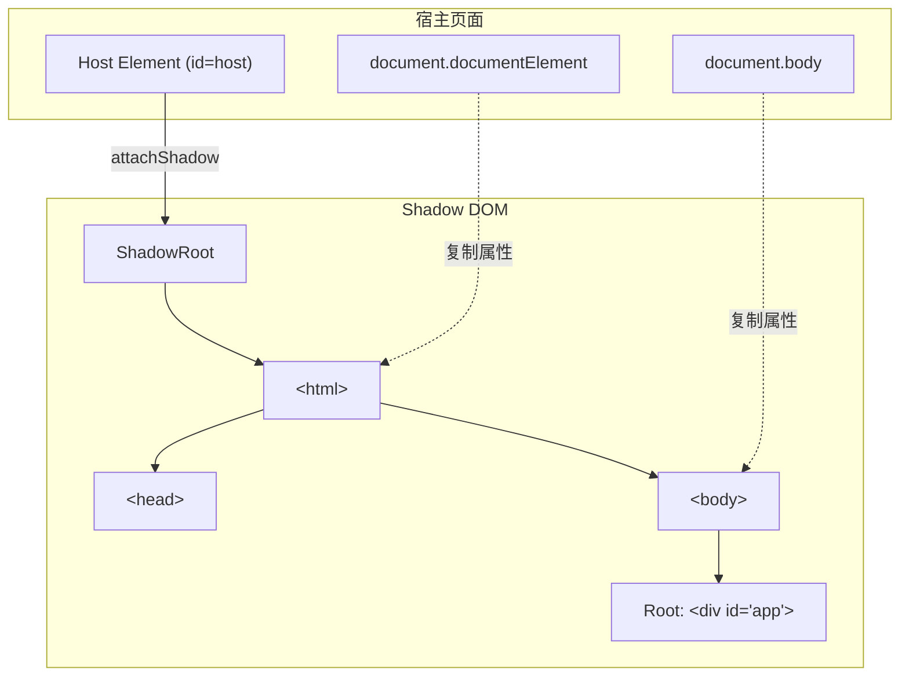
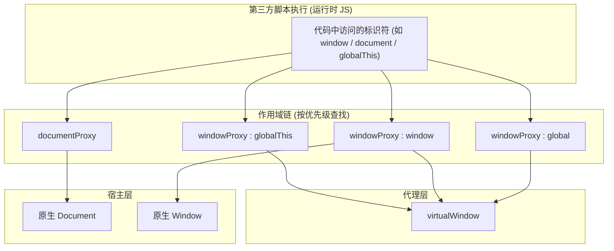
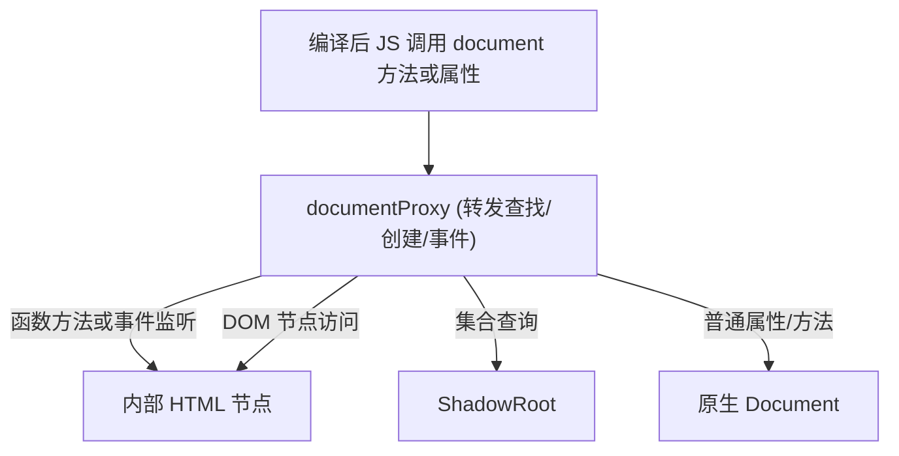
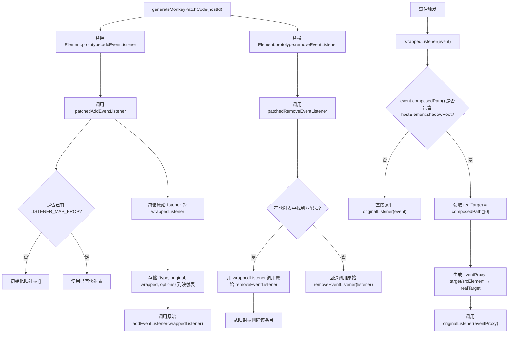
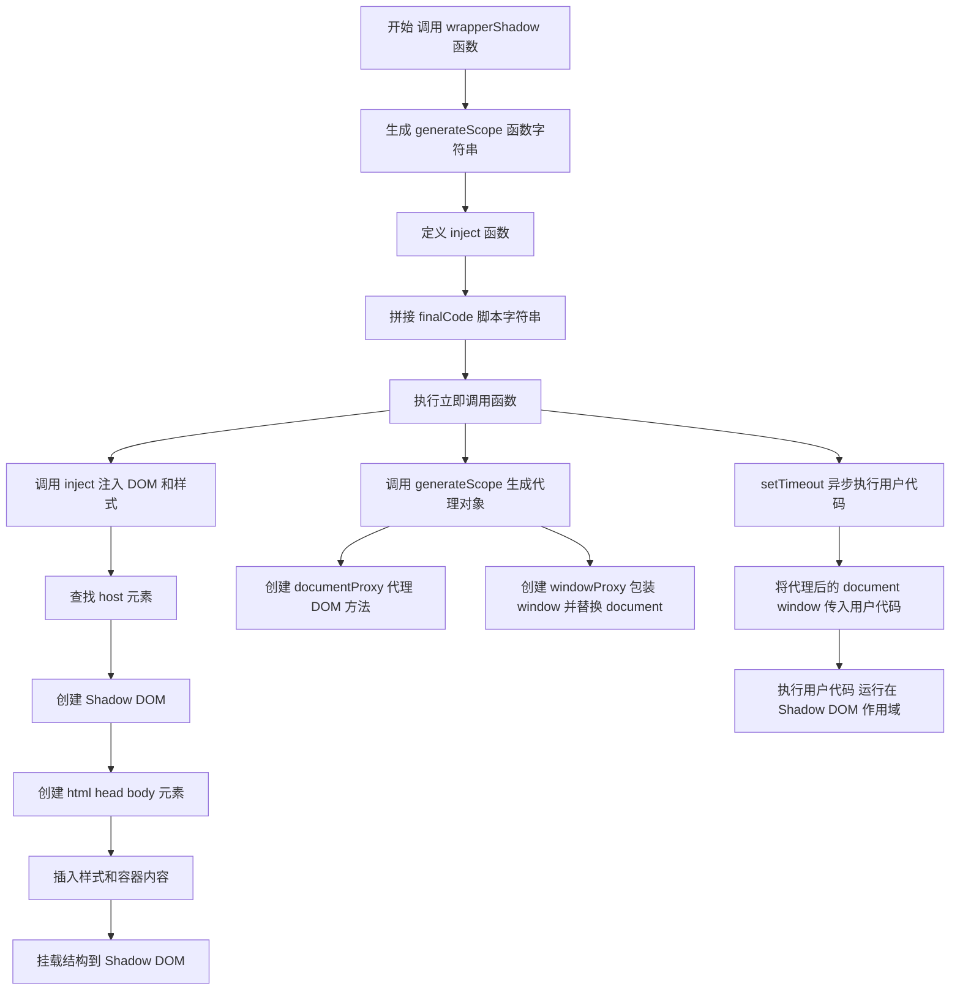
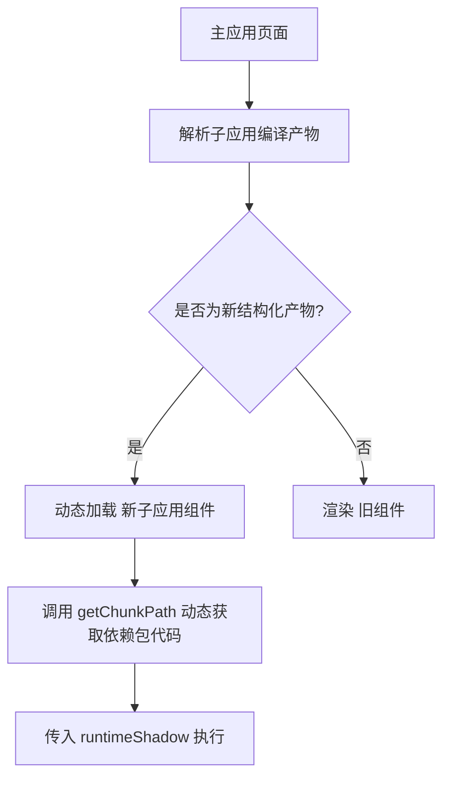

# 鱼与熊掌兼得：Shadow DOM + IIFE 代理构建轻量级、高性能的前端应用隔离沙箱

## 引言

随着业务复杂度的日益提升，我们常常需要在单一页面内集成多个独立开发、独立部署的模块或子应用。这种前端架构在带来灵活性的同时，也引发了一系列棘手的技术挑战。首当其冲的便是样式污染问题——全局 CSS 规则的冲突、第三方库样式覆盖等，极大地增加了样式管理的难度。此外，多个应用共存还带来了 DOM 结构污染的风险，不同团队的脚本可能会无意间相互干扰，导致应用行为不可预测。

传统的解决方案，如 iframe，虽然能提供彻底的 HTML、CSS 和 JavaScript 隔离环境，但其弊端也同样显著。iframe 的创建和加载成本高昂，会带来额外的性能开销和白屏时间；同时，它在用户体验、路由同步、弹窗管理和主子应用通信方面也存在诸多不便，使得无缝集成变得异常困难。为了寻求一种更轻量、更高效的隔离方案，我们将目光投向了浏览器原生支持的 Shadow
DOM 技术。作为 Web Components 标准的核心组成部分，Shadow
DOM 允许我们将一个独立的、封装的 DOM 树附加到元素上，其内部的样式和结构与主文档完全隔离，从根本上解决了 CSS 冲突和 DOM 污染问题。相比 iframe，它提供了更优的性能和更无缝的集成体验。

然而，将一个完整的、已编译的前端应用（例如 Vue 应用）直接挂载到 Shadow
DOM 内部并不简单。我们会遇到一系列新的技术难题：

如何确保子应用中的 DOM 查询、事件绑定等 API 能在 Shadow DOM 的范围内正确工作？

如何解决 @font-face 等在 Shadow DOM 中失效的特定浏览器问题？

以及，如何设计一套非侵入式的方案，在不大规模改造主子应用的前提下，实现依赖共享和编译产物的极致优化？

## 前置知识

完全理解这篇文章中讨论的技术方案和优化策略，需要具备以下前置知识：

### 一、核心概念

1.  **Web Components & Shadow DOM**:
    - **是什么**: 这是整篇文章的核心技术。需要理解 Shadow
      DOM 的概念，它如何创建一个与主文档（Light DOM）隔离的 DOM 树。
    - **为什么用**: 必须明白它解决的主要问题——**样式封装**（避免 CSS 全局污染）和
      **DOM 隔离**（内部元素不受外部脚本干扰）。
    - **基本 API**: 熟悉 `element.attachShadow({ mode: 'open' })` 的用法和意义。

2.  **微前端 (Micro frontends)**:
    - **架构思想**: 了解什么是微前端，以及它旨在解决什么问题（如技术栈异构、团队独立开发、应用解耦）。这将帮助理解文章开头提出这些需求的背景。
    - **常见挑战**: 知道微前端架构通常会面临的挑战，如样式隔离、JS 沙箱、应用间通信等。

### 二、JavaScript

1.  **Proxy 对象**:
    - **核心功能**: 这是实现本文中“沙箱”的关键。需要非常清楚 `Proxy`
      如何用于**拦截和自定义**对象的基本操作（如 `get`, `set`），文章用它来代理
      `window` 和 `document` 对象。

2.  **IIFE (立即调用函数表达式)**:
    - **作用域**: 理解 IIFE 如何创建一个独立的函数作用域，以防止变量污染全局命名空间。文章利用它来包裹子应用代码，形成一个基础的“沙箱环境”。

3.  **DOM 事件模型**:
    - **事件传播**: 熟悉事件的冒泡和捕获阶段。
    - **Shadow DOM 中的事件**: 理解文章中重点讨论的**事件重定向 (retargeting)**
      机制，以及 `event.composed` 和 `event.composedPath()` 这两个 API 的作用。

4.  **原型链与 Monkey Patching**:
    - **原型**: 了解 JavaScript 的原型继承机制。

    - **猴子补丁**: 文章中对 `Element.prototype.addEventListener`
      的修改就是典型的猴子补丁，用于劫持事件监听。

      > Monkey
      > Patching（猴子补丁）是一种编程手法，指在运行时动态修改已有代码的行为，通常是给类、模块或对象添加、修改或替换方法/属性，而不去改动它的源码。简单说，就是偷偷把“猴子补丁”贴在已有的东西上，让它表现得不一样。

5.  **内存管理与垃圾回收 (GC)**:
    - **基本原理**: 对 JavaScript 的垃圾回收机制（特别是标记清除算法）有基本认识。
    - **内存泄漏**: 知道循环引用等常见内存泄漏场景。这有助于理解文章中关于
      `virtualWindow` 和卸载函数设计的必要性，以确保子应用被销毁时能被正常回收。

### 三、构建工具与工程化

1.  **Webpack (或类似打包工具)**:
    - **核心概念**: 熟悉 Webpack 的基本工作流程，包括 `entry`, `output`,
      `loader`, `plugin`。 了解 **Code Splitting**
      (`optimization.splitChunks`) 和 **`externals`**。
    - **插件开发**: 对 Webpack 插件的生命周期有基本概念，以便理解的
      `VirtualAfterBuildPlugin` 是如何工作的。
2.  **Babel**:
    - **作用**: 知道 Babel 是如何将新的 JavaScript 语法转换为向后兼容的代码，以及它如何处理 Polyfill。
    - **配置**: 了解 `.babelrc` 或 `babel.config.js` 的基本配置，特别是
      `presets` 和 `targets` 选项，这关系到编译产物的兼容性和体积。

### 四、CSS 相关知识

1.  **CSS 作用域与样式污染**:
    - **全局性**:
      CSS 规则默认是全局生效的，以及这在大型项目或多应用集成中会带来什么问题。
    - **`@font-face` 规则**: 了解其基本用法，以便明白为什么它在 Shadow
      DOM 中会失效，是文章需要解决的一个具体技术难点。
    - **CSS 变量 (Custom Properties)**: CSS 变量可以穿透 Shadow
      DOM 的边界，是实现样式定制的一种方式。

### 五. 不同打包格式的区别 (UMD, AMD, ESM等)

在前端工程化中，JavaScript 模块化打包格式决定了代码如何在不同环境中被加载和执行。早期的 IIFE 模式虽然能隔离作用域，但无法很好地解决依赖管理问题，因此诞生了多种模块化规范，了解它们的区别有助于我们更好地进行架构选型和优化。

1. **IIFE (立即调用函数表达式)**:

- **特点**: 这不是一种正式的模块化规范，而是一种利用函数作用域来避免污染全局命名空间的模式。文章中实现的沙箱就是借鉴了此思想。
- **场景**: 适用于简单的脚本，或者作为其他模块化格式的基础包裹层。

2. **AMD (Asynchronous Module Definition - 异步模块定义)**:

- **特点**: 专为浏览器端设计，采用异步方式加载模块，推崇“依赖前置”，即先加载所有依赖再执行回调。
- **代表**: RequireJS。
- **示例**:

```javascript
define(['dependency1', 'dependency2'], function (dep1, dep2) {
  //
});
```

3. **CommonJS (CJS)**:

- **特点**: 主要用于服务器端（如 Node.js）。模块加载是同步的，通过 require 导入，通过 module.exports 或 exports 导出。
- **场景**: Node.js 环境。由于其同步特性，直接在浏览器中使用需要打包工具处理。
- **示例**:

```javascript
const moduleA = require('./moduleA');
module.exports = {
  //
};
```

4. **UMD (Universal Module Definition - 通用模块定义)**:

- **特点**: 一种兼容 AMD、CommonJS 和全局变量模式的“万金油”方案。它会先判断环境，然后使用对应的模块系统。
- **场景**: 主要用于需要跨多种环境（浏览器、Node.js）使用的库，如早期的 jQuery 插件。
- **缺点**: 代码冗余，体积相对较大。

5. **ESM (ECMAScript Modules)**:

- **特点**:
  ES6 官方推出的标准化模块系统。通过 import 和 export 语法进行模块的导入导出。其最大优势是静态结构（在编译时就能确定依赖关系），这使得
  **Tree Shaking** 成为可能。
- **场景**: 现代浏览器和新版 Node.js 都原生支持，是目前前端开发的主流选择。
- **示例**:

```javascript
import moduleA from './moduleA.js';
export default {
  //
};
```

## Web Components

Web 组件的一个关键特性是创建自定义元素：即由 Web 开发人员定义行为的 HTML 元素，扩展了浏览器中可用的元素集。Web
Components 提供了一套浏览器原生的组件化标准，其核心由三个主要技术组成：`自定义元素 (Custom Elements)`、`Shadow DOM`
和 `HTML 模板 (HTML Templates)`。自定义元素允许我们定义新的 HTML 标签，Shadow
DOM 则提供了这些元素的样式和 DOM 结构封装，而 HTML 模板则为这些自定义元素提供了可复用的结构模板。

如下有个最简示例

```javascript
class MainBanner extends HTMLElement {
  constructor() {
    super();
    this.attachShadow({ mode: 'open' });
    this.shadowRoot.innerHTML = html`
          <style>
        * {
          margin: 0;
          padding: 0;
          box-sizing: border-box;
        }
        .banner {
          width: 100%;
          margin-bottom: 4.17vw;
          position: relative;
        }
        img {
          width: 100%;
          aspect-ratio: 1920/650;
          display: block;
        }
        .title {
          position: absolute;
          top: 50%;
          left: 8.33vw;
          transform: translateY(-50%);
          color: rgba(255, 255, 255, 1);
          display: flex;
          flex-direction: column;
          gap: 0.83vw;
        }
        .title h1 {
          font-family: Montserrat;
          font-weight: 700;
          font-style: Bold;
          font-size: 1.67vw;
          line-height: 2.03vw;
          letter-spacing: 0%;
        }
        .title span {
          font-family: Montserrat;
          font-weight: 500;
          font-style: Medium;
          font-size: 0.83vw;
          line-height: 1.04vw;
          letter-spacing: 0%;
        }

        @media (max-width: 1280px) and (min-width: 769px) {
          .banner {
            margin-bottom: 6.255vw;
          }
          .title {
            left: 6.26vw;
            gap: 1.245vw;
          }
          .title h1 {
            font-size: 2.505vw;
            line-height: 3.045vw;
          }
          .title span {
            font-size: 1.245vw;
            line-height: 1.56vw;
          }
        }
      </style>
      <div class="banner">
        <picture>
          <source
            srcset="
              https://cdn.shopify.com/s/files/1/0619/5265/5591/files/m_8aca2146-ea01-469f-ae20-ee08fca16049.jpg?v=1754463434
            "
            media="(max-width: 768px)"
          />
          
        </picture>
        <div class="title">
          <h1>
            Your Questions, <br class="show-m" />Answered by
            <br class="show-pc" />Wellness Experts
          </h1>
          <span
            >See what others are asking — and find advice that speaks to your
            journey.</span
          >
        </div>
      </div>
        `;
  }
}
customElements.define('main-banner', MainBanner);
```

```iframe
/demo/web-components.html
```

## Shadow DOM 基础

自定义元素的一个重要方面是封装，因为自定义元素从定义上来说是一种可重用功能：它可以被放置在任何网页中，并且期望它能够正常工作。因此，很重要的一点是，运行在页面中的代码不应该能够通过修改自定义元素的内部实现而意外地破坏它。Shadow
DOM 允许你将一个 DOM 树附加到一个元素上，并且使该树的内部对于在页面中运行的 JavaScript 和 CSS 是隐藏的。

一个 DOM 元素可以有以下两类 DOM 子树：

1. Light tree
   —— 一个常规 DOM 子树，由 HTML 子元素组成。我们在之前章节看到的所有子树都是直接可见。
2. Shadow tree —— 一个隐藏的 DOM 子树，不在 HTML 中反映，无法被察觉。

如果一个元素同时有以上两种子树，那么浏览器只渲染 shadow
tree。值得强调的是，Shadow
DOM 的隔离粒度是“元素级别”的，它封装了单个组件的内部结构和样式，而非像 iframe 那样创建了一个全新的“文档级别”隔离环境。这是其在性能和资源消耗上优于 iframe 的根本原因。

见最简示例

### 渲染




### 封装

可以看到Shadow DOM 被非常明显地和主文档分开：

1. Shadow DOM 元素对于 light DOM 中的 `querySelector` 不可见。
2. Shadow DOM 有自己的样式。外部样式规则在 shadow DOM 中不产生作用。
3. CSS变量能够从Light DOM传递到Shadow DOM。方便了样式的定制。

```html-box
<style>
body{
  --b-r: 10px;
}
p{
  color: blue;
}
p{
  background: yellow !important;
}
</style>
<body>
 <p>Hello Light DOM!</p>
</body>
<script>
const element = document.createElement('div');
const shadowRoot = element.attachShadow({ mode: 'open' });
shadowRoot.innerHTML = `
  <style>
  p{
    color: red;
    border-radius: var(--b-r,0);
    background: green;
  }
  </style>
  <p id="shadow">Hello, Shadow DOM!</p>
`;
document.body.appendChild(element);
console.log("是否能查到内部的元素",document.querySelector('#shadow'));
</script>
```

## Shadow DOM 事件

Shadow tree 背后的思想是封装组件的内部实现细节。

假设，在 `<user-card>` 组件的 shadow
DOM 内触发一个点击事件。但是主文档内部的脚本并不了解 shadow
DOM 内部，尤其是当组件来自于第三方库。

所以，为了保持细节简单，浏览器会重新定位（retarget）事件。

来看如下例子



```html-box
<user-card></user-card>

<script>
customElements.define('user-card', class extends HTMLElement {
  connectedCallback() {
    this.attachShadow({mode: 'open'});
    this.shadowRoot.innerHTML = `<p>
      <button>Click me</button>
    </p>`;
    this.shadowRoot.firstElementChild.onclick =
      e => alert("Inner target: " + e.target.tagName);
  }
});

document.onclick =
  e => alert("Outer target: " + e.target.tagName);
</script>
```

如果你点击了 button，就会出现以下信息：

1. Inner target: `BUTTON` —— 内部事件处理程序获取了正确的目标，即 shadow
   DOM 中的元素。
2. Outer target: `USER-CARD` —— 文档事件处理程序以 shadow host 作为目标。

事件重定向是一件很棒的事情，因为外部文档并不需要知道组件的内部情况。从它的角度来看，事件是发生在
`<user-card>`。

**如果事件发生在 slotted 元素上，实际存在于 light
DOM 上，则不会发生重定向。(如果学习过Vue，应该知道Vue的插槽原理，slot 元素实际存在于父组件上，所有的事件绑定等处理都是在父组件中进行的)**

例如，在下面的例子中，如果用户点击了
`<span slot="username">`，那么对于 shadow 和 light 处理程序来说，事件目标就是当前这个
`span` 元素。

```xml
<user-card id="userCard">
  #shadow-root
    <div>
      <b>Name:</b>
      <slot name="username">
        <span slot="username">John Smith</span>
      </slot>
    </div>
</user-card>
```

```html-box
<user-card id="userCard">
  <span slot="username">John Smith</span>
</user-card>

<script>
customElements.define('user-card', class extends HTMLElement {
  connectedCallback() {
    this.attachShadow({mode: 'open'});
    this.shadowRoot.innerHTML = `<div>
      <b>Name:</b> <slot name="username"></slot>
    </div>`;

    this.shadowRoot.firstElementChild.onclick =
      e => alert("Inner target: " + e.target.tagName);
  }
});

userCard.onclick = e => alert(`Outer target: ${e.target.tagName}`);
</script>

```

### event.composedPath()

**`composedPath()`** 是
[`Event`](https://developer.mozilla.org/zh-CN/docs/Web/API/Event)
接口的一个方法，当对象数组调用该侦听器时返回事件路径。如果影子根节点被创建并且[`ShadowRoot.mode`](https://developer.mozilla.org/zh-CN/docs/Web/API/ShadowRoot/mode)是关闭的，那么该路径不包括影子树中的节点。

因此，对于 `<span slot="username">` 上的点击事件，会调用
`event.composedPath()`并返回一个数组：[`span`, `slot`, `div`, `shadow-root`,
`user-card`, `body`,`html`, `document`,
`window`]。在组合之后，这正是扁平 DOM 中目标元素的父链。

> **Shadow 树详细信息仅提供给 `{mode:'open'}` 树**
>
> 如果 shadow 树是用 `{mode: 'closed'}`
> 创建的，那么组合路径就从 host 开始：`user-card` 及其更上层。
>
> 这与使用 shadow DOM 的其他方法的原理类似。closed 树内部是完全隐藏的。

### event.composed

大多数事件能成功冒泡到 shadow DOM 边界。很少有事件不能冒泡到 shadow DOM 边界。

这由 `composed` 事件对象属性控制。如果 `composed` 是
`true`，那么事件就能穿过边界。否则它仅能在 shadow DOM 内部捕获。

如果你浏览一下 [UI 事件规范](https://www.w3.org/TR/uievents)
就知道，大部分事件都是 `composed: true`：

- `blur`，`focus`，`focusin`，`focusout`，
- `click`，`dblclick`，
- `mousedown`，`mouseup` `mousemove`，`mouseout`，`mouseover`，
- `wheel`，
- `beforeinput`，`input`，`keydown`，`keyup`。

所有触摸事件（touch events）及指针事件（pointer events）都是 `composed: true`。

但也有些事件是 `composed: false` 的：

- `mouseenter`，`mouseleave`（它们根本不会冒泡），
- `load`，`unload`，`abort`，`error`，
- `select`，
- `slotchange`。

这些事件仅能在事件目标所在的同一 DOM 中的元素上捕获，

## 技术难点

接下来我们将一一解决这些技术难点

1. 我们需要一种**非侵入式**的方案。这意味着不能要求主应用对现有业务代码进行大量改造，而子应用本身应能被“即插即用”地集成.

```javascript
import Vue from 'vue';
import App from './App.vue';
import VueLazyLoad from 'vue-lazyload';
import 'swiper/css/swiper.css';
import './main.css';
import { getTextFunction } from './common.js';

Vue.config.productionTip = false;

Vue.prototype.$text = getTextFunction;

new Vue({
  render: (h) => h(App),
}).$mount('#app');
```

1. 如何在模版内，实现基本无感Vue，Swiper等三方事件绑定，比如点击事件，鼠标事件等。同时需要兼容异步防抖等

```javascript
const handleClick = debounce(function (index, e) {
  const targetParent = e.target.parentElement;
  const targetGrandparent = targetParent.parentElement;
  if (
    targetParent.classList.contains('front') &&
    !targetGrandparent.classList.contains('cover-back')
  ) {
    this.nextPage(index);
  } else if (
    targetParent.classList.contains('back') &&
    !targetGrandparent.classList.contains('cover')
  ) {
    this.prevPage(index);
  }
}, 100);
```

1. font-face 在Shadow DOM 中无法生效 见
   1. [chrome-bug](https://bugs.chromium.org/p/chromium/issues/detail?id=336876)
   2. [firefox-bug](https://github.com/mdn/interactive-examples/issues/887)

## 方案确定

### 挂载转发和微前端的殊途同归

无界的介绍

> 微前端已经是一个非常成熟的领域了，但开发者不管采用哪个现有方案，在适配成本、样式隔离、运行性能、页面白屏、子应用通信、子应用保活、多应用激活、vite 框架支持、应用共享等用户核心诉求都或存在问题、或无法提供支持。Web
> Components 是一个浏览器原生支持的组件封装技术，可以有效隔离元素之间的样式，iframe 可以给子应用提供一个原生隔离的运行环境，相比自行构造的沙箱 iframe 提供了独立的 window、document、history、location，可以更好的和外部解耦。无界微前端采用 webcomponent +
> iframe 的沙箱模式，在实现原生隔离的前提下比较完善的解决了上述问题。

虽然wujie的方案非常优秀，但是对于我来说，性能敏感度较高，且JS隔离并不需要完全隔离，所以最终选择了渲染隔离方案。主要原因有如下几点：

1. 无界方案需要将编译产物挂载到iframe中，而iframe的初始化耗时较长。**通过最简代码iframe初始化需要耗时14ms**

```html
<!DOCTYPE html>
<html lang="en">
  <head>
    <meta charset="UTF-8" />
    <meta name="viewport" content="width=device-width, initial-scale=1.0" />
    <title>Document</title>
  </head>

  <body>
    <iframe srcdoc="<div></div>" frameborder="0"></iframe>
    <script>
      const iframe = document.querySelector('iframe');
      const start = performance.now();
      iframe.onload = () => {
        console.log(performance.now() - start);
      };
    </script>
  </body>
</html>
```

2. 同时对于iframe方案，因为我们存在对父应用的交互以及可能存在的调用， 在iframe和主应用进行数据公用的成本非常大，所以最终采用了**IIFE实现沙箱**结合ShadowDOM 渲染隔离方案。由于，对于Light
   DOM来说，Shadow
   DOM是不可见的，所以需要对编译产物内部DOM查找的方法等处理，我们这里通过IIFE将DOM查找方法转发到Shadow
   Root 上，这样就可以在Shadow DOM 中进行DOM查找，同时不会影响到主应用。
3. IIFE 方案，只需要对编译产物进行包装，不需要对主应用进行任何修改，同时性能开销非常小，不需要创建额外的window

除了 iframe 初始化耗时和数据共享复杂性，iframe 方案在实现路由同步、历史栈管理、弹窗定位（需要父子通信调整 z-index）以及 SEO 友好性方面也可能引入额外的开发和维护成本。相比之下，IIFE +
Shadow DOM 方案在满足渲染隔离需求的同时，提供了更轻量、更灵活的集成方式。

### 事件处理

对于事件处理，由于事件重定向的机制，对于内部的点击事件，如果为防抖节流等异步包装，拿到的事件对象，会丢失target，导致无法获取到正确的元素，所以需要将事件对象缓存起来，在事件处理函数中，通过缓存的事件对象，获取到正确的元素。所以，需要在不影响外部代码的情况下，通过对事件进行包装处理

### 字体处理

由于Shadow DOM 内无法直接使用font-face，所以在编译时，需要将产物中的font face
style 进行单独抽离，然后在主应用中进行字体注入。

## 编译时处理

根据上面的分析，我们可以得到由于Shadow
DOM的一些限制和基于性能优化,仍然需要在编译时做一些处理：

- 字体的扫描抽离
- 依赖的扫描抽离
- 子应用复用主应用的polyfill及依赖
- 考虑在极端情况下,例如第三方webview,是否能够直接渲染出子应用产物内容

### DOM结构

基于上述分析，设计如下DOM结构,然后在运行时再通过特征判断，进行产物拆分

- `data-type="root"` 容器节点,内部为用于挂载编译产物的容器节点
- `data-type="font"` 字体节点，内部为字体css代码抽离
- `data-type="style"` 样式节点，内部为业务样式代码
- `data-type="polyfill"`
  polyfill 节点，内部为core 等浏览器版本polyfill兼容代码,同时也支持在非主应用环境下,能正确渲染
- `data-type="entry"` 入口节点，内部为业务代码
- `data-type="config"` 配置节点，内部为业务配置 包含扫描到的依赖声明

```html
<div data-type="root">
  <div id="app"></div>
</div>
<style data-type="font">
  业务字体
</style>
<style data-type="style">
  业务CSS代码
</style>
<script
  data-type="polyfill"
  src="https://cdnjs.cloudflare.com/polyfill/v3/polyfill.min.js?version=4.8.0"
></script>
<script
  data-type="vue-polyfill"
  src="https://cdnjs.cloudflare.com/ajax/libs/vue/2.7.8/vue.runtime.min.js"
></script>
<script data-type="entry">
  业务JavaScript代码;
</script>
<script data-type="config" type="application/json">
  业务JSON配置
</script>
```

### 构建流程图



## 沙箱实现

### 1. 环境模拟

首先，我们需要在shadow
DOM 内完全模拟一个html环境，包括body，head等，同时需要将编译产物挂载到shadow
DOM 中，同时需要将编译产物中的DOM查找方法转发到Shadow，Root 上，这样就可以在Shadow
DOM 中进行DOM查找，同时不会影响到主应用。



可以得到如下DOM 树


```javascript
export function runWrapperShadow(options) {
  const {
    hostId = 'host',
    injectJSPackages = [],
    injectCSSPackages = [],
    cssCode,
    font,
    root,
  } = options;

  // 创建 shadow DOM
  const host = document.getElementById(hostId);
  const shadowHost = host.shadowRoot ?? host?.attachShadow({ mode: 'open' });
  if (!shadowHost) throw new Error('host not found');
  // 多次渲染的时候，先清空
  shadowHost.innerHTML = '';
  const commonCSS = `*{margin:0;padding:0;box-sizing:border-box;} :host{position:relative;}`;
  const htmlShadow = document.createElement('html');
  const bodyShadow = document.createElement('body');
  // 获取html上的所有属性,然后拷贝到内部
  for (const attribute of document.documentElement.attributes) {
    htmlShadow.setAttribute(attribute.name, attribute.value);
  }
  // 获取body上的所有属性,然后拷贝到内部
  for (const attribute of document.body.attributes) {
    bodyShadow.setAttribute(attribute.name, attribute.value);
  }
  const headShadow = document.createElement('head');
  // innerHTML 在chrome有长度限制10KB
  const [linkStyleShadow, rejectUrl] = createStyleLinkByCode(
    `${commonCSS}\n${cssCode}\n${injectCSSPackages.join('\n')}`,
  );
  const [fontStyleShadow, rejectFontUrl] = createStyleLinkByCode(font || '');
  uninstallFns.push(rejectUrl, rejectFontUrl);

  headShadow.appendChild(linkStyleShadow);

  bodyShadow.innerHTML = root ?? `<div id="app"></div>`;
  [headShadow, bodyShadow].forEach((el) => htmlShadow.appendChild(el));
  shadowHost.appendChild(htmlShadow);
  host.appendChild(fontStyleShadow);
}

/**
 * 将字符串内容转换为一个临时的 Blob URL。
 * @param {string} content - 需要转换的字符串内容。
 * @param {string} [mimeType='text/css'] - Blob 的 MIME 类型。
 * @returns {string} - 生成的 Blob URL。
 */
function stringToUrl(content, mimeType = 'text/css') {
  const blob = new Blob([content], { type: mimeType });
  const blobUrl = URL.createObjectURL(blob);
  return blobUrl;
}

function createStyleLinkByCode(code) {
  const link = document.createElement('link');
  link.rel = 'stylesheet';
  const url = stringToUrl(code);
  link.href = url;
  return [
    link,
    () => {
      URL.revokeObjectURL(url);
    },
  ];
}
```

### 2. DOM转发和沙箱处理

我们通过如下处理

1. **全局对象 (`window`, `global`, `globalThis`)** → 统一被代理成
   **`windowProxy`**。
2. **`document`** → 被代理成 **`documentProxy`**，所有 DOM 操作被转发到
   `ShadowRoot`。
3. **代理层**：
   - `documentProxy` 控制 DOM 查询和事件绑定范围。
   - `windowProxy` 拦截全局变量的访问与赋值。

4. **作用域链**：第三方脚本运行时使用 `[documentProxy, windowProxy, ...]`
   作为上下文。

#### 作用域链



#### DOM方法转发



```javascript
export function runWrapperShadow(options) {
  const {
    hostId = 'host',
    injectJSPackages = [],
    injectCSSPackages = [],
    cssCode,
    font,
    root,
  } = options;

  // 省略接上
  const needHandle = ['document', 'window', 'global', 'globalThis'];
  const proxyGlobalVar = removeRepeat([
    'webpackJsonp',
    ...injectJSPackages.map((item) => item.name),
  ]);
  const injectJSCode = injectJSPackages.map((item) => item.code).join('\n');

  const generateScope = (hostId, proxyGlobalVar) => {
    function isConstructable(fn) {
      if (typeof fn !== 'function') return false;
      try {
        // eslint-disable-next-line no-new
        new new Proxy(fn, { construct: () => ({}) })();
        return true;
      } catch {
        return false;
      }
    }

    const shadowRoot = document.getElementById(hostId)?.shadowRoot;
    if (!shadowRoot) return [document, window];

    const forwardFnKeys = [
      'querySelector',
      'querySelectorAll',
      'getElementsByTagName',
      'getElementsByClassName',
      'getElementsByName',
      'getElementById',
      //! 为什么要转发? 因为可能在外部去查找内部的dom,且如果不卸载,会导致内存泄漏
      'addEventListener',
      'removeEventListener',
    ];

    const forwardDOMKeys = ['body', 'head'];
    const forwardDOMCollectionKeys = [
      'forms',
      'images',
      'links',
      'scripts',
      'styleSheets',
      'embeds',
    ];
    const forwardCollectionKeyMap = {
      forms: 'form',
      images: 'img',
      links: 'a[href]',
      scripts: 'script',
      styleSheets: 'style, link[rel="stylesheet"]',
      embeds: 'embed',
    };

    const documentProxy = new Proxy(document, {
      get(target, key) {
        const originData = Reflect.get(target, key);
        if (forwardFnKeys.includes(key))
          return (...args) => shadowRoot.querySelector('html')[key](...args);
        if (forwardDOMKeys.includes(key)) return shadowRoot.querySelector(key);
        if (key === 'documentElement') return shadowRoot.querySelector('html');
        if (typeof originData === 'function') return originData.bind(target);
        if (forwardDOMCollectionKeys.includes(key))
          return shadowRoot.querySelectorAll(forwardCollectionKeyMap[key]);
        return Reflect.get(target, key, document);
      },
    });

    //! 方便GC 和防止污染外部window
    const virtualWindow = {};

    const windowProxy = new Proxy(window, {
      get(target, key) {
        if (key === 'document') return documentProxy;
        if (proxyGlobalVar.includes(key)) return virtualWindow[key];
        const originData = Reflect.get(target, key);
        if (isConstructable(originData)) return originData;
        if (typeof originData === 'function') {
          const fn = originData.bind(window);
          fn.prototype = originData.prototype;
          return fn;
        }
        return Reflect.get(target, key, window);
      },
      set(target, key, value) {
        if (proxyGlobalVar.includes(key)) {
          virtualWindow[key] = value;
          return true;
        }
        return Reflect.set(target, key, value);
      },
    });

    return {
      getVirtualWindow: () => virtualWindow,
      scope: [documentProxy, windowProxy, windowProxy, windowProxy],
    };
  };
}
```

#### documentProxy

`documentProxy`
的核心思想是受控地暴露和转发。它确保了子应用执行的所有 DOM 查询（如
`querySelector`）和操作都优先在 shadowRoot 内部进行，从而实现了 DOM 的强隔离。对于那些在
`Shadow DOM`
内部没有等效表示或不需要隔离的属性/方法，它会回退到原生 document 对象，以维持子应用的正常运行。`virtualWindow`
的设计则为子应用提供了一个“假”的全局环境，防止其直接污染外部 window 对象，从而增强了沙箱的隔离性和垃圾回收的效率。

#### proxyGlobalVar

proxyGlobalVar 的设计不仅仅是为了性能和 GC，它也是实现**细粒度环境隔离**的关键。通过明确声明哪些全局变量需要被代理到 virtualWindow，我们可以有效防止子应用意外地或恶意地修改主应用的全局对象。对于未声明的全局变量，子应用依然可以访问到主应用的真实 window 对象，但其赋值操作会被代理拦截到 virtualWindow，从而形成了一层**读多写少、写不污染**的保护机制。

### 3. 事件处理

通过`monkey patch` 对`addEventListener` 和 `removeEventListener`
进行代理，实现事件处理。 对于注册的事件，在触发时，判断事件是否在 Shadow
DOM 内，如果是，则代理事件，将事件源从 Shadow
DOM 内部暴露，同时保证异步可见性。解决事件重定向机制带来的问题。



```javascript
function generateMonkeyPatchCode(hostId) {
  const LISTENER_MAP_PROP = Symbol('__patchedListeners');

  const createPatchedAddEventListener = function (originalAddEventListener) {
    return function (type, listener, options) {
      const eventTarget = this;

      if (!eventTarget[LISTENER_MAP_PROP]) {
        eventTarget[LISTENER_MAP_PROP] = [];
      }

      const wrappedListener = function (event) {
        const hostElement = document.getElementById(hostId);

        if (
          !hostElement ||
          typeof event.composedPath !== 'function' ||
          !event.composedPath().includes(hostElement.shadowRoot)
        ) {
          return listener.apply(this, arguments);
        }
        const realTarget = event.composedPath()[0];
        const eventProxy = new Proxy(event, {
          get(target, key) {
            if (key === 'target' || key === 'srcElement') return realTarget;
            const value = Reflect.get(target, key);
            if (typeof value === 'function') return value.bind(target);
            return value;
          },
        });
        return listener.call(this, eventProxy);
      };

      // 存储原始监听器和包裹后的监听器的映射关系
      eventTarget[LISTENER_MAP_PROP].push({
        type: type,
        original: listener,
        wrapped: wrappedListener,
        options: options,
      });

      return originalAddEventListener.call(
        eventTarget,
        type,
        wrappedListener,
        options,
      );
    };
  };

  const createPatchedRemoveEventListener = function (
    originalRemoveEventListener,
  ) {
    return function (type, listener, options) {
      const eventTarget = this;
      const listenerMap = eventTarget[LISTENER_MAP_PROP];

      // 如果没有映射表或者映射表为空，直接调用原始方法
      if (!listenerMap || listenerMap.length === 0) {
        return originalRemoveEventListener.call(
          eventTarget,
          type,
          listener,
          options,
        );
      }

      // 统一 options 格式，方便比较 参照原生remove和add的处理方式
      const capture =
        typeof options === 'boolean' ? options : !!(options && options.capture);

      for (let i = listenerMap.length - 1; i >= 0; i--) {
        const entry = listenerMap[i];

        // 统一 entry.options 的 capture 格式
        const entryCapture =
          typeof entry.options === 'boolean'
            ? entry.options
            : !!(entry.options && entry.options.capture);

        // 检查事件类型、原始监听器和捕获阶段是否匹配
        if (
          entry.type === type &&
          entry.original === listener &&
          entryCapture === capture
        ) {
          // 找到了匹配项，使用包裹后的监听器去移除
          originalRemoveEventListener.call(
            eventTarget,
            type,
            entry.wrapped,
            options,
          );

          listenerMap.splice(i, 1);

          return;
        }
      }
      // 如果映射表中找不到，也尝试用原始监听器调用一次
      originalRemoveEventListener.call(eventTarget, type, listener, options);
    };
  };
  let uninstallFn = () => {};

  // 应用补丁
  if (
    Element.prototype.addEventListener &&
    Element.prototype.removeEventListener
  ) {
    const originalAdd = Element.prototype.addEventListener;
    const patchedAdd = createPatchedAddEventListener(originalAdd);
    Element.prototype.addEventListener = patchedAdd;
    const originalRemove = Element.prototype.removeEventListener;
    const patchedRemove = createPatchedRemoveEventListener(originalRemove);
    Element.prototype.removeEventListener = patchedRemove;
    uninstallFn = () => {
      Element.prototype.addEventListener = originalAdd;
      Element.prototype.removeEventListener = originalRemove;
    };
  }
  return uninstallFn;
}
```

### 4. 组装产物

```javascript
const finalCode = js(`
    ;(function () {
      const hostId = "${hostId}";
      const getScope = ${generateScope};
      setTimeout(() => {
        const {scope, getVirtualWindow} = getScope(hostId,[${proxyGlobalVar.reduce(
          (prev, cur) => {
            return prev + `"${cur}"` + ',';
          },
          '',
        )}]);
        const windowProxy = scope[1];
        const handleFn = function (getVirtualWindow, ${needHandle.join(',')}) {
          ${injectJSCode};
          const loadWebpack =${loadWebpackJsonp};
          loadWebpack(${JSON.stringify(
            injectJSPackages
              .filter(({ isCDN }) => !isCDN)
              .map(({ name, path }) => {
                return {
                  name,
                  path,
                };
              }),
          )});
          const {${proxyGlobalVar.join(',')}} = getVirtualWindow();
          ${jsCode};
        };
        handleFn.call(windowProxy, getVirtualWindow, ...scope);
      }, 0);
    })();
  `);

// eslint-disable-next-line no-new-func
new Function(finalCode)();
```

### 实际代码

```javascript
(function () {
  const hostId = 'shadow-desc';
  const getScope = function (hostId, proxyGlobalVar) {
    // 省略
  };
  setTimeout(() => {
    const { scope, getVirtualWindow } = getScope(hostId, [
      'webpackJsonp',
      'Vue',
      'Swiper',
    ]);
    const windowProxy = scope[1];
    const handleFn = function (
      getVirtualWindow,
      document,
      window,
      global,
      globalThis,
    ) {
      const loadWebpack = function (e) {
        // 省略
      };
      loadWebpack([{ name: 'Swiper', path: 'f9b8b56.js' }]);
      const { webpackJsonp, Vue, Swiper } = getVirtualWindow();
      // 编译后业务代码所在位置
    };
    handleFn.call(windowProxy, getVirtualWindow, ...scope);
  }, 0);
})();
```

### 完整流程



## 主应用部分改造

首先对于主应用进行编译分析,可以看到同时产生了多份Vue,Swiper等库的编译产物,因此需要将编译产物进行抽离或external,避免重复加载和击中CDN缓存


### 变更流程



### 依赖抽离编译优化

依赖分为两种,一种是业务依赖,一种是公共依赖,公共依赖很简单直接通过cdn引入, 业务依赖由于通过了webpack处理,因此需要通过通过额外的polyfill进行加载.

以`vue`在nuxt为例, 为了防止子应用的vue和主应用的vue冲突,因此还需要多次注入Vue,以便于进行隔离,防止子应用干扰

```javascript
const CDN = {
  vue: 'https://cdn.jsdelivr.net/npm/vue@2.7.6/dist/vue.min.js',
};

const config = {
  head: {
    scripts: [
      {
        src: CDN.vue,
      },
      {
        type: 'text/javascript',
        charset: 'utf-8',
        innerHTML: `
          window.MainVue = window.Vue;
          delete window.Vue;
        `,
      },
      {
        src: CDN.vue,
      },
    ],
  },
  build: {
    extend(config, context) {
      config.externals = {
        ...config.externals,
        vue: 'MainVue',
      };
    },
  },
};
```

业务依赖的处理更加的复杂,例如`Swiper`
在`nuxt2`中,因为不是所有页面都会使用到swiper,同时不能在对主应用进行大规模改造的情况下满足需求,因此需要通过虚拟模块在编译后动态函数注入chunk的路径。主要处理以下两种格式的库代码

1. UMD格式

```javascript
!(function (t, e) {
  'object' == typeof exports && 'undefined' != typeof module
    ? (module.exports = e())
    : 'function' == typeof define && define.amd
      ? define(e)
      : ((t = 'undefined' != typeof globalThis ? globalThis : t || self).Vue =
          e());
})(this, function () {
  // 库代码
});
```

1. 经过Webpack处理后的代码

```javascript
(window.webpackJsonp = window.webpackJsonp || []).push([
  [84],
  [
    function (t, e, n) {
      // 库代码
    },
  ],
]);
```

```javascript
function extendConfig(config, context) {
  const SPLIT_CHUNKS = Object.freeze({
    swiper: {
      name: 'swiper.min',
      test: /[\\/]swiper[\\/]js[\\/]swiper\.min\.js$/,
      origin: 'swiper/js/swiper.min.js',
      type: '.js',
    },
    swiperCss: {
      name: 'swiperCss.min',
      origin: 'swiper/css/swiper.min.css',
      type: '.css',
      test: /[\\/]swiper[\\/]css[\\/]swiper\.min\.css$/,
    },
  });
  // 以包为单位进行chunk拆分
  config.optimization.splitChunks.cacheGroups = {
    ...config.optimization.splitChunks.cacheGroups,
    ...Object.fromEntries(
      Object.entries(SPLIT_CHUNKS)
        .filter(([_, { cdn }]) => !cdn)
        .map(([key, { name, test }]) => {
          return [
            key,
            {
              test,
              name,
              chunks: 'all',
              priority: 20,
              enforce: true,
            },
          ];
        }),
    ),
  };

  // 路径别名
  config.resolve.alias = {
    ...config.resolve.alias,
    swiper$: SPLIT_CHUNKS.swiper.origin,
    'swiper/css/swiper.min.css': SPLIT_CHUNKS.swiperCss.origin,
    'swiper/css/swiper.css': SPLIT_CHUNKS.swiperCss.origin,
    // 虚拟模块
    '~chunk': virtualPath,
  };

  // 虚拟模块注入
  config.plugins.push(
    new VirtualAfterBuildPlugin({
      chunks: Object.values(SPLIT_CHUNKS),
    }),
  );
}
```

**VirtualAfterBuildPlugin**

这个插件的主要工作是在运行时动态注入虚拟模块,然后在客户端获取到编译后chunk路径,然后动态加载chunk

有如下类型声明

```typescript
declare module '~chunk' {
  export function getChunkPath(): Record<
    string,
    {
      path?: string;
      cdn?: string;
    }
  >;
}
```

```javascript
const VirtualModule = require('webpack-virtual-modules');
const path = require('path');
const virtualPath = path.resolve(process.cwd(), './src/virtual-module');
const { RawSource } = require('webpack-sources');

const isProd = process.env.NODE_ENV === 'production';
const CHUNK_PATH_PLACEHOLDER = '__WEBPACK_CHUNK_PATH_PLACEHOLDER__';
const js = notDo;
class VirtualAfterBuildPlugin {
  name = 'VirtualAfterBuildPlugin';
  opt = {};
  constructor(opt = {}) {
    this.virtualModule = new VirtualModule({});
    this.opt = opt;
  }

  getLocalChunkPath(mergeLocalFn) {
    const chunks = mergeLocalFn
      ? mergeLocalFn(this.opt.chunks)
      : this.opt.chunks;
    return chunks.reduce((prev, cur, index, arr) => {
      const { origin, name, type = '.js', buildPath, cdn } = cur;
      const localPath = isProd ? `"${buildPath}"` : `"${name}${type}"`;
      let str =
        prev +
        `"${origin}":{"name":"${name}","path": ${localPath},"cdn":"${cdn ?? ''}"},`;
      if (index === arr.length - 1) {
        str += '}';
      }
      return str;
    }, `{`);
  }

  generateRuntimeJS() {
    const localChunkPath = isProd
      ? CHUNK_PATH_PLACEHOLDER
      : this.getLocalChunkPath();
    return js`
      export const getChunkPath = () => {
        return ${localChunkPath};
      };
    `;
  }

  /**
   * @param {import('webpack').Compiler} compiler
   */
  apply(compiler) {
    const { chunks: optChunks = [] } = this.opt;
    this.virtualModule.apply(compiler);

    const chunkPath = {};
    compiler.hooks.beforeCompile.tap(this.name, () => {
      this.virtualModule.writeModule(virtualPath, this.generateRuntimeJS());
    });
    compiler.hooks.emit.tapAsync(this.name, (compilation, callback) => {
      compilation.chunks.forEach((chunk) => {
        const curChunk = optChunks.find((v) => v.name === chunk.name);
        if (curChunk) {
          chunk.files.forEach((file) => {
            if (file.endsWith(curChunk.type)) {
              chunkPath[curChunk.origin] = file;
            }
          });
        }
      });

      const chunkStr = `
       {
      return ${this.getLocalChunkPath((c) => {
        return c.map((v) => {
          return {
            ...v,
            buildPath: chunkPath[v.origin],
          };
        });
      })}
     }
    `;
      for (const filename in compilation.assets) {
        // 只处理 JS 文件
        if (filename.endsWith('.js')) {
          const asset = compilation.assets[filename];
          const originalSource = asset.source();

          // 如果文件内容包含我们的占位符 用 webpack-sources 的 RawSource 更新资源
          if (originalSource.includes(CHUNK_PATH_PLACEHOLDER)) {
            const newSource = originalSource.replace(
              CHUNK_PATH_PLACEHOLDER,
              chunkStr,
            );
            compilation.assets[filename] = new RawSource(newSource);
          }
        }
      }
      callback();
    });
  }
}

module.exports.VirtualAfterBuildPlugin = VirtualAfterBuildPlugin;
module.exports.virtualPath = virtualPath;

function notDo(strings, ...values) {
  return String.raw({ raw: strings }, ...values);
}
```

### 入口改造

在主应用加载子应用时，需要将子应用的入口进行改造，需要在兼容老代码的同时，尽可能的不影响性能和使用新功能

```vue
<!-- prev -->
<OnlineDescription ref="DetailPC" :goods_desc="goods_desc" name="pc_iframe" />
<!-- after -->
<template v-if="onlineDescComponent">
  <component
    :is="onlineDescComponent"
    ref="DetailPC"
    v-bind="goodDescProps"
  ></component>
</template>
```

```javascript
function handleDesc() {
  if (process.client) {
    const code = this.goods_desc;
    const regGroup = [
      /<div\s+data-type="root"[^>]*>([\s\S]*?)<\/div>/,
      /<style\s+data-type="font"[^>]*>([\s\S]*?)<\/style>/,
      /<style\s+data-type="style"[^>]*>([\s\S]*?)<\/style>/,
      /<script\s+data-type="entry"[^>]*>([\s\S]*?)<\/script>/,
      /<script\s+data-type="config"[^>]*>([\s\S]*?)<\/script>/,
    ];
    const results = [];
    for (let i = 0; i < regGroup.length; i++) {
      const result = code.match(regGroup[i]);
      if (result) {
        results.push(result[1].trim());
      } else {
        break;
      }
    }
    // 未匹配特征，使用旧的组件
    if (results.length === 0) {
      this.onlineDescComponent = OnlineDescription.name;
      return;
    }
    const [root, font, style, entry, configStr] = results;
    this.detailDesc = {
      root,
      font,
      style,
      entry,
      configStr,
    };
    this.onlineDescComponent = ShadowDesc.name;
  }
}
```

**为什么不使用DOM parser？**

> DOM parser 和 正则的性能差异

使用如下代码进行测试

```javascript
function check(code) {
  const regGroup = [
    /<div\s+data-type="root"[^>]*>([\s\S]*?)<\/div>/,
    /<style\s+data-type="font"[^>]*>([\s\S]*?)<\/style>/,
    /<style\s+data-type="style"[^>]*>([\s\S]*?)<\/style>/,
    /<script\s+data-type="entry"[^>]*>([\s\S]*?)<\/script>/,
    /<script\s+data-type="config"[^>]*>([\s\S]*?)<\/script>/,
  ];
  const results = [];
  for (let i = 0; i < regGroup.length; i++) {
    const result = code.match(regGroup[i]);
    if (result) {
      results.push(result[1].trim());
    }
  }
  return results;
}
```

```javascript
function check(code) {
  const parser = new DOMParser();
  const doc = parser.parseFromString(code, 'text/html');
  return [
    doc.querySelector('div[data-type="root"]')?.innerHTML,
    doc.querySelector('style[data-type="font"]')?.innerHTML,
    doc.querySelector('style[data-type="style"]')?.innerHTML,
    doc.querySelector('script[data-type="entry"]')?.innerHTML,
    doc.querySelector('script[data-type="config"]')?.innerHTML,
  ];
}
```

测试代码

```javascript
function(fn,key,time = 10){
  const start = performance.now();
  let result = fn();
  for(let i = 0; i < time-1; i++){
    fn();
  }
  const end = performance.now();
  console.log(`执行${key}共${time}次耗时：${end - start}ms`,result);
}
```

使用如下格式代码测试

```html
<div data-type="root">
  <div id="app">&nbsp;</div>
</div>
<script data-type="entry">
  import { createApp } from 'vue';
</script>
<style data-type="font">
  * {
  }
</style>
<style data-type="style">
  * {
  }
</style>
<script data-type="config" type="application/json">
  { "imports": ["vue", "swiper"] }
</script>
```

测试结果

```
执行最小例，正则共5000次耗时：4.800000000745058ms
执行最小例，DOM parser共5000次耗时：109.60000000149012ms

执行55KB，正则共5000次耗时：53ms
执行55KB，DOM parser共5000次耗时：1297ms
```

尽管 DOM
Parser 在处理不规范 HTML 时具有更好的健壮性，但对于我们这种**已知结构化且严格规范的编译产物**，正则匹配的性能优势是压倒性的。在需要高性能解析，且产物结构可控的场景下，正则方案无疑是更优的选择，能够显著减少页面加载和渲染的阻塞时间。

## 额外性能优化

### 子应用模版编译分析

通过只包含Hello World模版我们可以发现在的情况下，编译产物的大小为 144KB。


所以我们可以做如下切分

- 首先可以将Vue进行external，这样Vue的代码就不会打包到子应用中，而是通过主应用引入，这样可以将子应用的体积减小到 88KB
- 去除未使用的依赖LazyLoad，这样可以将子应用的体积减小到 55KB

- 去除本级的Babel， 改为使用主站的babel

```
ios: "15",
safari: "15",
chrome: "88",
```

- 去除引入的swiper.css 改为父级注入，这样可以将子应用的体积减小到 23KB

```javascript
// before
module.exports = {
  presets: ['@vue/cli-plugin-babel/preset'],
};
// after
module.exports = {
  presets: [
    [
      '@babel/preset-env',
      {
        useBuiltIns: false,
        corejs: false,
        debug: false,
        targets: {
          ios: '15',
          safari: '15',
          chrome: '88',
        },
      },
    ],
  ],
};
```

- 去除冗余的polyfill，在非主站中采用cf
  cdn，在主应用中直接继承，同时清除删除package中的`browserslist`。这样可以将子应用的体积减小到 16KB


### 沙箱性能优化

#### 垃圾回收

在单页应用（SPA）中，内存泄漏是一个长期存在的问题。所以如果子应用频繁加载和卸载，而其占用的内存不能被及时回收，则会导致主应用长期运行下内存不断上涨，最终影响用户体验甚至导致页面崩溃。因此，一套有效的垃圾回收策略对于沙箱的稳定性至关重要。

---

首先回顾下基础知识**内存管理与垃圾回收**

[引用计数垃圾回收](https://developer.mozilla.org/zh-CN/docs/Web/JavaScript/Guide/Memory_management#%E5%BC%95%E7%94%A8%E8%AE%A1%E6%95%B0%E5%9E%83%E5%9C%BE%E5%9B%9E%E6%94%B6)

> 备注：现代 JavaScript 引擎不再使用引用计数进行垃圾回收。

这是最初级的垃圾回收算法。此算法把确定对象是否仍然需要这个问题简化为确定对象是否仍有其他引用它的对象。如果没有指向该对象的引用，那么该对象称作“垃圾”或者可回收的。

```javascript
let x = {
  a: {
    b: 2,
  },
};
// 创建了两个对象。一个作为另一个的属性被引用。
// 另一个被赋值给变量‘x’。
// 很显然，没有可以被垃圾回收的对象。

let y = x;
// 变量‘y’是第二个拥有对象引用的变量。

x = 1;
// 现在，起初在‘x’中的对象有唯一的引用，就是变量‘y’。

let z = y.a;
// 引用对象的‘a’属性。
// 现在，这个对象有两个引用，一个作为属性，
// 另一个作为变量‘z’。

y = 'mozilla';
// 起初在‘x’中的对象现在是零引用了。它可以被垃圾回收了。
// 但是，它的属性‘a’仍被变量‘z’引用，所以这个对象还不能回收。

z = null;
// 起初在 x 中的对象的属性‘a’是零引用了。这个对象可以被垃圾回收了。
```

循环引用是一个限制。在下面的例子中，创建了两个对象，一个对象的属性引用另一个对象，形成了一个循环。在函数调用结束之后，它们离开了函数作用域。在那个点，它们不再被需要了，为它们分配的内存应该被回收。然而，引用计数算法不会认为它们可以被回收，因为每个对象至少还有一个指向自己的引用，这样的结果就是它们两个都不会被标记为可以被垃圾回收。循环引用是内存泄露的常见原因。

```javascript
function f() {
  const x = {};
  const y = {};
  x.a = y; // x 引用 y
  y.a = x; // y 引用 x

  return 'azerty';
}

f();
```

[标记清除算法](https://developer.mozilla.org/zh-CN/docs/Web/JavaScript/Guide/Memory_management#标记清除算法)

这个算法将“对象不再需要”这个定义简化为“对象不可达”。

这个算法假定有一组叫做根的对象。在 JavaScript 中，根是全局对象。垃圾回收器将定期从这些根开始，找到从这些根能引用到的所有对象，然后找到从这些对象能引用到的所有对象，等等。从根开始，垃圾回收器将找到所有可到达的对象并收集所有不能到达的对象。

基于**GC和隔离**此方面的考虑，在runtime中，我们采用如下策略,在函数内部声明虚拟window，在子应用卸载后，能够正确GC。细节见[内存管理](https://developer.mozilla.org/zh-CN/docs/Web/JavaScript/Guide/Memory_management#%E5%9E%83%E5%9C%BE%E5%9B%9E%E6%94%B6)

```javascript
export function runWrapperShadow(options) {
  const generateScope = (hostId, proxyGlobalVar) => {
    //! 方便GC 和防止污染外部window
    const virtualWindow = {};

    const windowProxy = new Proxy(window, {
      get(target, key) {
        if (proxyGlobalVar.includes(key)) return virtualWindow[key];
        if (typeof originData === 'function') {
          const fn = originData.bind(window);
          fn.prototype = originData.prototype;
          return fn;
        }
        return Reflect.get(target, key, window);
      },
      set(target, key, value) {
        if (proxyGlobalVar.includes(key)) {
          virtualWindow[key] = value;
          return true;
        }
        return Reflect.set(target, key, value);
      },
    });

    return {
      getVirtualWindow: () => virtualWindow,
      scope: [documentProxy, windowProxy, windowProxy, windowProxy],
    };
  };
}
```

同时在spa时候，需要在切换页面的时候，能够正确回收掉子应用的patch和blob

```javascript
export function runWrapperShadow(options) {
  const uninstallFns = [];

  const [linkStyleShadow, rejectUrl] = createStyleLinkByCode(
    `${commonCSS}\n${cssCode}\n${injectCSSPackages.join('\n')}`,
  );
  const [fontStyleShadow, rejectFontUrl] = createStyleLinkByCode(font || '');
  uninstallFns.push(rejectUrl, rejectFontUrl);
  function generateMonkeyPatchCode(hostId) {
    let uninstallFn = () => {};
    // 应用补丁
    if (
      Element.prototype.addEventListener &&
      Element.prototype.removeEventListener
    ) {
      const originalAdd = Element.prototype.addEventListener;
      const patchedAdd = createPatchedAddEventListener(originalAdd);
      Element.prototype.addEventListener = patchedAdd;
      const originalRemove = Element.prototype.removeEventListener;
      const patchedRemove = createPatchedRemoveEventListener(originalRemove);
      Element.prototype.removeEventListener = patchedRemove;
      uninstallFn = () => {
        Element.prototype.addEventListener = originalAdd;
        Element.prototype.removeEventListener = originalRemove;
      };
    }
    return uninstallFn;
  }
  return () => uninstallFns.forEach((fn) => fn());
}
```

#### runtime 性能

应用基于IIFE和Proxy,并未引入额外的runtime，因此和直接渲染对比，基本没有性能损耗


