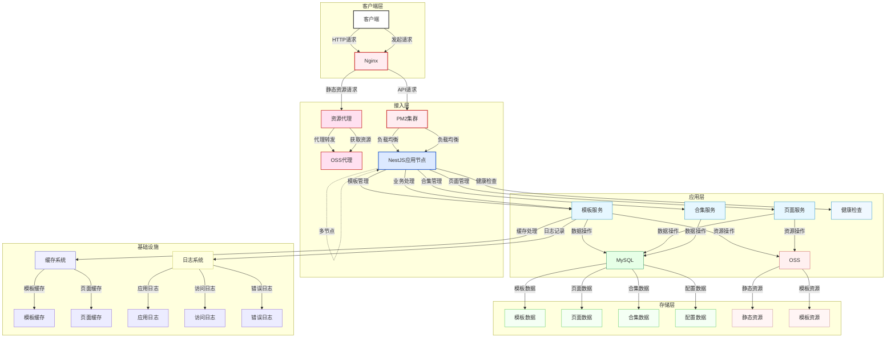

# 前端如何学习 nest

## 前言

```mermaid
graph TB

    %% 客户端层
    subgraph 客户端层
        Client[客户端] --> |HTTP请求| Nginx
    end

    %% 接入层
    subgraph 接入层
        Nginx --> |静态资源请求| ResourceProxy[资源代理]
        Nginx --> |API请求| PM2Cluster[PM2集群]

        ResourceProxy --> |代理转发| OSSProxy[OSS代理]
        PM2Cluster --> |负载均衡| NestJSApp[NestJS应用节点]
    end

    %% 应用层
    subgraph 应用层
        NestJSApp --> |模板管理| TemplateService[模板服务]
        NestJSApp --> |页面管理| PageService[页面服务]
        NestJSApp --> |合集管理| CollectionService[合集服务]
        NestJSApp --> |健康检查| HealthService[健康检查]

        TemplateService --> |数据操作| MySQL
        PageService --> |数据操作| MySQL
        CollectionService --> |数据操作| MySQL

        TemplateService --> |资源操作| OSS
        PageService --> |资源操作| OSS
    end

    %% 存储层
    subgraph 存储层
        MySQL --> |模板数据| TemplateDB[模板数据]
        MySQL --> |页面数据| PageDB[页面数据]
        MySQL --> |合集数据| CollectionDB[合集数据]
        MySQL --> |配置数据| ConfigDB[配置数据]

        OSS --> |静态资源| StaticResource[静态资源]
        OSS --> |模板资源| TemplateResource[模板资源]
    end

    %% 基础设施
    subgraph 基础设施
        Cache[缓存系统] --> |模板缓存| TemplateCache[模板缓存]
        Cache --> |页面缓存| PageCache[页面缓存]

        Log[日志系统] --> |应用日志| AppLog[应用日志]
        Log --> |访问日志| AccessLog[访问日志]
        Log --> |错误日志| ErrorLog[错误日志]
    end

    %% 请求流程（强调）
    Client --> |发起请求| Nginx
    ResourceProxy --> |获取资源| OSSProxy
    PM2Cluster --> |负载均衡| NestJSApp
    NestJSApp --> |业务处理| TemplateService
    TemplateService --> |缓存处理| Cache
    TemplateService --> |日志记录| Log

    %% 样式
    style Client fill:#fefefe,stroke:#333,stroke-width:2px
    style Nginx fill:#ffecf0,stroke:#c33,stroke-width:2px
    style PM2Cluster fill:#ffecf0,stroke:#c33,stroke-width:2px
    style ResourceProxy fill:#ffe0f0,stroke:#c33,stroke-width:1.5px
    style OSSProxy fill:#ffe0f0,stroke:#c33,stroke-width:1.5px

    style NestJSApp fill:#dce9ff,stroke:#3366cc,stroke-width:2px
    style TemplateService fill:#e6f7ff,stroke:#3399cc
    style PageService fill:#e6f7ff,stroke:#3399cc
    style CollectionService fill:#e6f7ff,stroke:#3399cc
    style HealthService fill:#f0f8ff,stroke:#3399cc

    style MySQL fill:#e6ffe6,stroke:#339966
    style TemplateDB fill:#f4fff4,stroke:#66cc66
    style PageDB fill:#f4fff4,stroke:#66cc66
    style CollectionDB fill:#f4fff4,stroke:#66cc66
    style ConfigDB fill:#f4fff4,stroke:#66cc66

    style OSS fill:#fff0f0,stroke:#cc6666
    style StaticResource fill:#fff5f5,stroke:#cc9999
    style TemplateResource fill:#fff5f5,stroke:#cc9999

    style Cache fill:#f0f0ff,stroke:#6666cc
    style Log fill:#ffffe0,stroke:#cccc66

    %% 多节点提示
    NestJSApp -.-> |多节点| NestJSApp

```
