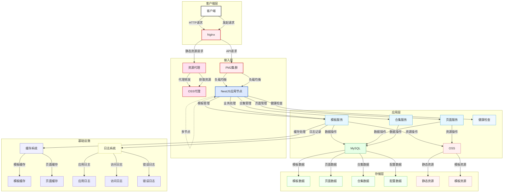

# 前端如何学习 nest

## 前言




## 设计模式

### 反射(Reflection)

reflect-metadata

TypeScript 中的 reflect-metadata 包确实实现了一部分“反射（Reflection）”能力，用
于在运行时读取或写入类型相关的元数据，这在 JavaScript 中是原生不具备的。

🧠 什么是“反射”？反射是指程序在运行时可以“自我检查”和“自我修改”的能力，常见于
Java、C# 等语言。

在 JavaScript/TypeScript 语境中，反射指的是：在运行时读取类、方法、参数、属性的
类型信息动态获取元数据，甚至动态调用

### 控制反转（IoC）

### 依赖注入（DI）

### 面向切面编程（AOP）

在没有 AOP 的情况下，功能模块间的横切关注点（如日志记录、事务管理）会反复出现在
代码的不同地方。每当业务逻辑改变时，我们可能需要修改多个位置的代码，导致代码难以
维护。AOP 通过将这些横切关注点提取到切面中，避免了代码重复，简化了维护和扩展。

#### AOP的核心概念

- **切面（Aspect）**：切面是AOP的核心，代表了横切关注点的模块化，包含了跨越多个功能模块的代码逻辑。例如，日志切面、事务切面、权限验证切面等。

- 通知（Advice）

  ：通知是AOP中定义的操作，描述了“什么时候”以及“如何”去执行切面代码。常见的通知类型包括：

  - **前置通知（Before）**：在方法执行之前执行某些操作。
  - **后置通知（After）**：在方法执行之后执行某些操作。
  - **环绕通知（Around）**：在方法执行之前和之后都执行操作，甚至可以决定是否执行目标方法。

例如 axios 的拦截器

```ts
import axios from 'axios';

const instance = axios.create({
  baseURL: 'https://api.example.com',
});
instance.interceptors.request.use((config) => {
  // 在发送请求之前做些什么
  return config;
});
instance.interceptors.response.use((response) => {
  // 对响应数据做些什么
  return response;
});
```

### 面向对象编程（OOP）

### 函数式编程（FP）

### 策略模式

```ts
export function createStorageQueue(
  key: string,
  maxLength: number,
  storage: Storage = localStorage,
) {
  function getQueue(): string[] {
    const data = storage.getItem(key);
    if (!data) return [];
    try {
      return JSON.parse(data);
    } catch {
      return [];
    }
  }

  function saveQueue(queue: string[]) {
    storage.setItem(key, JSON.stringify(queue));
  }

  return {
    enqueue(item: string) {
      let queue = getQueue();
      queue.push(item);
      queue = [...new Set(queue)];
      while (queue.length > maxLength) {
        queue.shift();
      }
      saveQueue(queue);
    },
    getQueue() {
      return getQueue();
    },
    clear() {
      storage.removeItem(key);
    },
  };
}
```

```typescript
@Injectable()
export class UserService {
  // 省略业务逻辑
}

@Controller('users')
export class UserController {
  constructor(private readonly userService: UserService) {}

  @Get()
  getAll() {
    return this.userService.findAll();
  }
}
```

上例中，`UserController` 通过构造函数注入 `UserService`，对象的创建和依赖关系由
NestDI 容器自动处理，这就是**依赖注入**的体现。Nest 中的模块（`@Module`）、服务
（`@Injectable`）等装饰器都使用元数据来标记依赖关系，框架启动时扫描这些信息并自
动实例化所需对象，从而实现控制反转。

## 面向切面编程（AOP）的基本思想及实现思路

面向切面编程（AOP）是一种将通用逻辑（如日志、权限、异常处理）与业务逻辑分离的编
程范式。其核心思想是在程序运行的执行链路上“横切”地加入额外逻辑，而无需在业务代码
中显式添加。例如，在请求调用链前后插入日志或权限校验，就属于 AOP 手段。这样可以
让业务代码保持纯粹，将横切关注点提取到可复用的切面中。

NestJS 内置了多种 AOP 机制：传统的 **中间件（Middleware）**、请求 **守卫
（Guard）**、参数验证/转换 **管道（Pipe）**、方法前后处理 **拦截器
（Interceptor）** 以及异常 **过滤器（Exception Filter）**。通过这些机制，开发者
可以在控制器方法执行前后透明地添加各种通用逻辑。例如，使用守卫判断请求权限、使用
拦截器统一格式化响应、使用异常过滤器捕获并处理抛出的错误等。这些机制都是 Nest 对
AOP 思想的具体实现，使得横向关注点可以灵活地应用于全局或单个路由。

## 面向对象编程（OOP）与函数式编程（FP）在 NestJS 中的融合

NestJS 设计上结合了面向对象编程和函数式编程的理念。**OOP** 体现在 Nest 的核心结
构上：控制器（Controllers）、服务（Providers）和模块（Modules）都是使用
TypeScript 类和装饰器来组织的，开发者用类来建模业务逻辑、使用继承和接口来抽象复
用。例如，一个 `UserService` 是一个类（面向对象），它的实例被注入到多个控制器中
共享。在此基础上，Nest 利用类和 DI 容器实现了模块化的代码组织，使程序结构清晰、
职责分离。

同时，Nest 也广泛使用函数式编程风格和响应式编程。**FP** 的典型体现是大量使用
RxJS 库和不可变数据处理。Nest 的拦截器、管道和数据流往往以 Observable 管道式链式
调用为主，支持使用高阶函数和纯函数来处理异步流。比如，在拦截器里可以使用
`map`、`tap` 等 RxJS 操作符对返回结果进行变换。下面的示例展示了一个返回
Observable 流并在其中使用 map 操作符的服务方法，体现了函数式风格：

```typescript
@Injectable()
export class NumbersService {
  getDoubled(): Observable<number[]> {
    return of([1, 2, 3]).pipe(map((nums) => nums.map((n) => n * 2)));
  }
}
```

在这个示例中，我们使用 RxJS 的 `of` 生成数据流，并用纯函数 `map` 对数组元素进行
计算。Nest 接收 Observable 类型的返回值时会自动订阅并发送结果给客户端。因此，在
Nest 中，面向对象的模块结构和函数式的流处理相辅相成，共同构建了可扩展且响应式的
应用程序框架。

## RxJS 基础与在 NestJS 中的使用

RxJS 是一个用于处理异步数据流的库，其核心是 **Observable**（可观察对象）。通过
`Observable`，我们可以定义“流”并在其中使用各种操作符（如
`map`、`filter`、`merge` 等）对数据进行处理，然后通过订阅（subscribe）消费结果。
在 NestJS 中，RxJS 被用于组织异步逻辑，尤其是在拦截器和业务服务里处理请求/响应流
时发挥重要作用。例如，控制器方法可以返回一个 `Observable`，框架会自动订阅它并将
发出的数据作为响应发送给客户端。

Nest 中典型的使用场景包括：**拦截器**常用 RxJS 操作符对请求或响应做处理；**服务
方法**可以返回 Observable，以流式方式处理异步 I/O；**管道**和 **守卫**也可在内部
使用 RxJS（如处理认证令牌流）。如下示例展示了一个拦截器，它在调用目标控制器方法
前后加上日志，并通过 RxJS 的 `map` 操作符格式化响应数据：

```typescript
@Injectable()
export class LoggingInterceptor implements NestInterceptor {
  intercept(context: ExecutionContext, next: CallHandler): Observable<any> {
    console.log('Before handling request');
    return next.handle().pipe(map((data) => ({ data, timestamp: Date.now() })));
  }
}
```

这里 `next.handle()` 返回一个 Observable，代表后续处理链的数据流。我们使用
`pipe(map(...))` 在数据流中插入逻辑，最终将包含原始数据和时间戳的对象返回。这种
管道式处理正是函数响应式编程的思想在 Nest 中的体现。如果只需获取 Observable 发出
的单次结果，也可使用 `toPromise()` 将其转换为 Promise，再使用 `await` 处理。

## TypeScript 装饰器与 reflect-metadata 的原理与应用

TypeScript 的装饰器（Decorator）是应用于类、属性、方法或参数的特殊标注，它本质上
是编译阶段运行的函数，用于为目标添加元数据或修改行为。NestJS 大量使用装饰器来声
明模块、控制器、依赖注入等关系，比如
`@Module()`、`@Controller()`、`@Injectable()` 等装饰器。每个装饰器在幕后都会调用
Reflect API（由 `reflect-metadata` 库提供）来附加元数据到类或成员上。TypeScript
编译器在开启了 `emitDecoratorMetadata` 选项后，还会自动为类型、参数等添加
`design:paramtypes`、`design:type` 等元数据。

Nest 在运行时会读取这些元数据来进行元编程。例如，Nest 的
`@Controller`、`@Module`、`@Injectable` 等装饰器内部都使用了
`Reflect.defineMetadata()` 方法为类附加配置信息。框架启动时，会通过
`Reflect.getMetadata()` 获取这些信息，分析依赖关系并完成实例化与注入。可以说
，Nest 的许多核心功能都建立在反射元数据机制之上。

下面的示例演示了自定义装饰器与 `reflect-metadata` 的基本用法：

```typescript
import 'reflect-metadata';

function SetRole(role: string): ClassDecorator {
  return Reflect.metadata('role', role);
}

@SetRole('admin')
class AdminService {}

const role = Reflect.getMetadata('role', AdminService);
console.log(role); // 输出: "admin"
```

在上例中，`SetRole` 装饰器通过 `Reflect.metadata` 将元数据附加到 `AdminService`
类。运行时我们用 `Reflect.getMetadata` 取出它。Nest 类似地使用这套机制，在
`@Module()` 中定义的控制器/提供者等信息、在控制器构造函数上的依赖类型信息，都会
被自动读出并用于依赖注入。

## NestJS 的核心功能模块：拦截器、管道、守卫、过滤器

NestJS 提供了几种核心模块，支持在请求处理流程中不同阶段插入横切逻辑，这些都是基
于 AOP 思想实现的：

- **拦截器（Interceptor）**：类似于方法的中间件，可在调用控制器方法前后执行代码
  。拦截器需实现 `NestInterceptor` 接口，并在 `intercept(context, next)` 方法中
  调用 `next.handle()` 执行后续逻辑。拦截器常用于日志、缓存、包装响应等。示例：

  ```typescript
  @Injectable()
  export class TransformInterceptor implements NestInterceptor {
    intercept(context: ExecutionContext, next: CallHandler): Observable<any> {
      console.log('Before...');
      return next.handle().pipe(map((data) => ({ data, transformed: true })));
    }
  }
  ```

- **管道（Pipe）**：用于对处理中的数据进行验证或转换，常作用于路由参数。管道需实
  现 `PipeTransform` 接口，定义 `transform(value, metadata)` 方法对输入 `value`
  进行处理。常见用法如参数类型转换、DTO 验证等。示例：

  ```typescript
  @Injectable()
  export class ParseIntPipe implements PipeTransform {
    transform(value: any, metadata: ArgumentMetadata) {
      const val = parseInt(value, 10);
      if (isNaN(val)) {
        throw new BadRequestException('Validation failed');
      }
      return val;
    }
  }
  ```

  在控制器中可通过 `@Param('id', ParseIntPipe)` 应用此管道，对路径参数 `id` 进行
  整数解析。

- **守卫（Guard）**：用于在请求到达路由处理前进行权限判断，返回 `true` 允许继续
  执行，返回 `false` 则拒绝。守卫需实现 `CanActivate` 接口，定义
  `canActivate(context)` 方法做逻辑检查。示例：

  ```typescript
  @Injectable()
  export class AuthGuard implements CanActivate {
    canActivate(context: ExecutionContext): boolean {
      const req = context.switchToHttp().getRequest();
      return validateUser(req.user);
    }
  }
  ```

  可以在控制器或方法上使用 `@UseGuards(AuthGuard)` 应用守卫。守卫常用于授权校验
  ，类似于 AOP 中的路由级别过滤。

- **异常过滤器（ExceptionFilter）**：用于捕获处理抛出的异常并格式化响应。过滤器
  需实现 `ExceptionFilter` 接口并使用 `@Catch()` 装饰要拦截的异常类型。示例：

  ```typescript
  @Catch(HttpException)
  export class HttpExceptionFilter implements ExceptionFilter {
    catch(exception: HttpException, host: ArgumentsHost) {
      const ctx = host.switchToHttp();
      const response = ctx.getResponse<Response>();
      const status = exception.getStatus();
      response.status(status).json({
        statusCode: status,
        message: exception.message,
      });
    }
  }
  ```

  将过滤器应用到路由后，当控制器内抛出 `HttpException` 时，会由该过滤器统一处理
  并返回自定义响应。所有这些核心模块（中间件、守卫、管道、拦截器、过滤器）都可以
  全局或按需启用，共同构成了 NestJS 的请求处理管道。

**参考资料：** NestJS 官方文档与社区文章。
