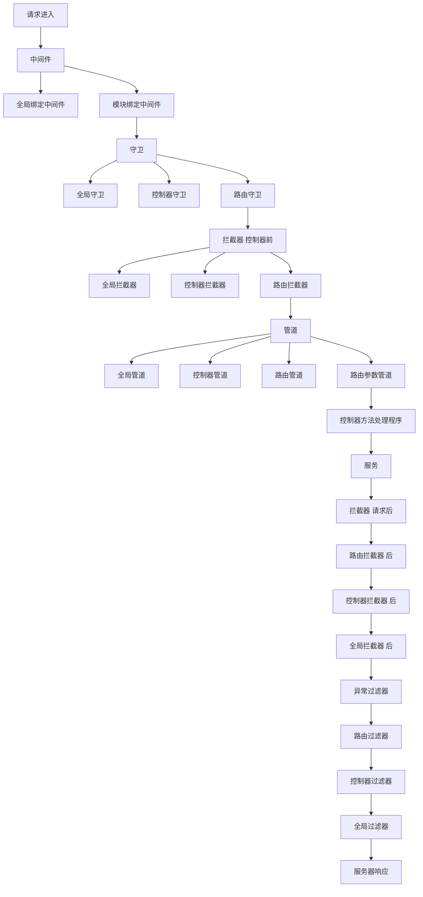
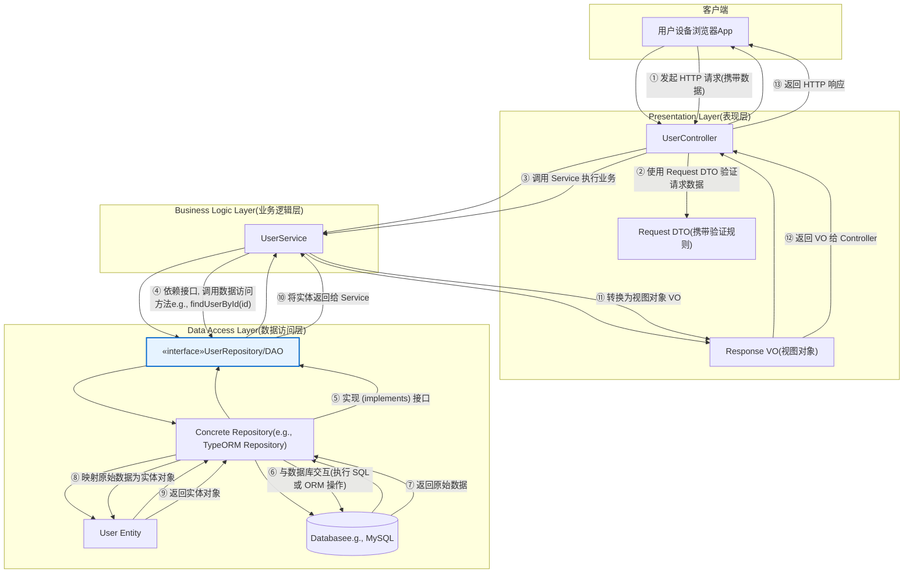

# 前端如何学习 nest

## 基础知识

### TypeScript

[去阅读文章](../typescript/ts学习.md)

### 装饰器

[去阅读文章](../typescript/装饰器.md)

### RxJS

[去阅读文章](../javascript/rxjs学习.md)

### MySql

[去阅读文章](../backend/mysql.md)

### TypeORM

[去阅读文章](../backend/typeorm.md)

### 设计模式

[去阅读文章](../backend/设计模式.md)

## nestjs 简介

Nest
(NestJS) 是一个用于构建高效、可扩展的[Node.js](https://nodejs.org/)服务器端应用程序的框架。它使用渐进式 JavaScript，完全基于 TypeScript 构建并支持[TypeScript](http://www.typescriptlang.org/)（但仍允许开发人员使用纯 JavaScript 编写代码），并融合了 OOP（面向对象编程）、FP（函数式编程）和 FRP（函数式响应式编程）的元素。

在底层，Nest 使用了强大的 HTTP 服务器框架，如[Express](https://expressjs.com/)（默认），并且可以选择配置为使用[Fastify](https://github.com/fastify/fastify)！

Nest 在这些常见的 Node.js 框架（Express/Fastify）之上提供了更高的抽象级别，同时也将其 API 直接暴露给开发者。这使得开发者可以自由地使用底层平台提供的大量第三方模块。

## controller

控制器负责处理传入的**请求**并将**响应**发送回客户端。


```ts
//cats.controller.ts
import { Controller, Get } from '@nestjs/common';

@Controller('cats')
export class CatsController {
  @Get()
  findAll(): string {
    return 'This action returns all cats';
  }
}
// route  get cats
```

## Provider

Provider是 Nest 的一个核心概念。许多基础的 Nest 类，例如service、(repository、factory和helper，都可以被视为提供者。其核心思想在于，它可以作为依赖进行**注入**（inject），从而允许对象之间建立各种各样的关系。而将这些对象“组装”（wiringup）起来的职责，则主要由 Nest 运行时系统来处理。

依赖注入(DI)是一种**控制反转 (Inversion of Control - IoC)**
技术。在这种技术中，您将依赖项的实例化工作委托给 IoC 容器（即 NestJS 运行时系统），而不是在自己的代码中以命令式的方式来完成。


```ts
// app.module.ts
import { Module } from '@nestjs/common';
import { CatsController } from './cats/cats.controller';
import { CatsService } from './cats/cats.service';

@Module({
  controllers: [CatsController],
  // 向IOC容器中注入
  providers: [CatsService],
})
export class AppModule {}

// cats.controller.ts

import { Controller, Get, Post, Body } from '@nestjs/common';
import { CreateCatDto } from './dto/create-cat.dto';
import { CatsService } from './cats.service';
import { Cat } from './interfaces/cat.interface';

@Controller('cats')
export class CatsController {
  constructor(
    // 注入获取到service
    private readonly catsService: CatsService,
  ) {}

  @Post()
  async create(@Body() createCatDto: CreateCatDto) {
    this.catsService.create(createCatDto);
  }

  @Get()
  async findAll(): Promise<Cat[]> {
    return this.catsService.findAll();
  }
}

// cats.service.ts

import { Injectable } from '@nestjs/common';
import { Cat } from './interfaces/cat.interface';

// 标记为provider
@Injectable()
export class CatsService {
  private readonly cats: Cat[] = [];

  create(cat: Cat) {
    this.cats.push(cat);
  }

  findAll(): Cat[] {
    return this.cats;
  }
}
```

## Module

模块是一个使用`@Module()`装饰器注解的类。


每个 Nest 应用程序至少有一个模块，即**根模块，它是 Nest 构建**应用程序图的起点。此图是 Nest 用于解决模块和提供程序之间的关系和依赖关系的内部结构。

`@Module()` 装饰器接受一个单独的对象，其属性用于描述该模块：

| 属性 (`Property`) | 说明                                                                                                                           |
| :---------------- | :----------------------------------------------------------------------------------------------------------------------------- |
| `providers`       | 将由 Nest 注入器实例化的提供者集合，这些提供者将至少在当前模块内共享。                                                         |
| `controllers`     | 在当前模块中定义的、必须被实例化的控制器集合。                                                                                 |
| `imports`         | 导入的模块列表。这些模块导出了在当前模块中所需的提供者。                                                                       |
| `exports`         | 由当前模块提供、并应在其他导入了本模块的模块中可用的提供者子集。你可以使用提供者本身，也可以只使用它的令牌（`provide` 的值）。 |

### 代码组织与功能

`CatsController`和`CatsService`紧密相关，并且服务于同一应用程序领域。将它们分组到功能模块中是合理的。功能模块组织与特定功能相关的代码，有助于保持清晰的边界和更好的组织。随着应用程序或团队的发展，这一点尤为重要，并且它符合[SOLID](https://en.wikipedia.org/wiki/SOLID)原则。

> **SOLID** 是面向对象编程和设计的五个基本原则的缩写
>
> 它的核心目标是：**降低模块间的耦合度，提高模块的内聚性**。
>
> 以下是五个原则的简介：
>
> 1.  **S - 单一职责原则 (Single Responsibility Principle)**
>
> - **核心思想：**
>   一个类或模块应该只负责一项功能，并且该功能应该被完整地封装在这个类中。
> - **简单理解：**
>   一个类只做好一件事。如果你发现一个类的改动原因有多个，那么它可能违反了此原则。
>
> 2.  **O - 开放/封闭原则 (Open/Closed Principle)**
>
> - **核心思想：** 软件实体（如类、模块、函数）应该对扩展开放，对修改封闭。
> - **简单理解：**
>   当需要增加新功能时，应该通过添加新代码（扩展）来实现，而不是修改已有的旧代码（修改）。这通常通过接口和抽象类来实现。
>
> 3.  **L - 里氏替换原则 (Liskov Substitution Principle)**
>
> - **核心思想：**
>   所有引用基类（父类）的地方必须能透明地使用其子类的对象，而程序行为不发生改变。
> - **简单理解：**
>   子类应该能够完全替代它的父类，并且表现出与父类相同的行为。子类不应该破坏父类已有的功能。
>
> 4.  **I - 接口隔离原则 (Interface Segregation Principle)**
>
> - **核心思想：**
>   客户端不应该被强迫依赖于它们不使用的方法。应使用多个专门的接口，而不是一个庞大臃肿的通用接口。
> - **简单理解：**
>   接口要小而专，不要设计“万能”接口。一个类对另一个类的依赖应该建立在最小的接口上。
>
> 5.  **D - 依赖倒置原则 (Dependency Inversion Principle)**
>
> - **核心思想：**
>   高层模块不应该依赖于低层模块，两者都应该依赖于抽象。抽象不应该依赖于细节，细节应该依赖于抽象。
> - **简单理解：**
>   要面向接口编程，而不是面向实现编程。代码应该依赖于抽象的接口（如 ILogger），而不是具体的实现（如 FileLogger），这样可以轻松地替换具体实现而不影响高层逻辑。

```ts
// cats.module.ts
import { Module } from '@nestjs/common';
import { CatsController } from './cats.controller';
import { CatsService } from './cats.service';

@Module({
  controllers: [CatsController],
  providers: [CatsService],
})
export class CatsModule {}
```

### 共享

在 Nest 中，模块默认是**单例**，因此您可以轻松地在多个模块之间共享任何提供程序的相同实例。

在上方的例子中所有导入 的模块都重用`CatsModule`相同的 实例。


## 中间件

**中间件是在路由处理程序之前**调用的函数。中间件函数可以访问[请求](https://expressjs.com/en/4x/api.html#req)和[响应](https://expressjs.com/en/4x/api.html#res)对象，以及`next()`应用程序请求-响应周期中的中间件函数。**下一个**中间件函数通常用名为 的变量表示`next`。


```ts
// logger.middleware.ts
import { Injectable, NestMiddleware } from '@nestjs/common';
import { Request, Response, NextFunction } from 'express';

@Injectable()
export class LoggerMiddleware implements NestMiddleware {
  use(req: Request, res: Response, next: NextFunction) {
    console.log('Request...');
    next();
  }
}
```

## Filter

Nest 内置了一个**异常层**，负责处理应用程序中所有未处理的异常。当应用程序代码未处理的异常时，该层会捕获该异常，并自动发送适当的、用户友好的响应。


```ts
import getConfig from '@/config/configuration';
import {
  ArgumentsHost,
  Catch,
  ExceptionFilter,
  HttpException,
  HttpStatus,
} from '@nestjs/common';
import { Request, Response } from 'express';
import { AppLoggerService } from '../modules/logger/logger.service';
import { ErrorResponseDto } from '../vos/api-response.vo';

@Catch()
export class HttpExceptionFilter implements ExceptionFilter {
  constructor(private readonly loggerService: AppLoggerService) {}
  catch(exception: any, host: ArgumentsHost) {
    const ctx = host.switchToHttp();
    const response = ctx.getResponse<Response>();
    const request = ctx.getRequest<Request>();
    const errResponse: ErrorResponseDto = {
      status: HttpStatus.INTERNAL_SERVER_ERROR,
      message: 'Internal server error',
      errors: void 0,
      timestamp: new Date().toISOString(),
      path: request.url,
    };
    // 属于静态文件服务
    if (request.url.startsWith(`${getConfig().base}/static`)) {
      response.status(404).send('Not Found');
      return;
    }
    if (exception instanceof HttpException) {
      errResponse.status = exception.getStatus();
      errResponse.message = exception.message;
      const exceptionRes = exception.getResponse();
      errResponse.errors =
        typeof exceptionRes === 'string'
          ? [exceptionRes]
          : //@ts-expect-error type
            (exceptionRes.errors ?? [exceptionRes.message]);
    } else if (exception instanceof Error) {
      errResponse.message = exception.message;
    }
    this.loggerService.error(
      `[${errResponse.status}] ${request.method} ${request.url} Error: ${errResponse.message}`,
      'HttpExceptionFilter',
    );
    response.status(200).json(errResponse);
  }
}
```

## Pipe

管道是一个用`@Injectable()`装饰器注释的类，它实现`PipeTransform`接口。

管道有两种典型的用例：

- **转换**：将输入数据转换为所需形式（例如，从字符串转换为整数）
- **验证**：评估输入数据，如果有效，则直接传递，否则抛出异常

`arguments`在这两种情况下，管道都会对[控制器路由处理程序](https://docs.nestjs.com/controllers#route-parameters)正在处理的参数进行操作。Nest 在方法调用之前插入一个管道，该管道接收发送给该方法的参数并对其进行操作。任何转换或验证操作都会在此时进行，之后，路由处理程序将使用任何（可能）转换后的参数调用。


例如如下DTO中

```ts
import { OmitType } from '@nestjs/swagger';
import { DocumentEntity } from '../entities/document.entity';
import { IsString } from 'class-validator';

export class CreateDocumentDto {
  @IsString()
  name!: string;
}
```

若request body为

```js
{
  name: 123123;
}
```

则抛出

```js
{
  status:400,
  message:'Bad Request',
  errors:[
    'name must be a string'
  ]
}
```

## Guard

`guard` 是一个用`@Injectable()`装饰器注释的类，它实现了`CanActivate`接口。

守卫只有**一个职责**。它们根据运行时存在的某些条件（例如权限、角色、ACL 等）决定路由处理程序是否处理给定的请求。这通常被称为**授权**
它们的设计与异常过滤器、管道和拦截器非常相似，旨在让你在请求/响应周期的正确位置插入处理逻辑，并以声明式的方式进行。这有助于保持代码的 DRY 原则和声明式。


```ts
import { extractTokenFromHeader } from '@/utils';
import {
  CanActivate,
  ExecutionContext,
  Injectable,
  UnauthorizedException,
} from '@nestjs/common';
import { Reflector } from '@nestjs/core';
import { JwtService } from '@nestjs/jwt';
import { SKIP_AUTH } from '../decorators/skip-auth.decorator';
import { UtilService } from '../modules/util/util.service';

@Injectable()
export class AuthGuard implements CanActivate {
  constructor(
    private jwtService: JwtService,
    private reflector: Reflector,
    private readonly utilService: UtilService,
  ) {}

  async canActivate(context: ExecutionContext): Promise<boolean> {
    const skipAuth = this.reflector.getAllAndOverride<boolean>(SKIP_AUTH, [
      context.getHandler(),
      context.getClass(),
    ]);
    if (skipAuth) {
      return true;
    }

    const request = context.switchToHttp().getRequest();
    const token = extractTokenFromHeader(request);
    if (!token) {
      throw new UnauthorizedException();
    }
    try {
      const payload = await this.jwtService.verifyAsync(
        token,
        this.utilService.getJwtVerifyOptions(),
      );
      request['user'] = payload;
    } catch {
      throw new UnauthorizedException();
    }
    return true;
  }
}
```

## 拦截器

拦截器是一个用`@Injectable()`装饰器注释并实现`NestInterceptor`接口的类。

拦截器具有一系列实用功能，这些功能受到[面向切面编程](https://en.wikipedia.org/wiki/Aspect-oriented_programming)（AOP）技术的启发。它们可以：

- 在方法执行之前/之后绑定额外的逻辑
- 转换函数返回的结果
- 转换函数抛出的异常
- 扩展基本功能行为
- 根据特定条件完全覆盖函数（例如，出于缓存目的）


面向切面编程

```ts
import {
  Injectable,
  NestInterceptor,
  ExecutionContext,
  CallHandler,
} from '@nestjs/common';
import { Observable } from 'rxjs';
import { tap } from 'rxjs/operators';

@Injectable()
export class LoggingInterceptor implements NestInterceptor {
  intercept(context: ExecutionContext, next: CallHandler): Observable<any> {
    console.log('Before...');

    const now = Date.now();
    return next
      .handle()
      .pipe(tap(() => console.log(`After... ${Date.now() - now}ms`)));
  }
}
```

响应拦截器示例

```ts
// response.interceptor.ts
import {
  CallHandler,
  ExecutionContext,
  HttpStatus,
  Injectable,
  NestInterceptor,
} from '@nestjs/common';
import { Request, Response } from 'express';
import { Observable } from 'rxjs';
import { map } from 'rxjs/operators';
import { MetaData } from 'src/constants/metadata';

@Injectable()
export class ResponseInterceptor<T> implements NestInterceptor<T> {
  intercept(
    context: ExecutionContext,
    next: CallHandler,
  ): Observable<{
    status: number;
    message: string;
    data: T;
  }> {
    // 检查是否有跳过拦截器的元数据
    const hasSkipInterceptor = Reflect.getMetadata(
      MetaData.SKIP_RESPONSE_INTERCEPTOR,
      context.getHandler(),
    ) as boolean;
    if (hasSkipInterceptor) {
      return next.handle(); // 如果有，直接返回，不经过拦截器逻辑
    }
    return next.handle().pipe(
      map((data: T) => {
        const ctx = context.switchToHttp();
        const res = ctx.getResponse<Response>();
        const req = ctx.getRequest<Request>();
        let status = res.statusCode;
        if (req.method === 'POST') {
          if (res.statusCode === HttpStatus.CREATED) {
            status = HttpStatus.OK;
            res.status(status);
          }
        }
        return {
          status,
          message: 'success',
          data,
          timestamp: new Date().toISOString(),
        };
      }),
    );
  }
}
```

## 请求流程图



## OpenAPI

### 简介

一个可维护的项目，应该有良好的文档.
OpenAPI 规范（OAS），是定义一个标准的、与具体编程语言无关的RESTful
API的规范。OpenAPI 规范使得人类和计算机都能在“不接触任何程序源代码和文档、不监控网络通信”的情况下理解一个服务的作用。如果您在定义您的 API 时做的很好，那么使用 API 的人就能非常轻松地理解您提供的 API 并与之交互了。

如果您遵循 OpenAPI 规范来定义您的 API，那么您就可以用文档生成工具来展示您的 API，用代码生成工具来自动生成各种编程语言的服务器端和客户端的代码，用自动测试工具进行测试等等。

### 结构

OpenAPI 文档的顶层对象被称为 OpenAPI 对象。它由一系列固定字段构成，用以描述 API 的整体信息。

| 字段名           | 类型                          | 描述                                                                                                                                                                                       |
| :--------------- | :---------------------------- | :----------------------------------------------------------------------------------------------------------------------------------------------------------------------------------------- |
| **openapi**      | `string`                      | **必选**. 这个字符串必须是符合语义化版本号规范的 OpenAPI 规范版本号（例如 `"3.0.3"`）。`openapi` 字段应该被工具或客户端用来解释 OpenAPI 文档，这个值和 API `info.version` 字符串没有关联。 |
| **info**         | `Info 对象`                   | **必选**。此字段提供 API 相关的元数据，例如标题、版本、描述等。                                                                                                                            |
| **servers**      | `[Server 对象]`               | 这是一个 Server 对象的数组，提供到服务器的连接信息。如果没有提供 `servers` 属性或者是一个空数组，那么默认为是 URL 值为 `/` 的 Server 对象。                                                |
| **paths**        | `Paths 对象`                  | **必选**。对所提供的 API 有效的路径和操作的定义。                                                                                                                                          |
| **components**   | `Components 对象`             | 一个包含多种可重用结构（如 Schemas、Parameters、Responses 等）的元素。                                                                                                                     |
| **security**     | `[Security Requirement 对象]` | 声明 API 使用的安全机制。这个列表中的值包含了可供选择的安全需求对象。认证一个请求时仅允许使用一种安全机制。单独的操作可以覆盖此处的全局定义。                                              |
| **tags**         | `[Tag 对象]`                  | 提供更多元数据的一系列标签。标签的顺序可以被工具用来决定 API 操作的分组和排序。每个标签名都应该是唯一的。                                                                                  |
| **externalDocs** | `External Documentation 对象` | 指向附加外部文档的链接。                                                                                                                                                                   |

```json
{
  "openapi": "3.0.0",
  "info": {
    "title": "lp及商详文档)",
    "description": "Collection的路径。",
    "version": "1.0",
    "contact": {}
  },
  "tags": [
    {
      "name": "Collection",
      "description": "与 Collection 相关的操作"
    }
  ],
  "servers": [
    {
      "url": "/lp/"
    }
  ],
  "paths": {
    "/collection/{id}": {
      "get": {
        "operationId": "CollectionController_findOne",
        "parameters": [
          {
            "name": "id",
            "required": true,
            "in": "path",
            "description": "要查询的Collection的ID",
            "schema": {
              "type": "string"
            }
          }
        ],
        "responses": {
          "200": {
            "description": "成功的响应",
            "content": {
              "application/json": {
                "schema": {
                  "allOf": [
                    {
                      "$ref": "#/components/schemas/ApiResponseVo"
                    },
                    {
                      "properties": {
                        "data": {
                          "$ref": "#/components/schemas/CollectionVo"
                        }
                      }
                    }
                  ]
                }
              }
            }
          }
        },
        "security": [
          {
            "bearer": []
          }
        ],
        "summary": "根据id查询collection",
        "tags": ["Collection"]
      }
    }
  },
  "components": {
    "securitySchemes": {
      "bearer": {
        "scheme": "bearer",
        "bearerFormat": "JWT",
        "type": "http",
        "name": "Authorization",
        "description": "请输入 JWT token",
        "in": "header"
      }
    },
    "schemas": {
      "ApiResponseVo": {
        "type": "object",
        "properties": {
          "status": {
            "type": "number",
            "description": "状态码",
            "example": 200
          },
          "data": {
            "type": "object",
            "description": "响应数据",
            "nullable": true
          },
          "message": {
            "type": "string",
            "description": "消息",
            "example": "Success"
          },
          "timestamp": {
            "type": "string",
            "description": "时间戳",
            "example": "2023-01-01T00:00:00Z"
          }
        },
        "required": ["status", "data", "message", "timestamp"]
      },
      "CollectionVo": {
        "type": "object",
        "properties": {
          "type": {
            "type": "string",
            "description": "模版类型",
            "enum": ["lp", "detail"]
          },
          "id": {
            "type": "string",
            "description": "collection id"
          },
          "name": {
            "type": "string",
            "description": "合集名称"
          },
          "desc": {
            "type": "string",
            "description": "合集描述"
          },
          "createUserId": {
            "type": "string",
            "description": "创建人"
          },
          "lastModifyUserId": {
            "type": "string",
            "description": "最后修改人"
          },
          "createTime": {
            "format": "date-time",
            "type": "string",
            "description": "创建时间"
          },
          "lastModifyTime": {
            "format": "date-time",
            "type": "string",
            "description": "最后修改时间"
          },
          "templateCount": {
            "type": "number",
            "description": "模版数量"
          },
          "createUserName": {
            "type": "string",
            "description": "创建用户名称"
          },
          "lastModifyUserName": {
            "type": "string",
            "description": "修改用户名称"
          }
        },
        "required": [
          "type",
          "id",
          "name",
          "desc",
          "createUserId",
          "lastModifyUserId",
          "createTime",
          "lastModifyTime",
          "templateCount",
          "createUserName",
          "lastModifyUserName"
        ]
      }
    }
  }
}
```

### 实例

通过如下装饰器可以为项目统一添加 OpenAPI 注解

```ts
import { applyDecorators, Type } from '@nestjs/common';
import {
  ApiBearerAuth,
  ApiExtraModels,
  ApiResponse,
  ApiResponseSchemaHost,
  getSchemaPath,
} from '@nestjs/swagger';
import { ApiResponseVo } from '../vos/api-response.vo';
import { PageDataVo } from '../vos/page-response.vo';

type SchemaType = ApiResponseSchemaHost['schema'];
const primitiveSchemas = {
  boolean: defineSchemaType({ type: 'boolean', example: true }),
  string: defineSchemaType({ type: 'string', example: 'text' }),
  number: defineSchemaType({ type: 'number', example: 123 }),
  streamFile: defineSchemaType({
    type: 'string',
    format: 'binary',
    description: '文件流',
  }),
} as const;
type PrimitiveKey = keyof typeof primitiveSchemas;

type ApiModel = Type<any> | PrimitiveKey;
export type ApiResponseWrapperOptionType = 'page' | 'origin';

export type ApiResponseWrapperOption = {
  isArray?: boolean;
  type?: ApiResponseWrapperOptionType;
};
export type NestDecorator = ReturnType<typeof applyDecorators>;
export function ApiResponseWrapper(
  model: ApiModel,
  option: ApiResponseWrapperOption,
): NestDecorator;
export function ApiResponseWrapper(
  model?: ApiModel,
  isArray?: boolean,
): NestDecorator;
export function ApiResponseWrapper(
  model?: ApiModel,
  option?: boolean | ApiResponseWrapperOption,
): NestDecorator {
  const isPrim = typeof model === 'string';
  const extra: Type<any>[] = [];
  if (!isPrim && model) extra.push(model);
  const notNeedResponse: PrimitiveKey[] = ['streamFile'];
  if (isPrim && notNeedResponse.includes(model)) {
    return applyDecorators(
      ApiResponse({
        status: 200,
        description: '成功的响应',
        schema: primitiveSchemas[model],
      }),
    );
  }
  const isArray =
    typeof option === 'boolean' ? option : (option?.isArray ?? false);
  const type =
    typeof option === 'boolean' ? 'origin' : (option?.type ?? 'origin');
  const typeMap: Record<ApiResponseWrapperOptionType, () => SchemaType> = {
    page: () => {
      return {
        allOf: [
          {
            $ref: getSchemaPath(PageDataVo),
          },
          {
            properties: {
              items: {
                type: 'array',
                items: {
                  $ref: getSchemaPath(model!),
                },
              },
            },
          },
        ],
      };
    },
    origin: () => {
      return isPrim
        ? primitiveSchemas[model]
        : model
          ? { $ref: getSchemaPath(model) }
          : { type: 'object', additionalProperties: true };
    },
  };

  const itemSchema = typeMap[type]();

  const dataSchema: SchemaType = {
    properties: {
      data: isArray
        ? {
            type: 'array',
            items: itemSchema,
          }
        : itemSchema,
    },
  };

  return applyDecorators(
    ApiBearerAuth(),
    ApiExtraModels(...extra),
    ApiResponse({
      status: 200,
      description: '成功的响应',
      schema: {
        allOf: [
          // 引用通用响应 DTO
          { $ref: getSchemaPath(ApiResponseVo) },
          dataSchema,
        ],
      },
    }),
  );
}

export function ApiPageResponseWrapper(model: ApiModel): NestDecorator {
  return ApiResponseWrapper(model, { type: 'page' });
}

function defineSchemaType(o: SchemaType) {
  return o;
}
```

## nestjs应用分层设计

在 NestJS 应用程序中，通过合理的分层设计，可以有效实现关注点分离（Separation of
Concerns），提升代码的可维护性、可扩展性和可测试性。其中，Controller、Service、DTO
(Data Transfer Object) 和 VO (View Object) 是构建这一健壮架构的关键组成部分。

1. **表现层 (Presentation Layer):**
   - **组件:** Controller, Request DTO, Response VO。
   - **核心职责:**
     作为应用的入口，负责处理 HTTP 请求和响应。它验证输入 (DTO)、委派业务处理、并格式化输出 (VO)，是连接客户端和业务逻辑的桥梁。
2. **业务逻辑层 (Business Logic Layer):**
   - **组件:** Service。
   - **核心职责:**
     实现应用的核心业务规则和流程。它编排数据访问操作和处理复杂的业务逻辑，是应用功能的大脑。
3. **数据访问层 (Data Access Layer):**
   - **组件:** Repository/DAO (接口与实现), Entity, Database。
   - **核心职责:** 封装所有与数据持久化相关的操作。通过抽象接口 (Repository/DAO
     Interface) 将业务逻辑与具体的数据库技术（如 TypeORM,
     MySQL）解耦，负责数据的增删改查 (CRUD) 和实体映射。

整个流程体现了多种关键的设计模式和原则：

- **数据流:**
  - **输入:** Client → Controller → Request DTO (验证) → Service。
  - **处理:** Service ↔ Repository ↔ Database ↔ Entity。
  - **输出:** Entity → Service → Response VO (转换) → Controller → Client。
- **关键模式与原则:**
  - **MVC/MVCS 变体:**
    Controller 和 Service 的分离是典型的模型-视图-控制器思想的演化。
  - **依赖倒置原则 (DIP):** 业务逻辑层 (Service) 依赖于数据访问层的**抽象接口**
    (Repository/DAO Interface)，而不是具体实现。这使得切换数据库或 ORM 框架变得容易。
  - **DTO/VO 模式:**
    - Request DTO 用于定义清晰的 API 输入契约并实现自动化验证。
    - Response
      VO 用于定义清晰的 API 输出契约，避免暴露内部数据库结构 (Entity)，实现内外模型的隔离。
  - **DAO/Repository 模式:**
    提供了统一的数据访问接口，将数据持久化的复杂性封装起来，使业务代码更干净、更易于测试。



### 具体实现

#### controller

```ts
@Controller('collection')
export class CollectionController {
  constructor(private readonly collectionService: CollectionService) {}
  @Get('list')
  @ApiPageResponseWrapper(CollectionVo)
  @ApiOperation({ summary: '分页查询collection' })
  findByCollectionIdPage(@Query() query: CollectionPageQueryDto) {
    return this.collectionService.findByPage(query);
  }
}
```

#### service

```ts
@Injectable()
export class CollectionService {
  constructor(
    @InjectRepository(CollectionEntity)
    private collectionRepository: Repository<CollectionEntity>,
  ) {}
  findByPage(query: CollectionPageQueryDto) {
    const { page, pageSize, name, ...rest } = query;
    return from(
      this.collectionRepository
        .createQueryBuilder('collection')
        .leftJoinAndSelect('collection.createUser', 'createUser')
        .leftJoinAndSelect('collection.lastModifyUser', 'lastModifyUser')
        .loadRelationCountAndMap(
          'collection.templateCount',
          'collection.templates',
        )
        .where(
          omitOrmUndefined({
            ...rest,
            name: likeIf(name),
          }),
        )
        .orderBy('collection.createTime', 'DESC')
        .skip((page - 1) * pageSize)
        .take(pageSize)
        .getManyAndCount(),
    ).pipe(
      map(([collections, count]) => {
        return PageDataDtoFactory({
          items: plainToInstance(CollectionVo, collections),
          total: count,
          page,
          pageSize,
        });
      }),
    );
  }
}

```

#### 表结构

| 字段名             | 描述          | 数据类型 | 约束         |
| ------------------ | ------------- | -------- | ------------ |
| `id`               | collection id | string   | 主键, 自增   |
| `name`             | 合集名称      | string   | 唯一         |
| `desc`             | 合集描述      | string   |              |
| `createUserId`     | 创建人        | string   | 索引         |
| `lastModifyUserId` | 最后修改人    | string   | 可为空, 索引 |
| `createTime`       | 创建时间      | Date     |              |
| `lastModifyTime`   | 最后修改时间  | Date     |              |


#### 数据库实体

```typescript
@Entity('collections')
export class CollectionEntity extends AbstractTypeEntity {
  @PrimaryGeneratedColumn()
  @ApiProperty({
    description: 'collection id',
  })
  id!: string;
  @ApiProperty({
    description: '合集名称',
  })
  @IsString()
  @Column({
    unique: true,
  })
  name!: string;
  @ApiProperty({
    description: '合集描述',
  })
  @IsString()
  @Column()
  desc!: string;
  @ApiProperty({
    description: '创建人',
  })
  @IsString()
  @Column()
  @Index()
  createUserId!: string;
  @ApiProperty({
    description: '最后修改人',
  })
  @IsString()
  @Column({
    nullable: true,
  })
  @Index()
  lastModifyUserId!: string;
  @ApiProperty({
    description: '创建时间',
    type: Date,
  })
  @CreateDateColumn({})
  createTime!: string;
  @ApiProperty({
    description: '最后修改时间',
    type: Date,
  })
  @UpdateDateColumn()
  lastModifyTime!: string;

  @OneToMany('templates', 'belongingCollection')
  templates!: Relation<TemplateEntity>[];
  @ManyToOne(() => UserEntity, {
    createForeignKeyConstraints: false,
  })
  @JoinColumn({
    name: 'createUserId',
  })
  @Exclude()
  createUser!: Relation<UserEntity>;
  @ManyToOne(() => UserEntity, {
    createForeignKeyConstraints: false,
  })
  @JoinColumn({
    name: 'lastModifyUserId',
  })
  @Exclude()
  lastModifyUser!: Relation<UserEntity>;
}
```

#### Dto

```typescript
export class CollectionPageQueryDto extends IntersectionType(
  PageDataQueryVo,
  PartialType(PickType(CollectionEntity, ['name'])),
  PickType(CollectionEntity, ['type']),
) {
  @IsOptional()
  @ApiPropertyOptional()
  @IsString()
  override name?: string;
}
```

#### Vo

```typescript
import { TransformExposeRelation } from '@/common/decorators/transform-expose-relation.decorator';
import { ApiProperty } from '@nestjs/swagger';
import { CollectionEntity } from '../entities/collection.entity';

export class CollectionVo extends CollectionEntity {
  @ApiProperty({ description: '模版数量', type: Number })
  templateCount!: number;
  @TransformExposeRelation<CollectionEntity>({
    description: '创建用户名称',
    path: 'createUser.metadata.name',
  })
  createUserName!: string;
  @TransformExposeRelation<CollectionEntity>({
    description: '修改用户名称',
    path: 'lastModifyUser.metadata.name',
  })
  lastModifyUserName!: string;
}
```
