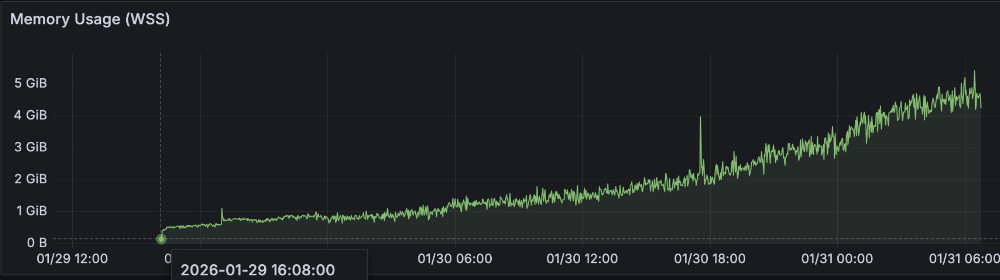
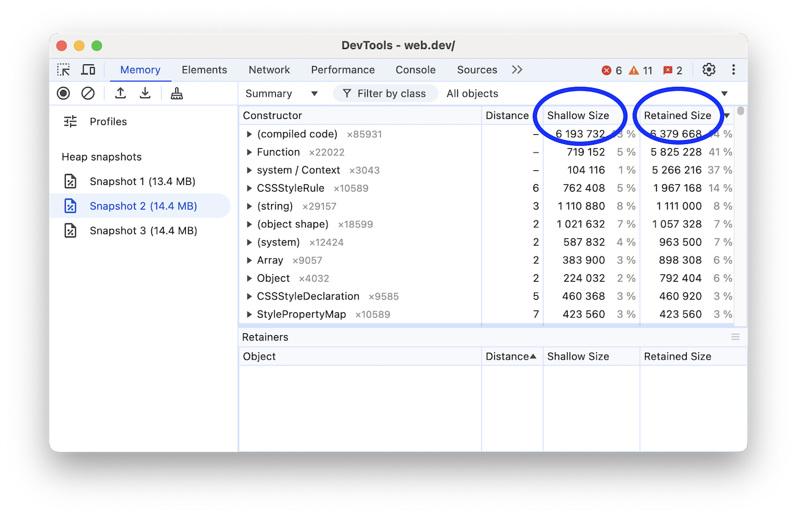
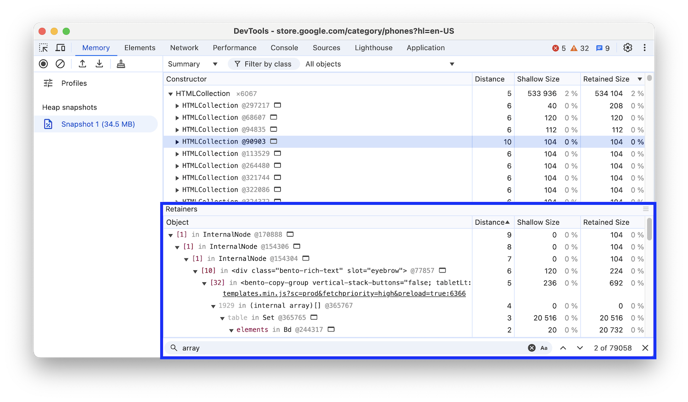
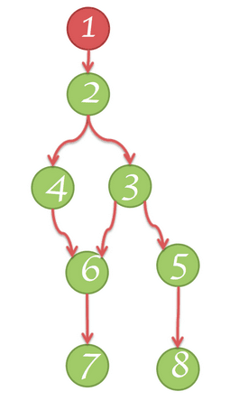
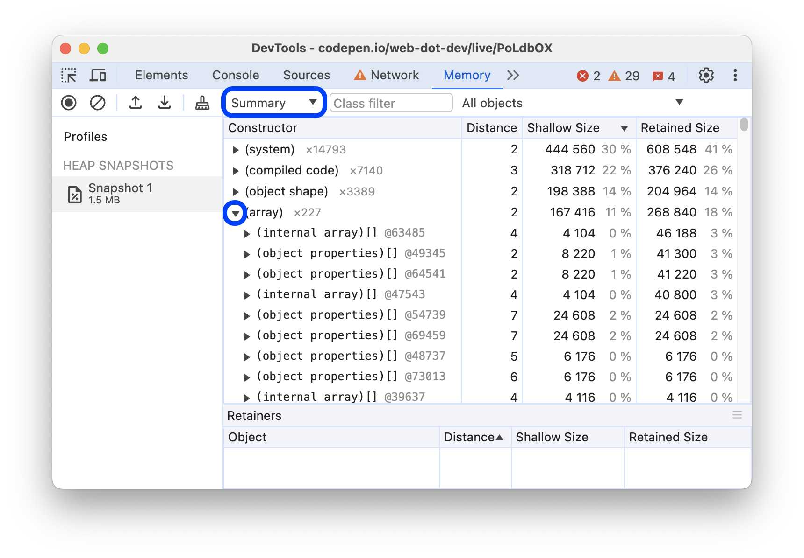
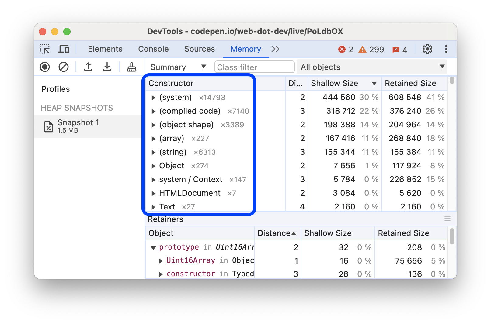
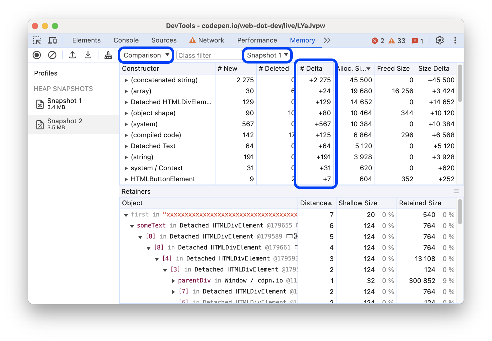
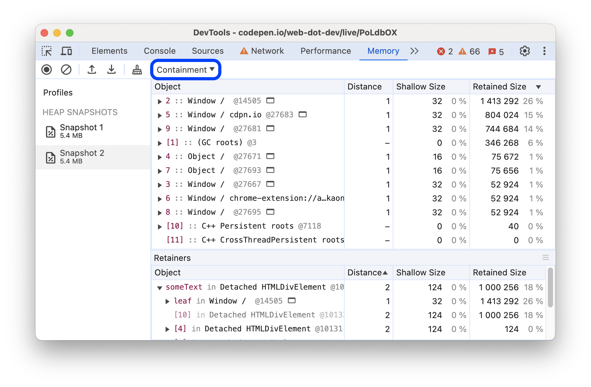
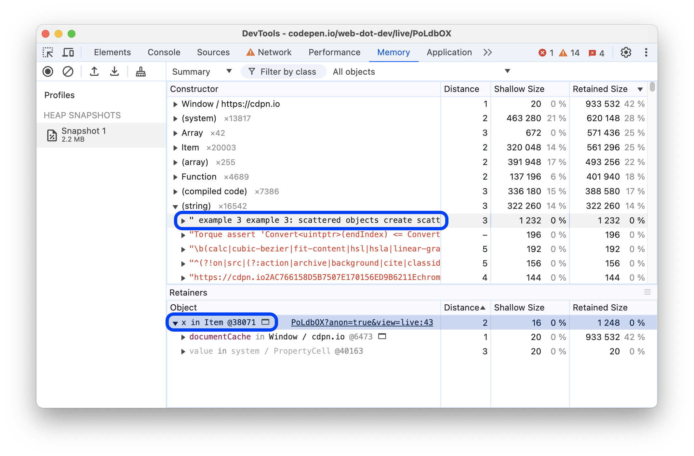
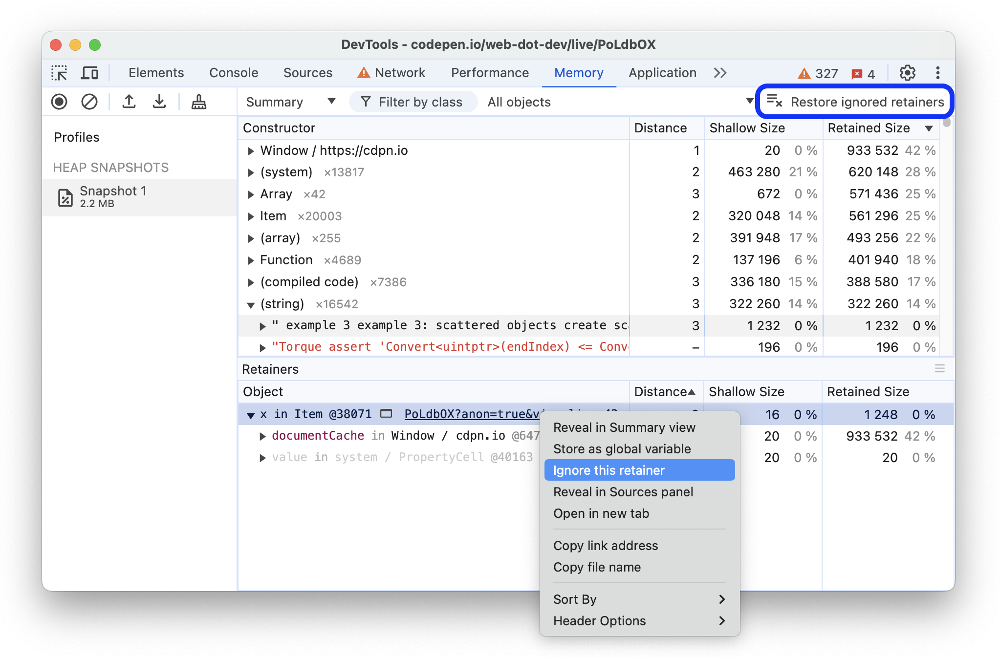

## 前情提要

最近在发版时遇到了一次内存泄漏问题，导致应用在运行一段时间后内存占用稳步提升，如下图所示：

## 术语

本部分介绍了内存分析中常用的术语，适用于适用于不同语言的各种内存性能分析工具。

### 对象大小

将内存视为包含基元类型（例如数字和字符串）和对象（关联数组）的图。它在视觉上可以表示为包含多个相互关联的点的图表，如下所示：

对象可以通过以下两种方式占用内存：

- 直接由对象本身进行调用。
- 隐式地保留对其他对象的引用，从而防止这些对象被垃圾回收器自动处置。

在 DevTools 中使用堆性能分析器,主要关注Shallow Size和Retained Size。

### 浅层大小

这是对象本身占用的内存大小。

典型的 JavaScript 对象会预留一些内存来存储其说明和立即值。通常，只有数组和字符串可以具有较大的浅层大小。不过，字符串和外部数组的主要存储空间通常位于渲染程序内存中，并且只在 JavaScript 堆上公开一个小型封装容器对象。

渲染程序内存是指用于渲染受检页面的进程的所有内存：原生内存 + 页面的 JS 堆内存 + 由页面启动的所有专用工作器的 JS 堆内存。不过，即使是小对象，也可以通过阻止自动垃圾回收进程处置其他对象，间接占用大量内存。

### 保留的大小

这是在删除对象本身及其无法从 **GC 根**访问的依赖对象后释放的内存大小。

**GC 根**由在从原生代码引用 V8 之外的 JavaScript 对象时创建的*句柄*（本地或全局）组成。您可以在堆快照的 **GC 根** > **Handle 作用域**和 **GC 根** > **全局句柄**下找到所有此类句柄。

存在许多内部 GC 根，其中大多数对用户而言并不重要。从浏览器的角度来看，根有以下几种：

- 窗口全局对象（在每个 iframe 中）。堆快照中有一个距离字段，该字段是从窗口到最短保留路径上的属性引用数量。
- 文档 DOM 树，由遍历文档可访问的所有原生 DOM 节点组成。其中有些可能没有 JS 封装容器，但如果有，则封装容器会在文档有效期间保持有效。
- 有时，调试程序上下文和开发者工具控制台可能会保留对象（例如在控制台评估后）。创建堆快照，并确保控制台清晰且调试器中没有有效断点。

内存图从根开始，该根可以是浏览器的 `window` 对象，也可以是 Node.js 模块的 `Global` 对象。您无法控制此根对象的 GC 方式。

从根无法访问的任何内容都会被 GC。（可达性分析）

### 对象保留树

堆（Heap）是一个由相互连接的对象构成的网络。在数学领域，这种结构被称为**图**（Graph）或**内存图**。图由通过**边**（Edges）连接的**节点**（Nodes）组成，节点和边都有各自的标签。

- **节点**（或对象）使用用于构建它们的**构造函数**（Constructor function）的名称进行标记。
- **边**使用**属性**（Properties）的名称进行标记。

在接下来的 Heap Profiler 记录中，我们可以看到一些值得关注的信息，其中包括**距离**：即对象到 **GC 根**（Garbage Collection root，垃圾回收根节点）的距离。如果几乎所有同类型的对象都位于相同的距离，却有少数几个对象的距离更远，这种情况就值得深入调查了。

### 支配者

**支配者对象**由树状结构组成，因为每个对象有且仅有一个直接支配者。一个对象的支配者可能并不包含对其所支配对象的直接引用；也就是说，支配者树并不是原图的生成树。

**在下图（逻辑）中：**

- 节点 1 支配节点 2
- 节点 2 支配节点 3、4 和 6
- 节点 3 支配节点 5
- 节点 5 支配节点 8
- 节点 6 支配节点 7

在以下示例中，节点 **#7**、**#3** 以及 **GC** 都是节点 **#10** 的**支配者**，因为它们存在于从根节点 (GC) 到节点 #10 的每一条路径上。特别地，**#7** 是节点 #10 的**直接支配者 (Immediate Dominator)**，因为它是从 GC 到 #10 的路径上距离 #10 最近的支配者。

### V8 特性

在进行内存分析时，理解堆快照为何呈现某种形态是非常有帮助的。本节描述了一些专门针对 **V8 JavaScript 虚拟机**的内存相关主题。

#### JavaScript 对象表示

JavaScript 有三种原始类型：

- **数字**（例如 3.14159...）
- **布尔值**（true 或 false）
- **字符串**（例如 'Werner Heisenberg'）

它们不能引用其他值，因此在内存图中始终是**叶子节点**或终止节点。

**数字**可以通过以下两种方式存储：

1. 作为直接的 31 位整数值，称为**小整数**；或者
2. 作为堆对象，称为**堆数字**。堆数字用于存储不符合小整数格式的值（例如**双精度浮点数**），或者当一个值需要被**装箱**时（例如在该数字上设置属性）。

**字符串**可以存储在：

1. **VM 堆**中；或者
2. 外部的**渲染器内存**中。在这种情况下，会创建一个**包装对象**用于访问该外部存储。例如，从 Web 接收的脚本源码和其他内容通常存储在外部，而不是直接拷贝到 VM 堆中。

新 JavaScript 对象的内存是从一个专用的 JavaScript 堆（或 **VM 堆**）中分配的。这些对象由 V8 的垃圾回收器管理，因此，只要至少存在一个指向它们的**强引用**，它们就会一直存活。

**原生对象**是指除 JavaScript 堆之外的所有其他对象。与堆对象不同，原生对象在其整个生命周期内不由 V8 垃圾回收器管理，并且只能通过其 JavaScript **包装对象**从 JavaScript 中访问。

> 由 **宿主环境**提供，而不是由 V8 引擎本身直接生成的对象。V8 只是一个 JavaScript 引擎，它被嵌入在不同的宿主环境中。
>
> 在浏览器环境可以是DOM，BOM。在Node端可以是一些C++ Addon

**串接字符串**是一种由成对的字符串存储并连接而成的对象，它是字符串拼接的结果。**串接字符串**内容的连接操作仅在需要时才会发生。例如，当需要构建一个已连接字符串的子串时，才会进行实际的连接。

- 例如，如果你将 `a` 和 `b` 拼接，你会得到一个表示拼接结果的字符串 `(a, b)`。如果你稍后将 `d` 与该结果拼接，你会得到另一个串接字符串 `((a, b), d)`。

**数组** —— 数组是带有数字键的对象。它们在 V8 VM 中被广泛用于存储大量数据。那些像字典一样使用的键值对集合，其底层通常也是由数组支持的。

一个典型的 JavaScript 对象可以使用两种数组类型来进行存储：

- **命名属性**
- **数字元素**

如果属性的数量非常少，它们可以直接存储在 JavaScript 对象**内部**。

**Map** —— 这是一个描述对象种类及其布局的对象。例如，Map 用于描述隐式的对象层次结构，以实现**快速属性访问**。

#### 对象组

每个**原生对象组**由相互引用的对象组成。以 DOM 子树为例，每个节点都有一个指向其父节点的链接，以及指向下一个子节点和下一个兄弟节点的链接，从而形成一个连通图。请注意，原生对象并不在 JavaScript 堆中表示——这就是为什么它们的大小显示为零。相反，V8 会创建**包装对象**。

每个包装对象都持有一个指向对应原生对象的引用，用于将命令重定向给它。反过来，对象组也持有这些包装对象。然而，这并不会创建一个无法回收的循环引用，因为 GC 足够智能，可以释放那些包装器不再被引用的对象组。但是，只要**忘记释放其中任何一个包装器**，就会导致整个组及其关联的包装器都被保留。

## Chrome开发者工具

由于主要关注 Node.js 内存泄漏问题，我们将使用 Chrome DevTools 来分析内存泄漏。虽然 Chrome DevTools 主要用于浏览器环境，但它也可以排查Node.js 应用程序堆快照。

### Summary摘要视图

初始状态下，堆快照会在 **Summary** 视图中打开，该视图将 **Constructor** 列在一列中。

**Constructor** 是以创建该对象的 JavaScript 函数命名的，普通对象的名称是基于它们所包含的属性，还有一些名称属于**特殊条目**。

所有对象首先按名称分组，其次按它们在源文件中的行号分组，例如 `source-file.js:line-number`。

你可以展开已分组的 **Constructor**，查看由它们实例化的具体对象。

**Constructor** 名称旁的数字指示了由该 **Constructor** 创建的对象的总数量。**Summary** 视图还显示了以下列：

- **Distance**：显示了通过节点间的最短简单路径到达根节点（Root）的距离。
- **Shallow size**：显示了由特定 **Constructor** 创建的所有对象的 **Shallow size** 总和。**Shallow size** 是指对象自身所占用的内存大小。通常，数组和字符串具有较大的 **Shallow size**。
- **Retained size**：显示了同一组对象中最大的 **Retained size**。**Retained size** 是指通过删除一个对象，并使其依赖项不再可达，从而能够释放的内存大小。

**Summary** 视图允许你根据低效内存使用的常见情况来筛选 **Constructor**。

要使用这些筛选器，请从操作栏最右侧的下拉菜单中选择以下选项之一：

- **All objects**：当前快照捕获的所有对象。这是默认设置。
- **Objects allocated before snapshot 1**：在拍摄第一个快照之前创建并保留在内存中的对象。
- **Objects allocated between Snapshots 1 and Snapshots 2**：查看最近一次快照与上一次快照之间的对象差异。每增加一个新的快照，都会在下拉列表中添加该筛选器的一个增量选项。
- **Duplicated strings**：在内存中被多次存储的字符串值。
- **Objects retained by detached nodes**：因为被分离的 DOM 节点（detached DOM node）引用而保持存活的对象。
- **Objects retained by the DevTools console**：因为在 DevTools 控制台中被求值（evaluated）或交互而保留在内存中的对象。

### Summary 中的特殊条目

除了按 **Constructor分组外，**Summary\*\* 视图还通过以下方式对对象进行分组：

- **内置函数**，例如 `Array` 或 `Object`。
- **HTML 元素**，按其标签分组，例如 `
`、`<a>`、`` 等。
- **你在代码中定义的函数**。
- **特殊类别**，这些类别不基于 **Constructor**。

#### `(array)`

该类别包含各种内部的“类数组”对象，它们并不直接对应于 JavaScript 中可见的对象。

- 例如，JavaScript `Array` 对象的内容存储在一个名为 `(object elements)[]` 的次级内部对象中，以便更容易调整大小。
- 同样，JavaScript 对象中的命名属性通常存储在名为 `(object properties)[]` 的次级内部对象中，这些对象也列在 `(array)` 类别下。

#### `(compiled code)`

该类别包含 V8 为了运行由 JavaScript 或 WebAssembly 定义的函数所需的内部数据。每个函数可以用多种方式表示，从体积小但运行慢，到体积大但运行快。

- V8 会自动管理此类别中的内存使用。如果一个函数运行多次，V8 会为该函数使用更多内存，以便它能运行得更快（优化编译）。
- 如果一个函数有一段时间没运行，V8 可能会清除该函数的内部数据（去优化/释放）。

#### `(concatenated string)`

当 V8 连接两个字符串时（例如使用 JavaScript `+` 运算符），它可能会选择在内部将结果表示为“连接字符串”（concatenated string），也就是所谓的 **Rope** 数据结构。

- V8 不会将两个源字符串的所有字符复制到一个新字符串中，而是分配一个带有 `first` 和 `second` 内部字段的小对象，这两个字段分别指向两个源字符串。这让 V8 能够节省时间和内存。
- 从 JavaScript 代码的角度来看，这些只是普通字符串，它们的行为与其他任何字符串一样。

#### `(object shape)`

正如“V8 中的快速属性”中所述，V8 追踪**隐藏类**（hidden classes，或称为 **shapes**），以便可以高效地表示具有相同属性且顺序相同的多个对象。

- 此类别包含那些被称为 `system / Map`（注意：这与 JavaScript 的 `Map` 对象**无关**）的隐藏类及相关数据。

#### `(sliced string)`

当 V8 需要提取子字符串时（例如当 JavaScript 代码调用 `String.prototype.substring()` 时），V8 可能会选择分配一个**切片字符串**（sliced string）对象，而不是从原始字符串中复制所有相关字符。

- 这个新对象包含一个指向原始字符串的指针，并描述了要使用原始字符串中的哪个字符范围。
- 从 JavaScript 代码的角度来看，这些只是普通字符串，它们的行为与其他任何字符串一样。
- **注意**：如果一个切片字符串保留（retain）了大量内存（因为它引用了一个巨大的原始字符串），那么程序可能触发了 Issue 2869，并且可能需要采取特定步骤来“扁平化”（flatten）该切片字符串（例如强制进行复制）。

#### `system / Context`

类型为 `system / Context` 的内部对象包含来自**闭包**的局部变量——即嵌套函数可以访问的 JavaScript 作用域。

- 每个函数实例都包含一个指向其执行所在的 `Context` 的内部指针，以便它可以访问这些变量。
- 即使 `Context` 对象在 JavaScript 中并不直接可见，但你确实（通过代码逻辑）可以直接控制它们。

#### `(system)`

这个类别包含各种尚未被归类到更有意义类别中的内部对象。

Gemini said

### Comparison 视图

**Comparison** 视图允许你通过相互比较多个快照来查找泄漏的对象。例如，执行一个操作并将其撤销（如打开文档再将其关闭），不应遗留任何多余的对象。

要验证特定操作是否会导致内存泄漏，请执行以下步骤：

1. 在执行操作前拍摄一个堆快照。
2. 执行操作。即以某种你认为可能导致泄漏的方式与页面进行交互。
3. 执行反向操作。即进行相反的交互，并重复几次。
4. 拍摄第二个堆快照，将其视图切换为 **Comparison**，并与 **Snapshot 1** 进行比较。

**Comparison** 视图显示两个快照之间的差异。当展开一个汇总条目时，会显示新增和已删除的对象实例：

### Containment 视图

**Containment** 视图提供了应用程序对象结构的“鸟瞰图”。它允许你窥视函数**闭包**的内部，观察构成 JavaScript 对象的 **VM 内部对象**，并从非常底层的角度了解应用程序的内存使用情况。

该视图提供了以下几个入口点：

- **DOM Window objects**：JavaScript 代码的全局对象。
- **GC roots**：VM 的垃圾回收器使用的 **GC 根**。GC 根可以由内置对象映射、符号表、VM 线程栈、编译缓存、句柄作用域和全局句柄组成。
- **Native objects**：为了实现自动化而被“推入”JavaScript 虚拟机内部的浏览器对象，例如 DOM 节点和 CSS 规则。

### Retainers 部分

**Memory** 面板底部的 **Retainers** 部分显示了指向（引用）视图中当前选中对象的对象。

当你在除 **Statistics** 之外的任何视图中选择不同的对象时，**Memory** 面板都会更新 **Retainers** 部分。

在这个例子中，选中的字符串被一个 `Item` 实例的 `x` 属性所保留。

### 忽略 Retainers

你可以隐藏 **Retainers**，以查明是否还有**其他**对象保留了当前选中的对象。通过使用此选项，你就不必为了测试而先从代码中移除该引用，然后再重新拍摄堆快照了。

