## 前情提要

最近在发版时遇到了一次内存泄漏问题，导致应用在运行一段时间后内存占用稳步提升，如下图所示：

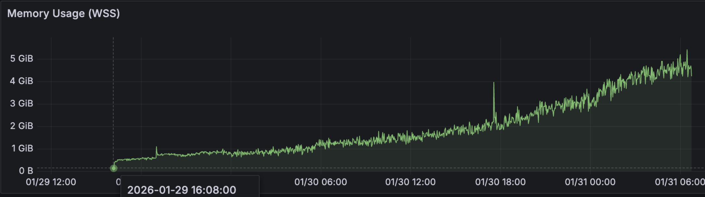

本文将基于此次内存泄漏问题的排查过程，介绍相关背景知识和分析工具。

## 术语

本部分介绍了内存分析中常用的术语，适用于不同语言的各种内存分析工具。

### 对象大小

将内存视为包含基元类型（例如数字和字符串）和对象（关联数组）的图。它在视觉上可以表示为包含多个相互关联的点的图表，如下所示：

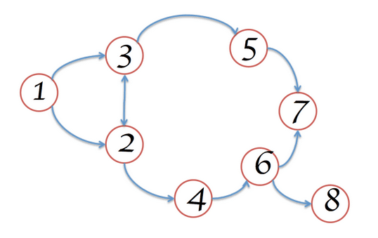

对象可以通过以下两种方式占用内存：

- 直接由对象本身占用。
- 通过隐式地持有对其他对象的引用，阻止垃圾回收器自动回收这些对象。

在 DevTools 中使用堆分析器（Heap Profiler）时，主要关注 Shallow Size 和 Retained Size 两个指标。

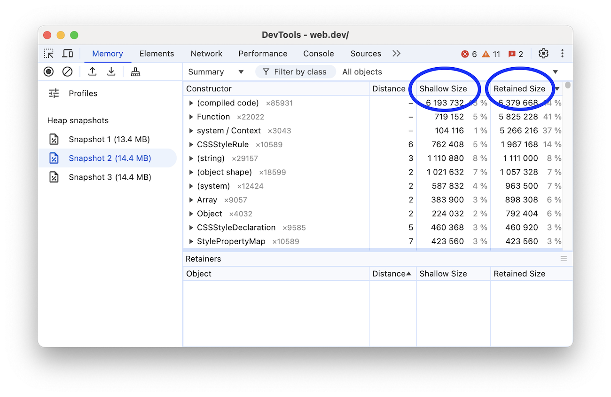

### 浅层大小 Shallow Size

这是对象本身占用的内存大小。

典型的 JavaScript 对象会预留一些内存来存储其描述信息和直接值。通常，只有数组和字符串可以具有较大的浅层大小。不过，字符串和外部数组的主要存储空间通常位于渲染程序内存中，并且只在 JavaScript 堆上公开一个小型封装容器对象。

渲染程序内存是指用于渲染受检页面的进程的所有内存：原生内存 + 页面的 JS 堆内存 + 由页面启动的所有专用工作器的 JS 堆内存。不过，即使是小对象，也可以通过阻止自动垃圾回收进程处置其他对象，间接占用大量内存。

### 保留的大小 Retained Size

这是在删除对象本身及其无法从 **GC Root**访问的依赖对象后释放的内存大小。

**GC Root**由从原生代码引用 V8 外部 JavaScript 对象时创建的*Handler*（局部或全局）组成。可以在堆快照的 **GC Root** > **Handle 作用域**和 **GC Root ** > **Global Handler**下找到所有此类Handler。

存在许多内部 GC Root，其中大多数对用户而言并不重要。从浏览器的角度来看，根有以下几种：

- 窗口全局对象（在每个 iframe 中）。堆快照中有一个距离字段，该字段是从窗口到最短保留路径上的属性引用数量。
- 文档 DOM 树，由遍历文档可访问的所有原生 DOM 节点组成。其中有些可能没有 JS 封装容器，但如果有，则封装容器会在文档有效期间保持有效。
- 有时，调试器上下文和开发者工具控制台可能会保留对象（例如在控制台求值后）。创建堆快照时，应确保控制台已清空且调试器中没有活动断点。

内存图从根开始，该根可以是浏览器的 `window` 对象，也可以是 Node.js 模块的 `Global` 对象。无法控制此根对象被 GC 回收的方式。


从根无法访问到的任何对象都会被 GC 回收（即可达性分析）。

### 对象保留树

堆（Heap）是一个由相互连接的对象构成的网络。在数学领域，这种结构被称为**图**（Graph）或**内存图**。图由通过**边**（Edges）连接的**节点**（Nodes）组成，节点和边都有各自的标签。

- **节点**（或对象）使用用于构建它们的**构造函数**（Constructor）的名称进行标记。
- **边**使用**属性**（Properties）的名称进行标记。

在 Heap Profiler 记录中，我们可以看到一些值得关注的信息，其中包括**距离(Disatance)**：即对象到 **GC Root**（垃圾回收根节点）的距离。如果几乎所有同类型的对象都位于相同的距离，却有少数几个对象的距离更远，这种情况就值得深入调查了。

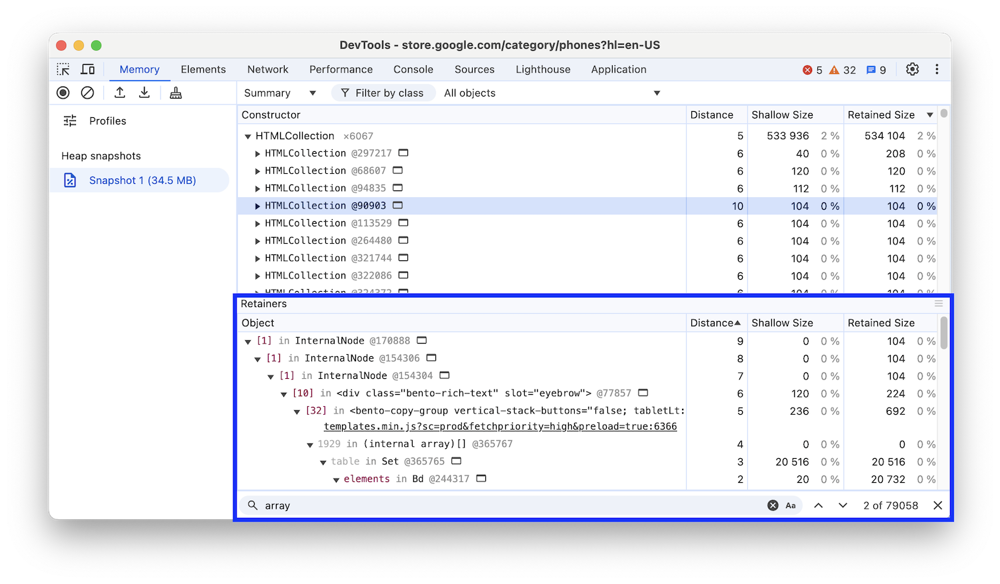

### 支配者Retainers

**支配者对象**由树状结构组成，因为每个对象有且仅有一个直接支配者。一个对象的支配者可能并不包含对其所支配对象的直接引用；也就是说，支配者树并不是原图的生成树。

> 生成树是一个连通的图的子图。
>
> 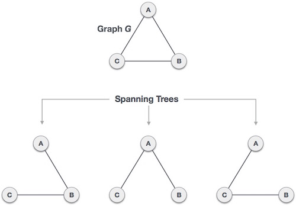

**在下图（逻辑）中：**

- 节点 1 支配节点 2

  > 到达后续所有节点的路径都必须经过 1

- 节点 2 支配节点 3、4、6

  > 节点 6 同时被 3 和 4 引用。如果移除 3，节点 6 仍可以通过 4 存活；如果移除 4，节点 6 仍可以通过 3 存活。因此，3 和 4 都不单独支配 6。节点 2 是到达 6 的最近的共同必经节点。

- 节点 3 支配节点 5

  > 5到达后续所有节点的路径都必须经过3

- 节点 5 支配节点 8

- 节点 6 支配节点 7

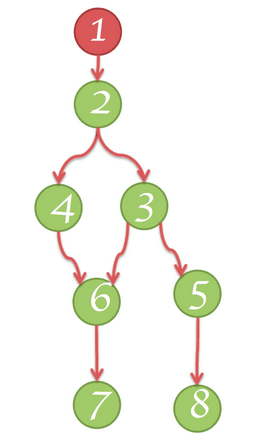

在以下示例中，节点 **#7**、**#3** 以及 **GC** 都是节点 **#10** 的**支配者**，因为它们存在于从根节点 (GC) 到节点 #10 的每一条路径上。特别地，**#7** 是节点 #10 的**直接支配者 (Immediate Dominator)**，因为它是从 GC 到 #10 的路径上距离 #10 最近的支配者。

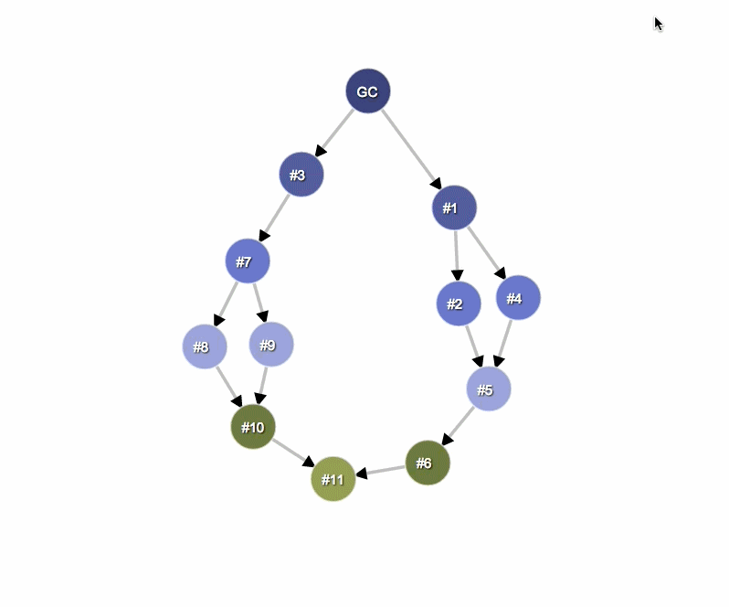

### V8 特性

在进行内存分析时，理解堆快照为何呈现某种形态是非常有帮助的。

#### JavaScript 对象表示

JavaScript 有三种原始类型：

- **数字**（例如 3.14159...）
- **布尔值**（true 或 false）
- **字符串**（例如 'Werner Heisenberg'）

它们不能引用其他值，因此在内存图中始终是**叶子节点**。

**数字**可以通过以下两种方式存储：

1. 作为直接的 31 位整数值，称为**小整数**；
2. 作为堆对象，称为**堆数字**。堆数字用于存储不符合小整数格式的值（例如**双精度浮点数**），或者当一个值需要被**装箱**时（例如在该数字上设置属性）。

**字符串**可以存储在：

1. **VM 堆**中；
2. 外部的**渲染器内存**中。在这种情况下，会创建一个**包装对象**用于访问该外部存储。例如，从 Web 接收的脚本源码和其他内容通常存储在外部，而不是直接拷贝到 VM 堆中。

新 JavaScript 对象的内存是从一个专用的 JavaScript 堆（或 **VM 堆**）中分配的。这些对象由 V8 的垃圾回收器管理，因此，只要至少存在一个指向它们的**强引用**，它们就会一直存活。

> 强引用是指一个对象直接引用另一个对象，或者通过一系列对象间接引用另一个对象。只要存在强引用，垃圾回收器就不会回收被引用的对象。

```typescript
// a 是一个强引用，指向一个对象
const a = { name: 'Alice' }
// b 是一个强引用，指向 a 引用的对象
const b = a
// c 是一个弱引用，指向 a 引用的对象
const c = new WeakRef(a)
// weakmap 是一个弱引用，指向 a 引用的对象
const weakmap = new WeakMap()
weakmap.set(a, 'some value')
```

**原生对象**是指除 JavaScript 堆之外的所有其他对象。与堆对象不同，原生对象在其整个生命周期内不由 V8 垃圾回收器管理，并且只能通过其 JavaScript **包装对象**从 JavaScript 中访问。

> 由 **宿主环境**提供，而不是由 V8 引擎本身直接生成的对象。V8 只是一个 JavaScript 引擎，它被嵌入在不同的宿主环境中。
>
> 在浏览器环境中可以是 DOM、BOM；在 Node.js 端可以是 C++ Addon 等。

**串接字符串**是一种由成对的字符串存储并连接而成的对象，它是字符串拼接的结果。**串接字符串**内容的连接操作仅在需要时才会发生。例如，当需要构建一个已连接字符串的子串时，才会进行实际的连接。

- 例如，如果你将 `a` 和 `b` 拼接，你会得到一个表示拼接结果的字符串 `(a, b)`。如果你稍后将 `d` 与该结果拼接，你会得到另一个串接字符串 `((a, b), d)`。

**数组** —— 数组是带有数字键的对象。它们在 V8 VM 中被广泛用于存储大量数据。那些像字典一样使用的键值对集合，其底层通常也是由数组支持的。

一个典型的 JavaScript 对象可以使用两种数组类型来进行存储：

- **命名属性**
- **数字元素**

如果属性的数量非常少，它们可以直接存储在 JavaScript 对象**内部**。

**Map** —— 这是一个描述对象种类及其布局的对象。例如，Map 用于描述隐式的对象层次结构，以实现**快速属性访问**。

#### 对象组

每个**原生对象组**由相互引用的对象组成。以 DOM 子树为例，每个节点都有一个指向其父节点的链接，以及指向下一个子节点和下一个兄弟节点的链接，从而形成一个连通图。请注意，原生对象并不在 JavaScript 堆中表示——这就是为什么它们的大小显示为零。相反，V8 会创建**包装对象**。

每个包装对象都持有一个指向对应原生对象的引用，用于将命令重定向给它。反过来，对象组也持有这些包装对象。然而，这并不会创建一个无法回收的循环引用，因为 GC 足够智能，可以释放那些包装器不再被引用的对象组。但是，只要**忘记释放其中任何一个包装器**，就会导致整个组及其关联的包装器都被保留。

## Chrome 开发者工具

由于主要关注 Node.js 内存泄漏问题，我们将使用 Chrome DevTools 进行分析。虽然 Chrome DevTools 主要面向浏览器环境，但它同样可以用于分析 Node.js 应用程序的堆快照。

### Summary视图

初始状态下，堆快照会在 **Summary** 视图中打开，该视图将 **Constructor** 列在一列中。

**Constructor** 列以创建该对象的 JavaScript 构造函数命名；普通对象则基于其包含的属性命名，还有一些属于**特殊条目**。

所有对象首先按名称分组，其次按它们在源文件中的行号分组，例如 `source-file.js:line-number`。

你可以展开已分组的 **Constructor**，查看由它们实例化的具体对象。

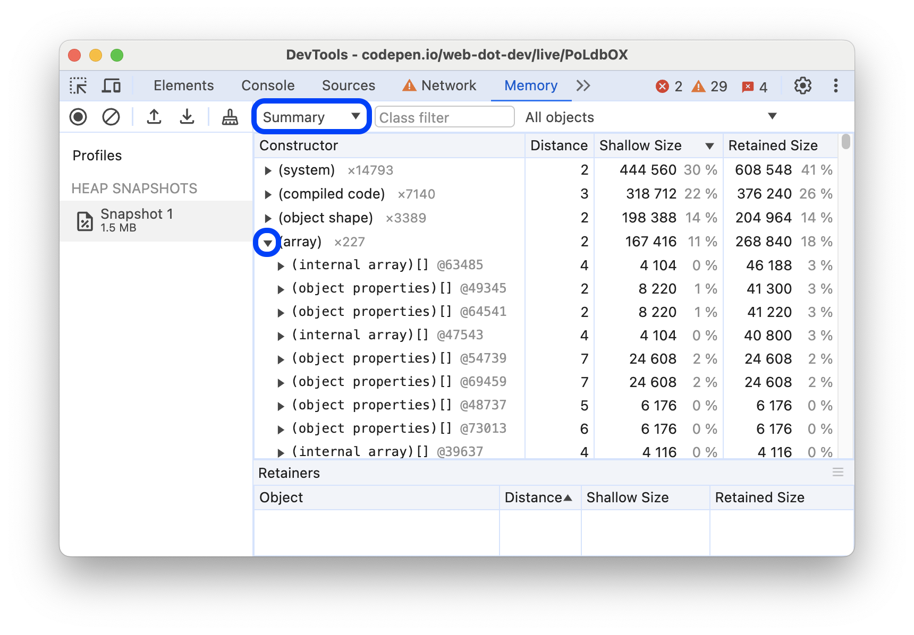

**Constructor** 名称旁的数字指示了由该 **Constructor** 创建的对象的总数量。**Summary** 视图还显示了以下列：

- **Distance**：显示了通过节点间的最短简单路径到达根节点（Root）的距离。
- **Shallow size**：显示了由特定 **Constructor** 创建的所有对象的 **Shallow size** 总和。**Shallow size** 是指对象自身所占用的内存大小。通常，数组和字符串具有较大的 **Shallow size**。
- **Retained size**：显示了同一组对象中最大的 **Retained size**。**Retained size** 是指通过删除一个对象，并使其依赖项不再可达，从而能够释放的内存大小。

**Summary** 视图允许根据低效内存使用的常见情况来筛选 **Constructor**。

要使用这些筛选器，请从操作栏最右侧的下拉菜单中选择以下选项之一：

- **All objects**：当前快照捕获的所有对象。这是默认设置。
- **Objects allocated before snapshot 1**：在拍摄第一个快照之前创建并保留在内存中的对象。
- **Objects allocated between Snapshots 1 and Snapshots 2**：查看最近一次快照与上一次快照之间的对象差异。每增加一个新的快照，都会在下拉列表中添加该筛选器的一个增量选项。
- **Duplicated strings**：在内存中被多次存储的字符串值。
- **Objects retained by detached nodes**：因为被分离的 DOM 节点（detached DOM node）引用而保持存活的对象。
- **Objects retained by the DevTools console**：因为在 DevTools 控制台中被求值（evaluated）或交互而保留在内存中的对象。

### Summary 中的特殊条目

除了按 **Constructor** 分组外，**Summary** 视图还通过以下方式对对象进行分组：

- **内置函数**，例如 `Array` 或 `Object`。
- **HTML 元素**，按其标签分组，例如 `<div>`、`<a>`、`` 等。
- **你在代码中定义的函数**。
- **特殊类别**，这些类别不基于 **Constructor**。

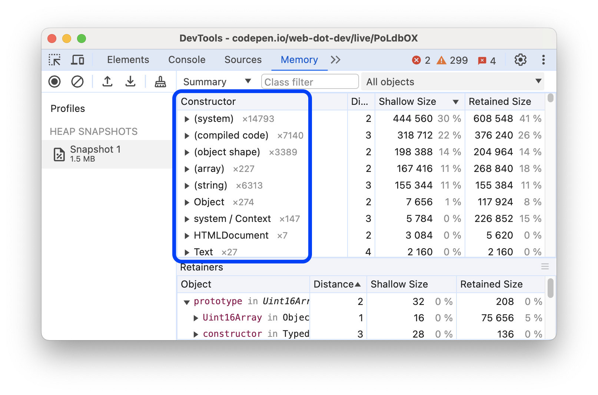

#### `(array)`

该类别包含各种内部的“类数组”对象，它们并不直接对应于 JavaScript 中可见的对象。

- 例如，JavaScript `Array` 对象的内容存储在一个名为 `(object elements)[]` 的次级内部对象中，以便更容易调整大小。
- 同样，JavaScript 对象中的命名属性通常存储在名为 `(object properties)[]` 的次级内部对象中，这些对象也列在 `(array)` 类别下。

#### `(compiled code)`

该类别包含 V8 为了运行由 JavaScript 或 WebAssembly 定义的函数所需的内部数据。每个函数可以用多种方式表示，从体积小但运行慢，到体积大但运行快。

- V8 会自动管理此类别中的内存使用。如果一个函数运行多次，V8 会为该函数使用更多内存，以便它能运行得更快（优化编译）。
- 如果一个函数有一段时间没运行，V8 可能会清除该函数的内部数据（去优化/释放）。

#### `(concatenated string)`

当 V8 连接两个字符串时（例如使用 JavaScript `+` 运算符），它可能会选择在内部将结果表示为“连接字符串”（concatenated string），也就是所谓的 **Rope** 数据结构。

- V8 不会将两个源字符串的所有字符复制到一个新字符串中，而是分配一个带有 `first` 和 `second` 内部字段的小对象，这两个字段分别指向两个源字符串。这让 V8 能够节省时间和内存。
- 从 JavaScript 代码的角度来看，这些只是普通字符串，它们的行为与其他任何字符串一样。

#### `(object shape)`

正如“V8 中的快速属性”中所述，V8 追踪**隐藏类**（hidden classes，或称为 **shapes**），以便可以高效地表示具有相同属性且顺序相同的多个对象。

- 此类别包含那些被称为 `system / Map`（注意：这与 JavaScript 的 `Map` 对象**无关**）的隐藏类及相关数据。

#### `(sliced string)`

当 V8 需要提取子字符串时（例如当 JavaScript 代码调用 `String.prototype.substring()` 时），V8 可能会选择分配一个**切片字符串**（sliced string）对象，而不是从原始字符串中复制所有相关字符。

- 这个新对象包含一个指向原始字符串的指针，并描述了要使用原始字符串中的哪个字符范围。
- 从 JavaScript 代码的角度来看，这些只是普通字符串，它们的行为与其他任何字符串一样。
- **注意**：如果一个切片字符串保留（retain）了大量内存（因为它引用了一个巨大的原始字符串），那么程序可能触发了 Issue 2869，并且可能需要采取特定步骤来“扁平化”（flatten）该切片字符串（例如强制进行复制）。

#### `system / Context`

类型为 `system / Context` 的内部对象包含来自**闭包**的局部变量——即嵌套函数可以访问的 JavaScript 作用域。

- 每个函数实例都包含一个指向其执行所在的 `Context` 的内部指针，以便它可以访问这些变量。
- 即使 `Context` 对象在 JavaScript 中并不直接可见，但你确实（通过代码逻辑）可以直接控制它们。

#### `(system)`

这个类别包含各种尚未被归类到更有意义类别中的内部对象。

### Comparison 视图

**Comparison** 视图允许你通过相互比较多个快照来查找泄漏的对象。例如，执行一个操作并将其撤销（如打开文档再将其关闭），不应遗留任何多余的对象。

要验证特定操作是否会导致内存泄漏，请执行以下步骤：

1. 在执行操作前拍摄一个堆快照。
2. 执行操作。即以某种你认为可能导致泄漏的方式与页面进行交互。
3. 执行反向操作。即进行相反的交互，并重复几次。
4. 拍摄第二个堆快照，将其视图切换为 **Comparison**，并与 **Snapshot 1** 进行比较。

**Comparison** 视图显示两个快照之间的差异。当展开一个汇总条目时，会显示新增和已删除的对象实例：

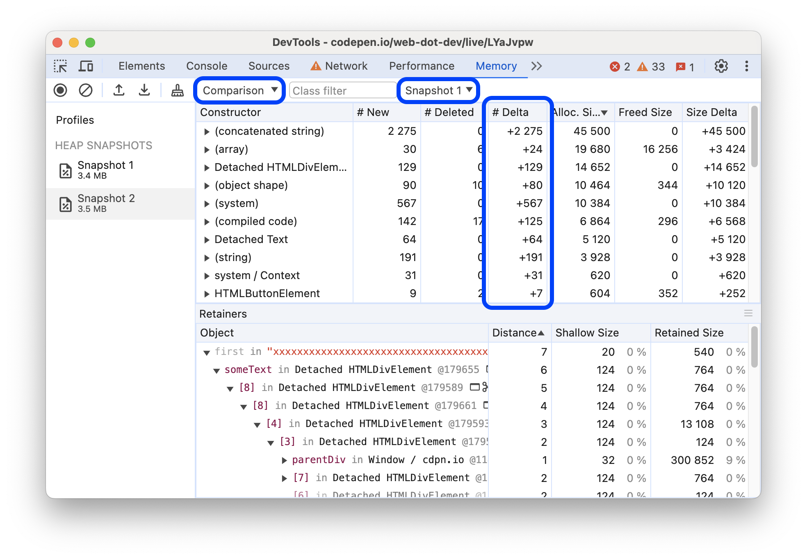

### Containment 视图

**Containment** 视图提供了应用程序对象结构的“鸟瞰图”。它允许你窥视函数**闭包**的内部，观察构成 JavaScript 对象的 **VM 内部对象**，并从非常底层的角度了解应用程序的内存使用情况。

该视图提供了以下几个入口点：

- **DOM Window objects**：JavaScript 代码的全局对象。
- **GC roots**：VM 的垃圾回收器使用的 **GC Root**。GC Root可以由内置对象映射、符号表、VM 线程栈、编译缓存、Handler作用域和全局Handler组成。
- **Native objects**：为了实现自动化而被“推入”JavaScript 虚拟机内部的浏览器对象，例如 DOM 节点和 CSS 规则。

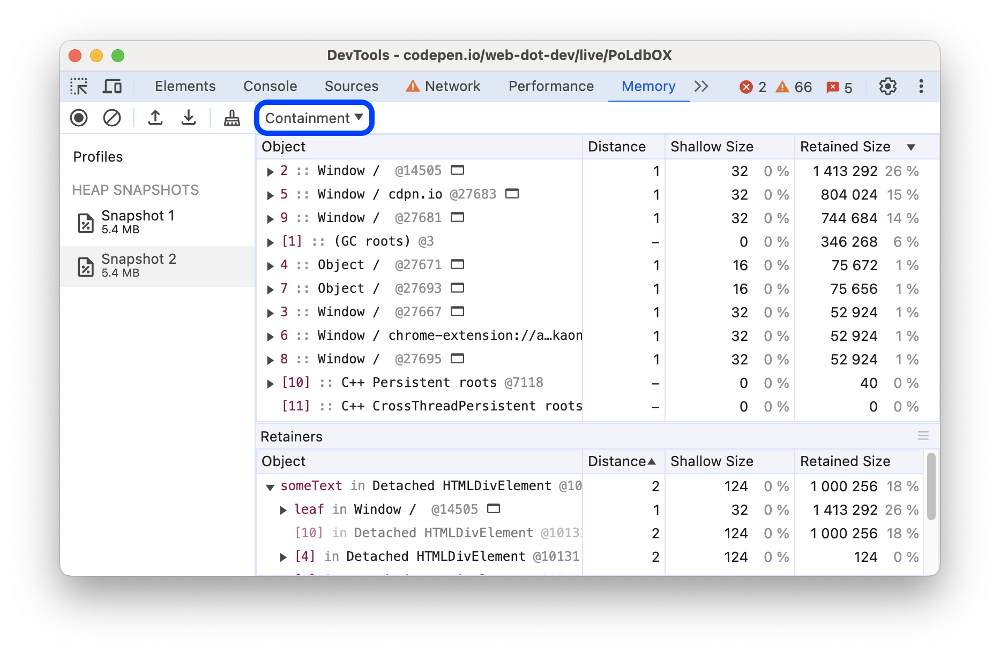

### Retainers 部分

**Memory** 面板底部的 **Retainers** 部分显示了指向（引用）视图中当前选中对象的对象。

当你在除 **Statistics** 之外的任何视图中选择不同的对象时，**Memory** 面板都会更新 **Retainers** 部分。

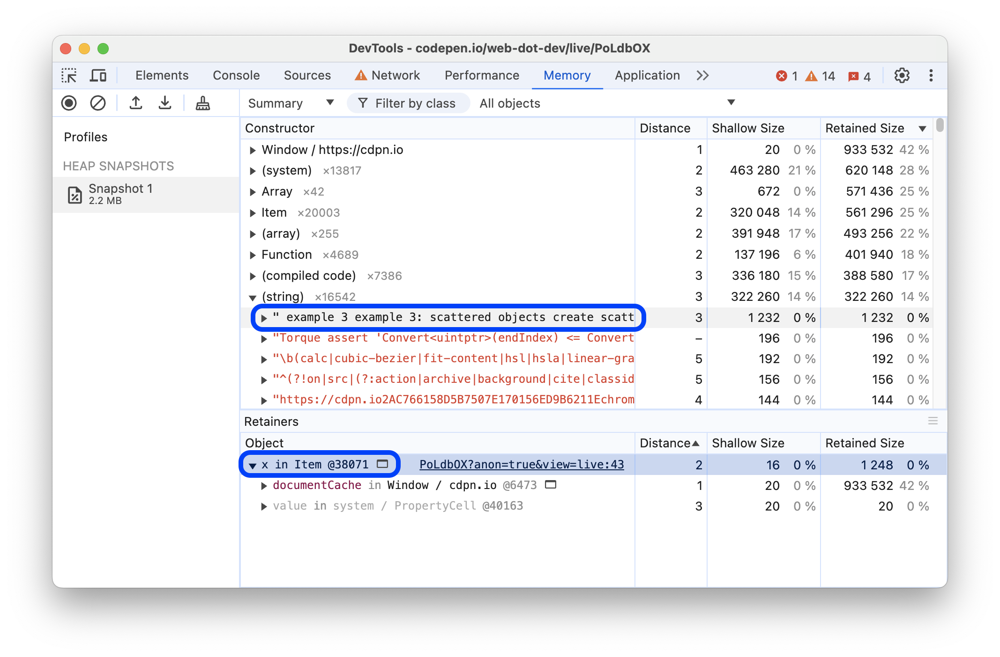

在这个例子中，选中的字符串被一个 `Item` 实例的 `x` 属性所保留。

### 忽略 Retainers

可以隐藏 **Retainers**，以查明是否还有**其他**对象保留了当前选中的对象。

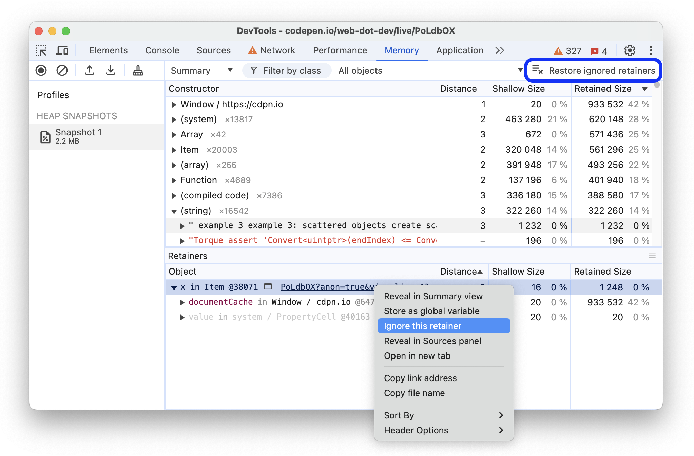

## 分析问题

要复现并捕获泄漏现场，需要在压测期间触发稳定的流量，同时在容器内采集堆快照。这里使用 wrk 对服务持续施压，再通过 pm2 观察各进程的内存占用，确认问题确实存在后，再用 Chrome DevTools 对堆快照进行比对分析。

**wrk 压测结果：**

```text
 wrk -t2 -c10 -d20s --latency --timeout 5s -s test_uri.lua http://localhost:4010
Running 20s test @ http://localhost:4010
  2 threads and 10 connections
  Thread Stats   Avg      Stdev     Max   +/- Stdev
    Latency   437.12ms  260.72ms   2.21s    93.53%
    Req/Sec    13.41      7.03    40.00     82.48%
  Latency Distribution
     50%  444.43ms
     75%  504.08ms
     90%  591.50ms
     99%    1.60s
  484 requests in 20.04s, 84.86MB read
  Non-2xx or 3xx responses: 250
Requests/sec:     24.15
Transfer/sec:      4.23MB
```

**压测后 pm2 各进程内存占用：**

| **id** | **name** | **mode** | **pid** | **uptime** | **status** | **cpu** | **mem** | **user** | **watching** |
| ------ | -------- | -------- | ------- | ---------- | ---------- | ------- | ------- | -------- | ------------ |
| 0      | v        | cluster  | 233     | 53s        | online     | 0%      | 401.4mb | root     | disabled     |
| 1      | v        | cluster  | 245     | 53s        | online     | 0%      | 398.1mb | root     | disabled     |
| 2      | v        | cluster  | 253     | 53s        | online     | 0%      | 627.5mb | root     | disabled     |
| 3      | v        | cluster  | 268     | 52s        | online     | 0%      | 540.5mb | root     | disabled     |

可以看到不同进程的内存差异较大，部分进程已明显偏高。接下来结合堆快照逐步排查泄漏根因。

### Comparison 视图定位泄漏方向

使用 Chrome DevTools 的 Comparison 视图对比压测前后的堆快照：

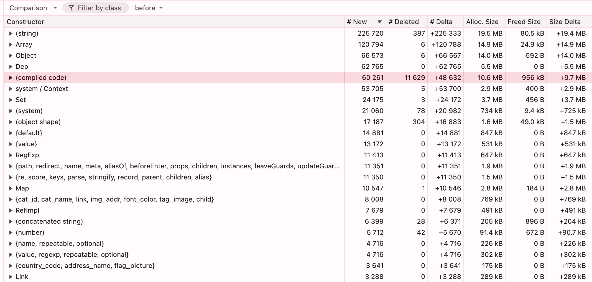

从对比结果中可以提取几个关键信号：

- **`(string)` / `Array` / `Object`**：新增数量最多，但这三类属于通用容器，仅凭它们无法定位问题，需要结合具体构造函数进一步下钻。
- **`Dep`**：新增 62765 个，Freed Size 为 **0 B**，完全没有被释放。`Dep` 是 Vue 响应式系统的依赖收集对象，正常情况下组件卸载后应随之回收，持续累积说明存在响应式订阅未被清理的情况。
- **`system / Context`**：新增 53700 个，几乎未释放。`Context` 对应闭包作用域，大量残留通常意味着有函数或回调被某处持续引用，无法被 GC 回收。
- **`{default}` / `{value}` / `RegExp` / 路由相关对象**（`{path, redirect, name…}` / `{re, score, keys…}`）：Freed Size 均为 **0 B**，只增不减。路由对象的数量不应随请求增长，这里的异常增量强烈暗示路由表或路由匹配器在每次请求时被重复创建，并挂载到了某个长期存活的引用上。

综合来看，泄漏的核心特征是：**与 Vue 响应式和路由相关的对象在压测期间持续累积，且释放量为零**。

泄漏对象的类型涉及多个模块（响应式、路由、闭包），说明根因很可能不在某个单一模块内部，而是某个上层入口在每次请求时创建了整棵对象树并持有了引用。接下来逐一排查可能的嫌疑点。

### 排除单例问题

怀疑日志服务的单例实现有问题——如果插件入口处每次调用 `getInstance` 时单例未能正确复用，就会重复创建 `ServerLogger` 实例，造成内存持续增长：

```typescript
export default defineNitroPlugin((nitroApp) => {
	const serverLogger = ServerLogger.getInstance({
		serverEmitter,
	})
})
```

通过堆快照在 Summary 视图中检索 `ServerLogger` 构造函数，可以看到内存中只存在一个实例：

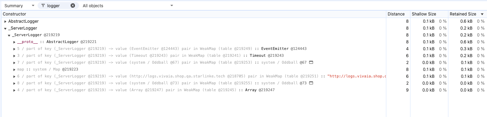

单例实现没有问题，**排除**。

### 排除监听器泄漏

另一个怀疑方向是事件监听器的重复注册。审查 `startTrack` 方法可以发现，`setInterval` 的重复创建虽然有 `#loggerTimer` 守卫，但 `on` 的调用却没有类似的防重入保护——如果 `startTrack` 被多次调用，监听器就会不断累积：

```typescript
class Logger {
	startTrack(): void {
		this.#serverEmitter.on('nuxtNodeLog', (reqData) => {
			this.#traceData.push(reqData)
		})
		if (this.#loggerTimer) return
		// eslint-disable-next-line custom/no-setinterval-server
		this.#loggerTimer = setInterval(() => {
			if (process.env.NODE_ENV === 'development') {
				return
			}
			if (this.#traceData.length > 0) {
				// 每次处理10条日志
				const reqDataList = this.#traceData.splice(
					0,
					Math.min(this.#traceData.length, 10)
				)
				this.#handleLogs(reqDataList)
			}
		}, 500)
	}
}
```

通过堆快照验证监听器数量：

1. 找到单例的 `ServerLogger` 实例（内存标识 @219219）
   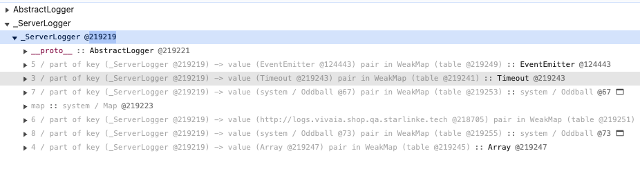
2. 顺藤摸瓜找到其持有的 `EventEmitter` 实例（内存标识 @124443）
   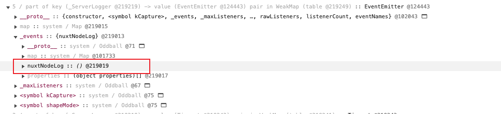
   `nuxtNodeLog` 指向 `() @219019`，是一个函数而非数组，说明当前只有一个监听器。

同样没有异常，**排除**。

> Tips：Node.js 的 `EventEmitter` 为了优化性能，对监听器的存储方式做了区分：
>
> - **单个监听器**：`_events.eventName` → `Function`
> - **多个监听器**：`_events.eventName` → `Array`
>
> 因此在堆快照中，只需观察对应事件名的值类型，即可快速判断监听器是否重复注册。

### 沿 Retainers 追踪引用链

排除了单例和监听器两个方向后，回到堆快照本身。在手动调用 `global.gc()` 后重新观察 Summary 视图，大量业务对象仍未被回收，且数量持续增长：

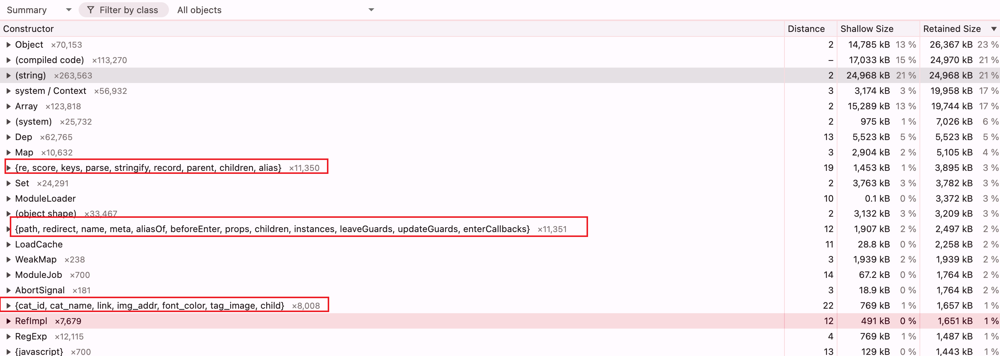

展开 Nuxt 的路由对象，可以看到 Distance 列显示为 `-`：

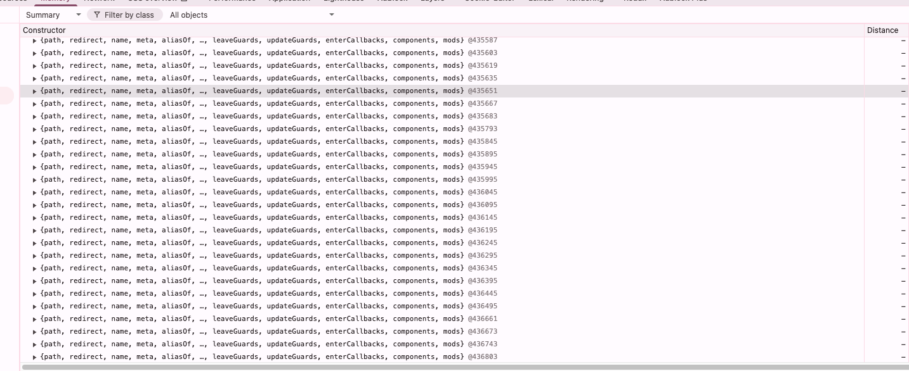

> Distance 为 `-` 表示这些对象从 GC Root 不可达——按理应该被垃圾回收器回收，但它们仍然驻留在堆中，说明有其他机制在阻止回收。

选中内存标识 @435451 的路由对象，查看下方的 **Retainers** 面板，可以看到它被一个 `system / Context` 对象所保留——这正是前文介绍的闭包作用域对象：

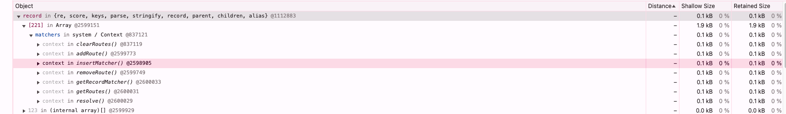

继续追踪 Context @837121 的 Retainers，发现它被 **DevTools console** 所保留：

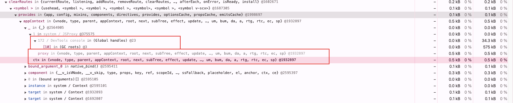

在其他大量 `system / Context` 对象中也能看到相同的 Retainers 指向——全部被 DevTools console 保留：

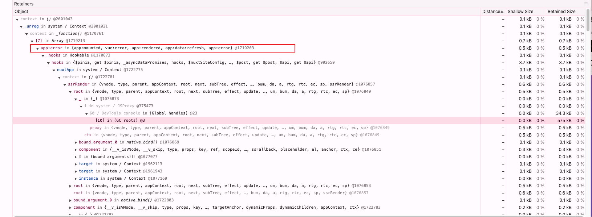

至此，引用链已经清晰：**业务对象 → 闭包 Context → DevTools console（全局Handler）**。

### Containment 视图确认全局Handler

为了进一步验证，切换到 Containment 视图，找到 Global Handles @23：

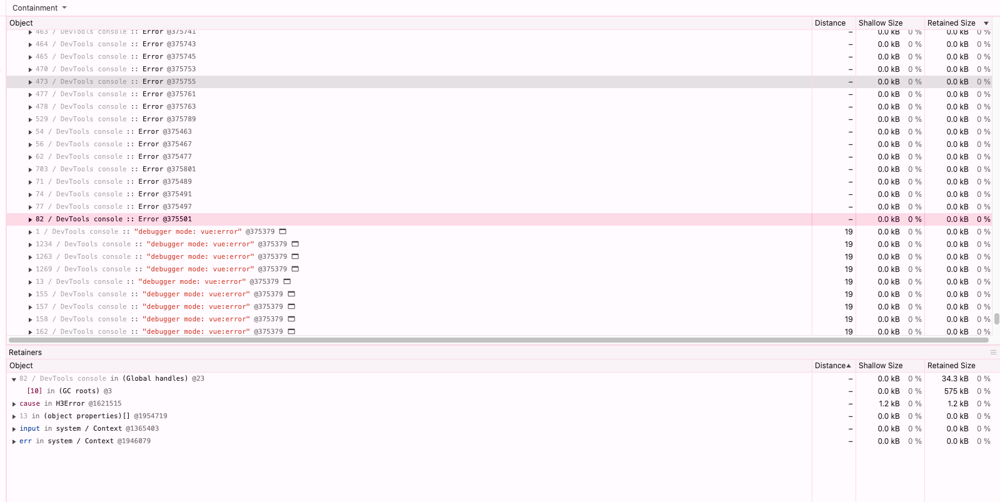

该全局Handler明确持有字符串 `debugger mode: window.unhandledrejection` 和大量 `Error` 对象的引用。这些 `Error` 对象又通过闭包作用域间接引用了路由对象、Vue 响应式对象等业务数据，形成了一条完整的泄漏链。

### 定位业务代码

结合全局Handler中的 `debugger mode` 字符串，在代码中定位到以下逻辑：

```ts
nuxtApp.hook('app:error', (error) => {
	const isDebuggerMode = getIsDebuggerMode()
	if (isDebuggerMode) {
		console.error('debugger mode: app:error', error)
	}
})

export function getIsDebuggerMode() {
	if (import.meta.client) {
		const urlParams = new URLSearchParams(window.location.search)
		return urlParams.has('debugger')
	}
	if (import.meta.dev) {
		return false
	}
	return true
}
```

问题在于：

1. `getIsDebuggerMode()` 在服务端（非 `client`、非 `dev`）始终返回 `true`。
2. 每次请求出错时，`app:error` 钩子都会执行 `console.error`，将 `Error` 对象写入标准错误输出。
3. Node.js 的 `console` API 会以**全局Handler**的形式保留对输出对象的引用，阻止 GC 回收。
4. `Error` 对象通过闭包和调用栈间接引用了大量业务对象（路由表、Vue 响应式依赖等），这些对象也随之无法被回收。
5. 随着请求不断到来，未释放的对象持续累积，内存稳步增长，最终引发 OOM。

## 总结

在高频请求路径上通过 `console.error` 输出了包含复杂引用关系的 `Event` 对象。`Event` 又循环引用了大量业务对象（路由表、Vue 响应式依赖等），导致这些对象无法被 GC 回收，形成了内存泄漏。

```ts
console.log(obj)
```

执行流程是：

1. 调用 `util.inspect(obj)`
2. 生成字符串
3. 写入 stdout
4. obj 的引用立即释放（如果没有其他引用）

- **机制**：当向 `process.stdout`（底层为 socket）写入数据时，如果写入速度远大于终端/文件的消费速度，Node 会在 C++ 层创建 `WriteWrap` 或 `ReqWrap` 对象来管理异步 I/O 队列。
- **泄露原因**：`WriteWrap` 会使用 Global Handle 锁定当前正在写入的数据块以防止在 I/O 期间被 GC。如果被锁定的数据块通过某种闭包（Closure）意外关联到了原始的被打印对象，就会导致一连串的内存驻留。
