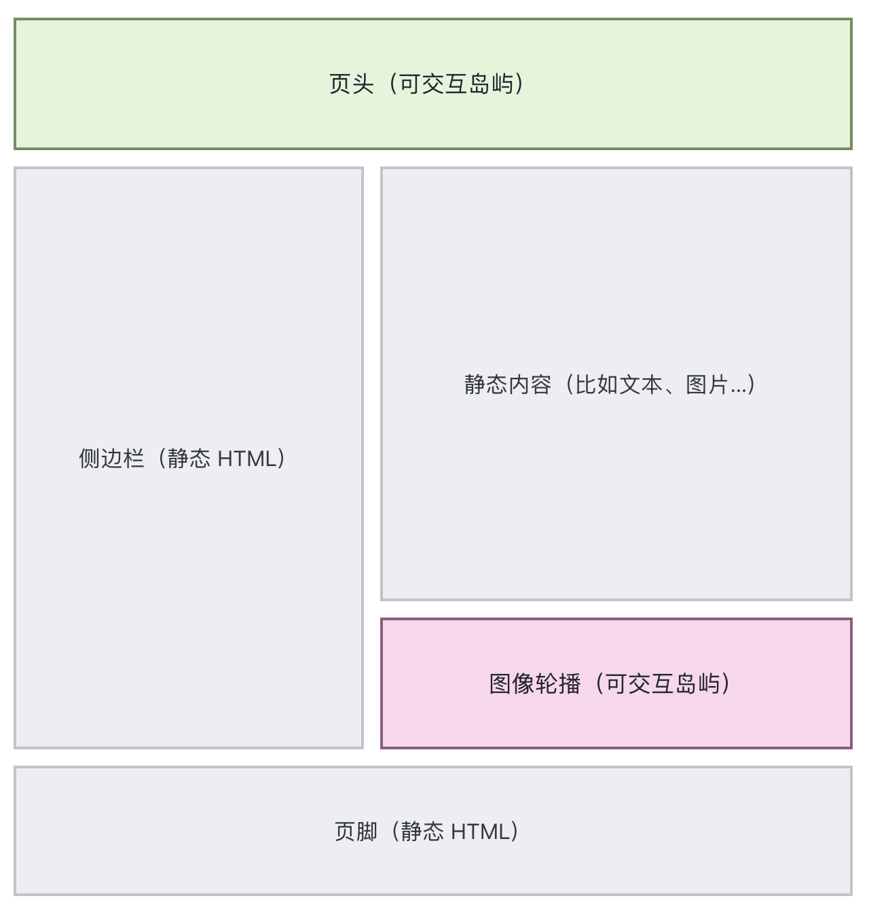

<!-- 搞一个keynote风格的演讲稿 纯前端 Framer
Motion（React 技术宣讲神器） 适合：对外技术页 / Keynote 风格宣讲 -->

## 引言

在现代前端开发中，静态站点生成器（SSG）因其高性能和良好的用户体验而受到广泛关注。Astro 作为一种新兴的静态站点生成器，凭借其独特的架构和优化策略，为开发者提供了强大的工具来构建高效的静态网站。本文将探讨基于 Astro 的高性能 SSG 方案，介绍其核心概念、优势以及实际应用案例。

## 前置知识

在深入了解基于 Astro 的高性能 SSG 方案之前，读者需要具备以下前置知识：

### 核心概念

- **水合**: 了解VUE/React等前端框架的水合原理
- **SSG**：了解 SSG 的基本原理和工作流程。
- **Astro 框架**：了解 Astro 的基本使用方法和特点。

## 水合

Dan Abramov（Create React App 和 Redux）对 Hydration 的定义是：_“Hydration 就像用用户交互和事件处理程序的‘水’来浇灌‘干燥的’HTML。”_

### CSR**客户端渲染**

客户端渲染是指所有页面都直接在浏览器中使用 JavaScript 加载和渲染。这样，浏览器负责处理所有请求（_数据获取_）、管理加载状态以及其他交互操作。


> 代码结构

```html
<!DOCTYPE html>
<html lang="en">
	<head>
		<meta charset="UTF-8" />
		<title>CSR Example</title>
	</head>
	<body>
		<!-- 注意这里几乎没有内容，只有一个挂载点 -->
		<div id="root"></div>

		<!-- JavaScript 负责渲染整个页面 -->
		<script src="/bundle.js"></script>
	</body>
</html>
```

### SSR服务端渲染

在服务器端渲染（SSR）中，页面在服务器端使用 JavaScript 生成，并以 HTML 格式发送给客户端。此过程优化了服务器端的数据获取，从而提升了用户体验。在 SSR 中，初始 HTML 加载完毕后，交互所需的 JavaScript 代码会在后台加载。


> 代码结构

```html
<!DOCTYPE html>
<html lang="en">
	<head>
		<meta charset="UTF-8" />
		<title>SSR Example</title>
	</head>
	<body>
		<!-- 服务器已经渲染好 HTML -->
		<div id="root">
			<h1>欢迎来到 SSR 页面</h1>
			<p>这是服务器端渲染生成的内容。</p>
			<button onclick="alert('按钮点击事件')">点击我</button>
		</div>

		<!-- JavaScript 只负责 Hydration -->
		<script src="/bundle.js"></script>
	</body>
</html>
```

### **什么是水合**

**水合Hydration**是指将服务器端预渲染的 HTML 代码在浏览器中实现交互的过程。换句话说，框架(React,Vue)会检查现有的 HTML 代码，并关联必要的 JavaScript 代码来激活组件，从而实现交互功能。

这样可以加快页面加载速度，因为静态内容（初始 HTML）会快速加载，交互功能随后才会启用。

这种做法结合了 SSR 和 CSR（客户端渲染）的优点：

- **服务器端渲染（SSR）** 提供了更快的首屏加载时间和更好的 SEO。
- **客户端渲染（CSR）** 提供了更丰富的交互体验。


> 值得注意的是，*水合作用*并不直接适用于仅在客户端运行的库或框架（_仅限客户端_），例如仅在客户端使用的 React。

除了传统的 Web 开发和现代前端框架外，在一些其他场景中也存在类似的 Hydration 过程：

- **静态站点生成（SSG）** ：在静态站点生成器（如 Gatsby、Next.js 的静态导出模式）中，初始页面会在构建时生成静态 HTML。客户端加载后，这些静态内容通过 JavaScript 变得动态和可交互。
- **增量静态渲染（ISR）** ：某些现代框架（如 Next.js 提供的 ISR）允许静态页面在构建后的特定时间内动态更新，而客户端加载的过程中依然需要进行 Hydration。

## SSG

### 什么是静态网站生成器？

静态网站生成器是一种基于原始数据和一组模板生成完整静态 HTML 网站的工具。从本质上讲，静态站点生成器自动完成对单个 HTML 页面进行编码的任务，并让这些页面提前准备好为用户提供服务。因为这些 HTML 页面是预先构建的，所以它们可以在用户的浏览器中非常快速地加载。

静态网站生成器是内容管理系统 (CMS) 的替代品，后者是另一种用于管理 Web 内容、生成网页和实施模板的工具。（模板是 Web 内容的可重用格式；开发人员使用模板来避免一遍又一遍地编写相同的格式。）

### 什么是静态网站？

静态网站由一个或多个 HTML 网页组成，这些网页每次都以相同的方式加载。静态网站与动态网站形成对比，动态网站根据一些不断变化的数据输入（例如用户的位置、一天中的时间或用户操作）进行不同的加载。静态网页是可以快速加载的简单 HTML 文件，而动态网页需要在浏览器中执行 JavaScript 代码才能呈现。

### 静态网站生成器和 CMS 之间有什么区别？

在互联网的早期，网站被存储为静态 HTML 站点，所有网页都预先布局和硬编码。这是低效的，因为它需要开发人员手动编码每个网页。

内容管理系统 (CMS) 的出现让开发人员能够避免所有这些手动设置。内容存储在 CMS 数据库中，而不是提前对页面进行编码，当用户请求页面时，服务器会执行以下操作：

1. 查询数据库，寻找正确的内容
2. 识别该内容将适合的模板
3. 生成页面
4. 向用户提供页面

CMS 中的内容必须适合 CMS 数据库提供的字段之一，但只要符合要求，它就应该每次都出现在网站上的适当位置。

静态站点生成器是这两种方法的折衷方案。与 CMS 一样，它允许开发人员使用模板并自动生成网页——但它会提前完成后者，而不是响应用户的请求。这可以提高[网站性能](https://www.cloudflare.com/learning/performance/why-site-speed-matters/)，因为网页可以立即交付给最终用户。它还为开发人员提供了更大的定制能力，因为他们不受 CMS 提供的数据库字段的限制。

### 使用静态站点生成器有哪些优缺点？

#### 优点

- **性能**因为静态站点生成器提前而不是按需（比如使用 CMS）创建网页，所以网页在用户浏览器中的加载速度稍快。
- **定制**开发人员可以创建他们想要的任何模板。它们不受 CMS 提供的字段限制，也不受 CMS 内置模板的限制。
- **更轻的后台**静态网站是轻量级的，不需要在服务器端运行那么多代码，而基于 CMS 的网站会不断地向服务器端查询内容。

#### 缺点

- **很少或没有预制模板**无限定制的缺点是可能需要更长的时间才能开始。许多静态网站生成器不附带模板，开发人员一开始要花很多时间从头开始建立模板。
- **没有用户友好的界面**非开发人员用户更难使用静态站点生成器发布内容。没有 CMS 界面，处理未格式化的原始数据可能会让用户望而生畏。此外，进行网站更新通常需要开发人员支持。

## Astro

**Astro 是一个集多功能于一体的 Web 框架。**它内置包含了你构建网站所需的一切。还有数百个不同的[集成](https://astro.build/integrations/)和 [API 钩子](https://docs.astro.build/zh-cn/reference/integrations-reference/)可根据你的具体用例和需求定制你的项目。**Astro** 是最适合构建像博客、营销网站、电子商务网站这样的**以内容驱动的网站**的 Web 框架。Astro 以开创了一种新的[前端架构](https://docs.astro.build/zh-cn/concepts/islands/)而闻名，与其他框架相比它减少了 JavaScript 的开销和复杂性。如果你需要一个加载速度快、具有良好 SEO 的网站，那么 Astro 就是你的选择。

一些亮点包括：

- **[群岛](https://docs.astro.build/zh-cn/concepts/islands/)**：一种基于组件的针对内容驱动的网站进行优化的 Web 架构。
- **[UI 无关](https://docs.astro.build/zh-cn/guides/framework-components/)**：支持 React、Preact、Svelte、Vue、Solid、HTMX、Web 组件等等。
- **[服务器优先](https://docs.astro.build/zh-cn/guides/on-demand-rendering/)**：将沉重的渲染移出访问者的设备。
- **[默认无 JS](https://docs.astro.build/zh-cn/basics/astro-components/)**：让客户端更少的执行 JS ，以提升网站速度。
- **[内容集合](https://docs.astro.build/zh-cn/guides/content-collections/)**：为你的 Markdown 内容，提供组织、校验并保证 TypeScript 类型安全。
- **[可定制](https://docs.astro.build/zh-cn/guides/integrations-guide/)**：Partytown、MDX 和数百个集成可供选择。

### 群岛架构

> “群岛” 架构的总体思想看似简单：在服务器上渲染 HTML 页面，并在高度动态的区域周围注入占位符或插槽 […] 这些区域随后可以在客户端 “激活” 成为小型独立的小部件，重用它们服务器渲染的初始 HTML。 — Jason Miller, Preact 的创造者

这种架构模式所依赖的技术也被称为 **局部化**或**选择性激活**。

渐进式水合技术在 React、Angular、Preact 和 Vue 等框架中的性能优势。在这些架构中，页面上的各个组件会随着时间的推移逐步加载和初始化。这可以通过 requestIdleCallback 实现简单的调度，也可以考虑视口可见性、交互可能性、产品价值等其他因素。

与渐进式水合作用类似，使用岛屿架构渲染页面，不仅能逐步初始化页面中较复杂的动态部分，还能*分别*初始化。这意味着页面的各个区域无需先加载其他内容即可实现交互。

与渐进式水合作用不同，基于**岛屿架构**构建的方法不需要自顶向下渲染。这是一个显著的优势，因为没有必须在子组件初始化之前初始化的外部“根”组件。页面的每个部分都是一个独立的单元，一个单元中的性能问题不会影响其他单元。



### Astro的群岛架构实现

```ts
class AstroIsland extends HTMLElement {
	public Component: any
	public hydrator: any

	async connectedCallback() {
		// 等待子节点加载完成（处理 HTML 流式传输的情况）
		if (
			this.hasAttribute('await-children') &&
			document.readyState !== 'complete'
		) {
			const mo = new MutationObserver(() => {
				if (this.lastChild?.nodeValue === 'astro:end') {
					mo.disconnect()
					this.start()
				}
			})
			mo.observe(this, { childList: true })
		} else {
			this.start()
		}
	}

	async start() {
		const opts = JSON.parse(this.getAttribute('opts')!)
		const directive = this.getAttribute('client') as string // 如: 'load', 'visible'

		// 调用指令对应的加载策略 (例如：在空闲时加载、在可见时加载)
		if (Astro[directive] === undefined) {
			window.addEventListener(`astro:${directive}`, () => this.start(), {
				once: true,
			})
			return
		}

		await Astro[directive]!(
			async () => {
				const rendererUrl = this.getAttribute('renderer-url')
				// 1. 动态导入：并行加载组件代码和注水器(Hydrator)代码
				const [componentModule, { default: hydrator }] = await Promise.all([
					import(this.getAttribute('component-url')!),
					rendererUrl ? import(rendererUrl) : () => () => {},
				])

				// 2. 确定导出组件的名字（默认是 'default'）
				const exportName = this.getAttribute('component-export') || 'default'
				this.Component = componentModule[exportName]
				this.hydrator = hydrator

				return this.hydrate // 返回注水函数供指令调用
			},
			opts,
			this
		)
	}

	hydrate = async () => {
		if (!this.hydrator || !this.isConnected) return

		// 递归等待：如果父级也是孤岛且未激活，先等父级注水，确保自顶向下激活
		const parentSsrIsland = this.parentElement?.closest('astro-island[ssr]')
		if (parentSsrIsland) {
			parentSsrIsland.addEventListener('astro:hydrate', this.hydrate, {
				once: true,
			})
			return
		}

		// 解析插槽 (Slots)
		const slots: Record<string, string> = {}
		for (const slot of this.querySelectorAll('astro-slot')) {
			if (slot.closest(this.tagName) !== this) continue
			slots[slot.getAttribute('name') || 'default'] = slot.innerHTML
		}

		// 解析 Props（通过前面的 revive 逻辑）
		const props = this.hasAttribute('props')
			? reviveObject(JSON.parse(this.getAttribute('props')!))
			: {}

		// 最终注水：调用渲染器（如 React, Vue 的渲染函数）将组件挂载到 DOM
		const hydrator = this.hydrator(this)
		await hydrator(this.Component, props, slots, {
			client: this.getAttribute('client'),
		})

		// 标记注水完成，触发事件
		this.removeAttribute('ssr')
		this.dispatchEvent(new CustomEvent('astro:hydrate'))
	}
}

// 注册自定义元素
if (!customElements.get('astro-island')) {
	customElements.define('astro-island', AstroIsland)
}
```

## 技术取舍

在选择使用 Astro 作为静态站点生成器时，需要考虑以下技术取舍：

- **性能 vs. 灵活性**：Astro 默认情况下提供了出色的性能，但在某些情况下，可能需要牺牲一些灵活性来实现最佳性能。
- **集成复杂性**：将 Astro 集成到现有项目中可能需要额外的工作，特别是如果现有项目已经使用了其他框架或技术栈。

在团队主应用采用Nuxt的情况下,经过综合考虑,决定采用Astro 结合Vue 3 来实现高性能的静态站点生成方案。以此达到性能和开发效率的平衡。

### 为什么?

在主应用采用Nuxt 框架的情况下，使用Astro结合Vue 3 有以下优势：

1. **无额外性能成本** : Astro 支持多种前端框架（包括 Vue 3），因此可以无缝集成到现有的 Vue 3 项目中.而主应用采用Nuxt 框架,本身也是基于Vue 3 构建的. 这样可以最大限度地减少性能开销。 可以将Astro 生成的静态内容直接嵌入到 Nuxt 应用中.需要客户端水合的部分,只需加载必要的Vue3即可.而 Vue 3 本身已经由 Nuxt 应用加载, 所以 不会引入额外的框架开销。
2. **提升性能** : Astro 的群岛架构允许只为需要交互的部分加载 JavaScript，从而显著减少初始加载时间和提高页面响应速度。这对于提升用户体验和 SEO 非常有利。
3. **开发效率** : 使用 Vue 3 作为前端框架，可以利用现有的 Vue 生态系统和工具链，提高开发效率。同时，Astro 提供了简洁的语法和强大的功能，使得构建静态站点更加高效。

## 那么问题来了

如何优雅的将Astro 集成到现有项目中？如何在不影响现有主站SSR框架(Nuxt,Next等)架构的前提下，提升网站性能？
有如下问题需要面对:

1. 如何处理Astro编译产物与现有主站SSR框架的集成？
   如下是一个最简的Astro 项目结合Vue3 编译的产物示例

   ```html
      <!DOCTYPE html>
      <html lang="en"></html>
   <head>
     <meta name="generator" content="Astro v5.16.0">
     <link rel="stylesheet" href="./assets/styles.css">
   </head>
   <body>
     <div class="lp-new-area" data-app="vivaia">
       <style>
         astro-island,
         astro-slot,
         astro-static-slot {
           display: contents
         }
       </style>
       <script></script>
       <script>
   		 预编译的Astro Island 组件加载脚本
   		</script>
       <astro-island uid="PDDNA" prefix="s0"
         component-url="./assets/_app.BXJsAGJH.js" component-export="default"
         renderer-url="./assets/client.DAeD31y9.js" props="{}" ssr client="visible"
         opts="{&quot;name&quot;:&quot;VueApp&quot;,&quot;value&quot;:true}"
         await-children><!--[-->
         <div>
   			  Vue 组件渲染的html内容
   			 </div><!--]--><!--astro:end-->
       </astro-island>
     </div>
   </body>

   </html>
   ```

2. 如何处理Astro编译产物中的静态资源引用路径问题？
   由于Astro 编译产物中的静态资源引用路径通常是相对路径,而现有主站SSR框架(Nuxt,Next等)的静态资源路径可能不同,需要对这些路径进行处理,以确保资源能够正确加载。
3. 如何确保Astro Vue 3 中的客户端水合逻辑能够正确执行？
   需要确保Astro 生成的Vue 3 组件在客户端能够正确水合,并且不会与现有主站SSR框架(Nuxt,Next等)的水合逻辑冲突。

4. 如何处理国际化的问题

5. 如何处理在服务端渲染和客户端渲染使用相同Astro产物可能引发的问题？
