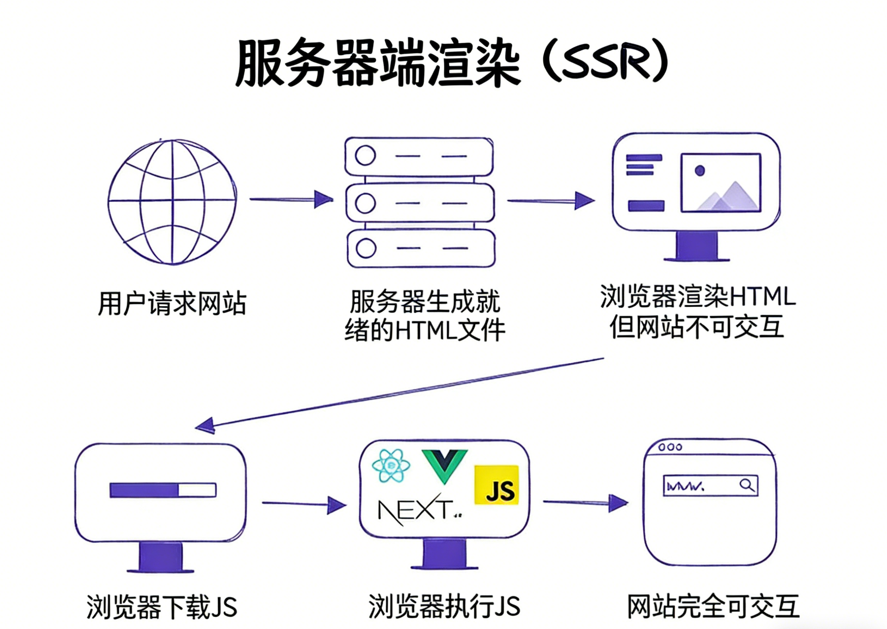
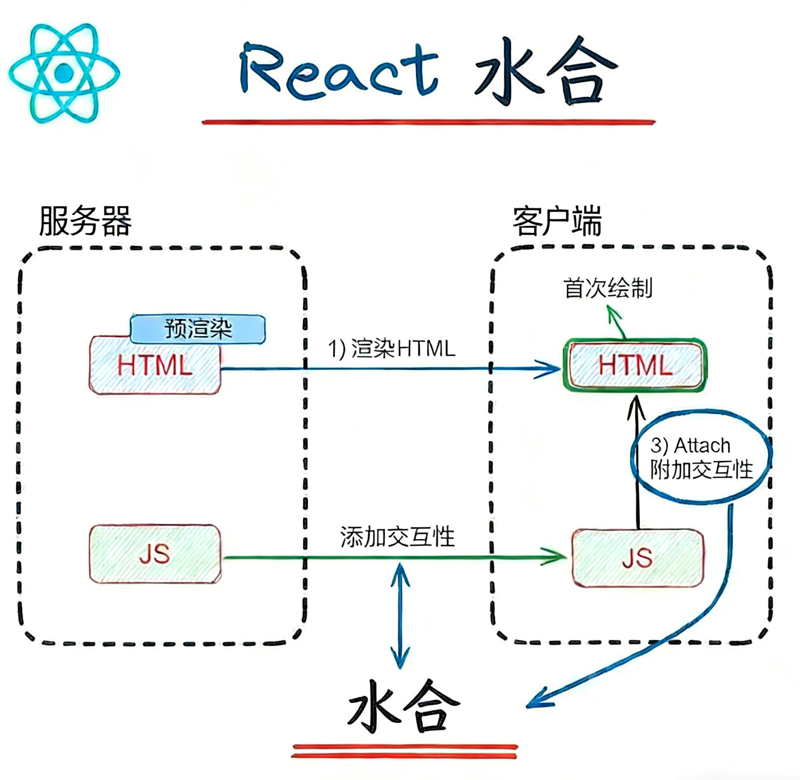

<!-- 搞一个keynote风格的演讲稿 纯前端 Framer
Motion（React 技术宣讲神器） 适合：对外技术页 / Keynote 风格宣讲 -->

## 引言

在现代前端开发中，静态站点生成器（SSG）因其高性能和良好的用户体验而受到广泛关注。Astro 作为一种新兴的静态站点生成器，凭借其独特的架构和优化策略，为开发者提供了强大的工具来构建高效的静态网站。本文将探讨基于 Astro 的高性能 SSG 方案，介绍其核心概念、优势以及实际应用案例。

## 前置知识

在深入了解基于 Astro 的高性能 SSG 方案之前，读者需要具备以下前置知识：

### 核心概念

- **水合**: 了解VUE/React等前端框架的水合原理
- **SSG**：了解 SSG 的基本原理和工作流程。
- **Astro 框架**：了解 Astro 的基本使用方法和特点。

## 水合

Dan Abramov（Create React App 和 Redux）对 Hydration 的定义是：_“Hydration 就像用用户交互和事件处理程序的‘水’来浇灌‘干燥的’HTML。”_

### CSR**客户端渲染**

客户端渲染是指所有页面都直接在浏览器中使用 JavaScript 加载和渲染。这样，浏览器负责处理所有请求（_数据获取_）、管理加载状态以及其他交互操作。


> 代码结构

```html
<!DOCTYPE html>
<html lang="en">
	<head>
		<meta charset="UTF-8" />
		<title>CSR Example</title>
	</head>
	<body>
		<!-- 注意这里几乎没有内容，只有一个挂载点 -->
		<div id="root"></div>

		<!-- JavaScript 负责渲染整个页面 -->
		<script src="/bundle.js"></script>
	</body>
</html>
```

### SSR服务端渲染

在服务器端渲染（SSR）中，页面在服务器端使用 JavaScript 生成，并以 HTML 格式发送给客户端。此过程优化了服务器端的数据获取，从而提升了用户体验。在 SSR 中，初始 HTML 加载完毕后，交互所需的 JavaScript 代码会在后台加载。



> 代码结构

```html
<!DOCTYPE html>
<html lang="en">
	<head>
		<meta charset="UTF-8" />
		<title>SSR Example</title>
	</head>
	<body>
		<!-- 服务器已经渲染好 HTML -->
		<div id="root">
			<h1>欢迎来到 SSR 页面</h1>
			<p>这是服务器端渲染生成的内容。</p>
			<button onclick="alert('按钮点击事件')">点击我</button>
		</div>

		<!-- JavaScript 只负责 Hydration -->
		<script src="/bundle.js"></script>
	</body>
</html>
```

### **什么是水合**

**水合Hydration**是指将服务器端预渲染的 HTML 代码在浏览器中实现交互的过程。换句话说，框架(React,Vue)会检查现有的 HTML 代码，并关联必要的 JavaScript 代码来激活组件，从而实现交互功能。

这样可以加快页面加载速度，因为静态内容（初始 HTML）会快速加载，交互功能随后才会启用。

这种做法结合了 SSR 和 CSR（客户端渲染）的优点：

- **服务器端渲染（SSR）** 提供了更快的首屏加载时间和更好的 SEO。
- **客户端渲染（CSR）** 提供了更丰富的交互体验。



> 值得注意的是，*水合作用*并不直接适用于仅在客户端运行的库或框架（_仅限客户端_），例如仅在客户端使用的 React。

除了传统的 Web 开发和现代前端框架外，在一些其他场景中也存在类似的 Hydration 过程：

- **静态站点生成（SSG）** ：在静态站点生成器（如 Gatsby、Next.js 的静态导出模式）中，初始页面会在构建时生成静态 HTML。客户端加载后，这些静态内容通过 JavaScript 变得动态和可交互。
- **增量静态渲染（ISR）** ：某些现代框架（如 Next.js 提供的 ISR）允许静态页面在构建后的特定时间内动态更新，而客户端加载的过程中依然需要进行 Hydration。

## SSG

### 什么是静态网站生成器？

静态网站生成器是一种基于原始数据和一组模板生成完整静态 HTML 网站的工具。从本质上讲，静态站点生成器自动完成对单个 HTML 页面进行编码的任务，并让这些页面提前准备好为用户提供服务。因为这些 HTML 页面是预先构建的，所以它们可以在用户的浏览器中非常快速地加载。

静态网站生成器是内容管理系统 (CMS) 的替代品，后者是另一种用于管理 Web 内容、生成网页和实施模板的工具。（模板是 Web 内容的可重用格式；开发人员使用模板来避免一遍又一遍地编写相同的格式。）

### 什么是静态网站？

静态网站由一个或多个 HTML 网页组成，这些网页每次都以相同的方式加载。静态网站与动态网站形成对比，动态网站根据一些不断变化的数据输入（例如用户的位置、一天中的时间或用户操作）进行不同的加载。静态网页是可以快速加载的简单 HTML 文件，而动态网页需要在浏览器中执行 JavaScript 代码才能呈现。

### 静态网站生成器和 CMS 之间有什么区别？

在互联网的早期，网站被存储为静态 HTML 站点，所有网页都预先布局和硬编码。这是低效的，因为它需要开发人员手动编码每个网页。

内容管理系统 (CMS) 的出现让开发人员能够避免所有这些手动设置。内容存储在 CMS 数据库中，而不是提前对页面进行编码，当用户请求页面时，服务器会执行以下操作：

1. 查询数据库，寻找正确的内容
2. 识别该内容将适合的模板
3. 生成页面
4. 向用户提供页面

CMS 中的内容必须适合 CMS 数据库提供的字段之一，但只要符合要求，它就应该每次都出现在网站上的适当位置。

静态站点生成器是这两种方法的折衷方案。与 CMS 一样，它允许开发人员使用模板并自动生成网页——但它会提前完成后者，而不是响应用户的请求。这可以提高[网站性能](https://www.cloudflare.com/learning/performance/why-site-speed-matters/)，因为网页可以立即交付给最终用户。它还为开发人员提供了更大的定制能力，因为他们不受 CMS 提供的数据库字段的限制。

### 使用静态站点生成器有哪些优缺点？

#### 优点

- **性能**因为静态站点生成器提前而不是按需（比如使用 CMS）创建网页，所以网页在用户浏览器中的加载速度稍快。
- **定制**开发人员可以创建他们想要的任何模板。它们不受 CMS 提供的字段限制，也不受 CMS 内置模板的限制。
- **更轻的后台**静态网站是轻量级的，不需要在服务器端运行那么多代码，而基于 CMS 的网站会不断地向服务器端查询内容。

#### 缺点

- **很少或没有预制模板**无限定制的缺点是可能需要更长的时间才能开始。许多静态网站生成器不附带模板，开发人员一开始要花很多时间从头开始建立模板。
- **没有用户友好的界面**非开发人员用户更难使用静态站点生成器发布内容。没有 CMS 界面，处理未格式化的原始数据可能会让用户望而生畏。此外，进行网站更新通常需要开发人员支持。

## Astro

https://raw.githubusercontent.com/susanforme/img/main/img/2025/02/27/15%E6%97%B620%E5%88%8609%E7%A7%92149607ef4f230bdb3148d5b6070c92f9-76240a64508f42978808e70bda3c8d04-tplv-k3u1fbpfcp-zoom-in-crop-mark-1512-0-0-0-b7d81d.webp

https://www.plasmic.app/blog/how-react-server-components-work?utm_source=chatgpt.com
