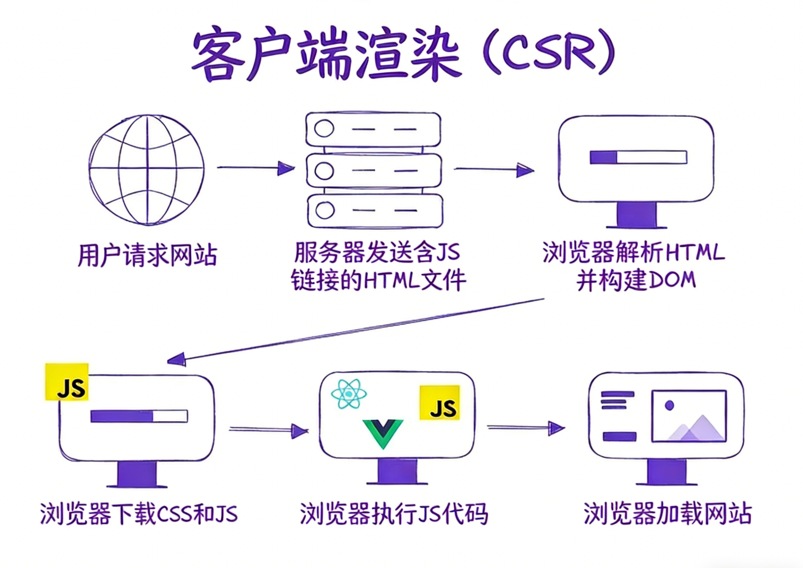
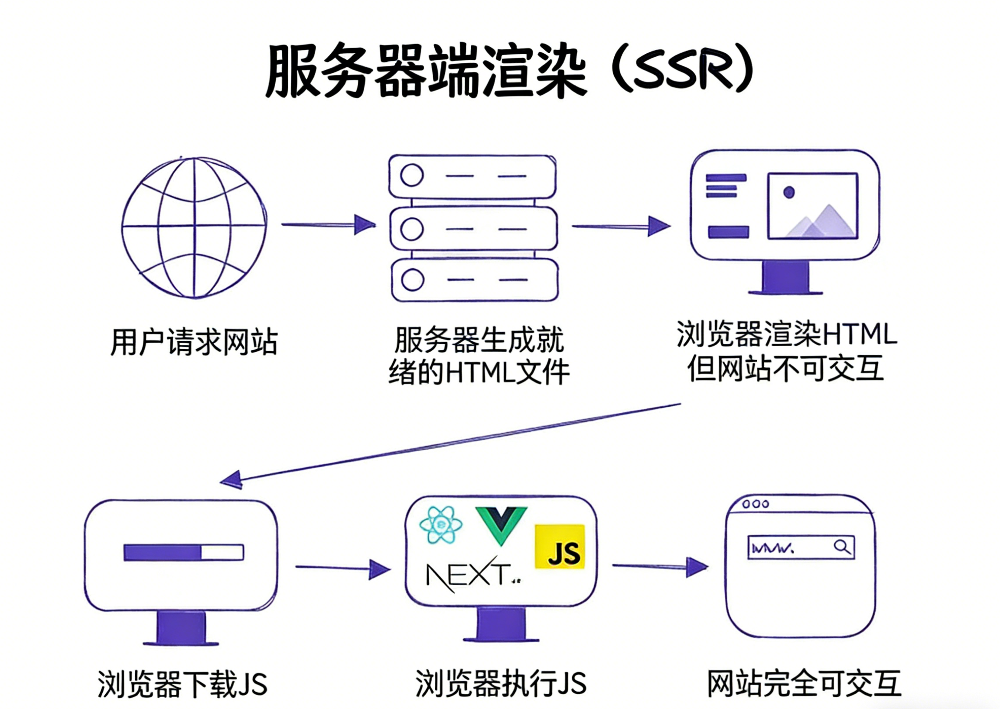
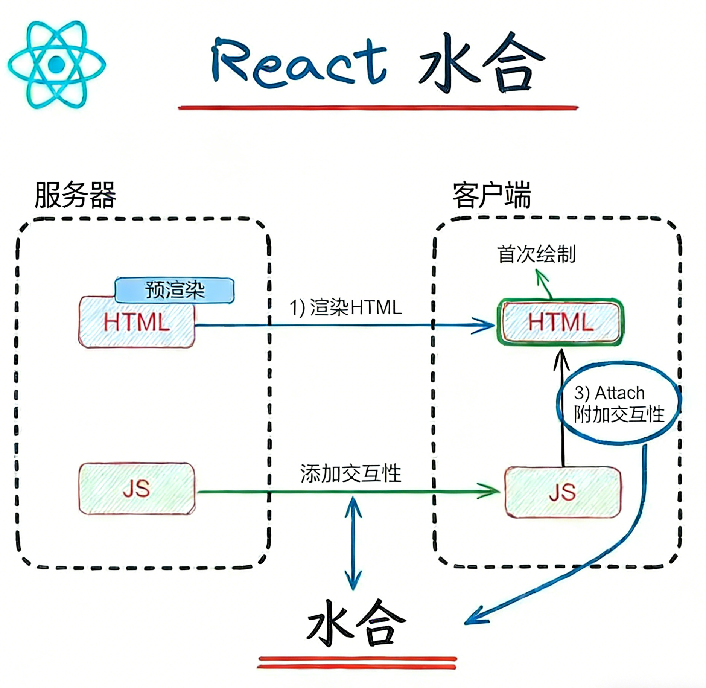
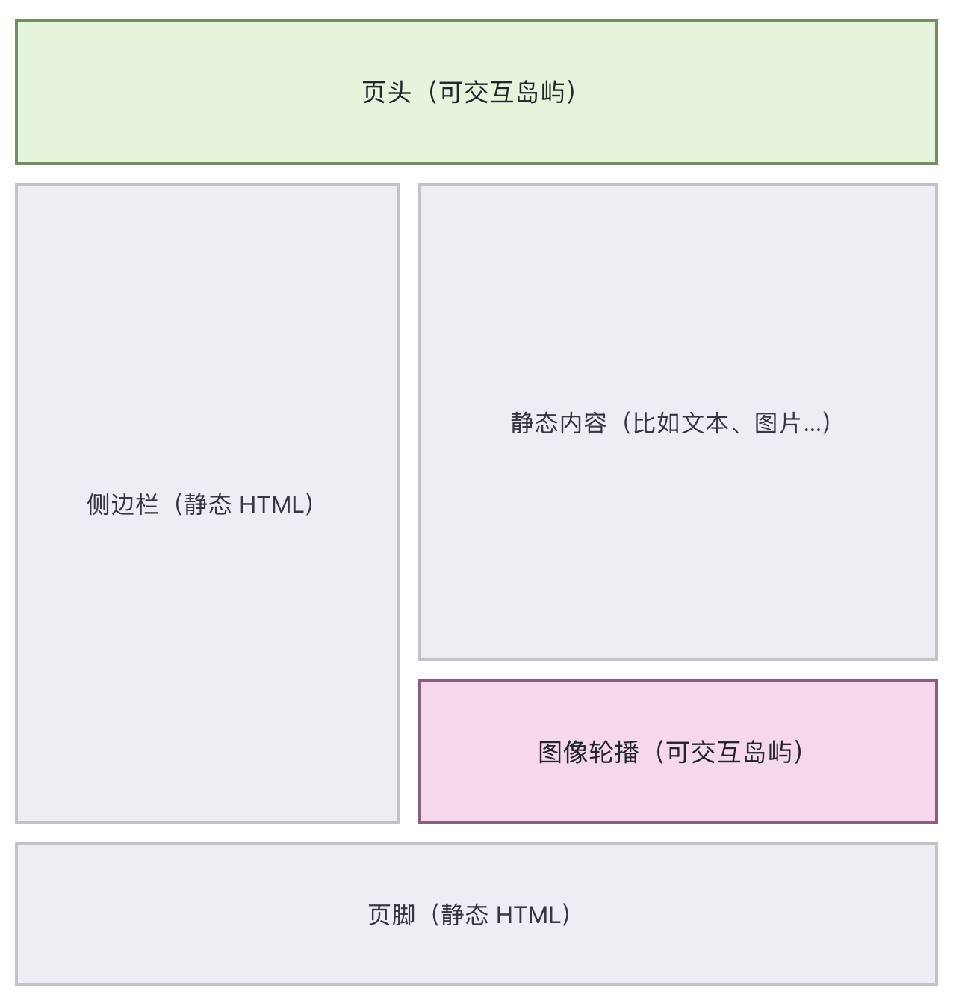

<!-- 搞一个keynote风格的演讲稿 纯前端 Framer
Motion（React 技术宣讲神器） 适合：对外技术页 / Keynote 风格宣讲 -->

## 引言

在现代前端开发中，静态站点生成器（SSG）因其高性能和良好的用户体验而受到广泛关注。Astro 作为一种新兴的静态站点生成器，凭借其独特的架构和优化策略，为开发者提供了强大的工具来构建高效的静态网站。本文将探讨基于 Astro 的高性能 SSG 方案，介绍其核心概念、优势以及实际应用案例。

## 前置知识

在深入了解基于 Astro 的高性能 SSG 方案之前，读者需要具备以下前置知识：

### 核心概念

- **水合**: 了解VUE/React等前端框架的水合原理
- **SSG**：了解 SSG 的基本原理和工作流程。
- **Astro 框架**：了解 Astro 的基本使用方法和特点。

## 水合

Dan Abramov（Create React App 和 Redux）对 Hydration 的定义是：_“Hydration 就像用用户交互和事件处理程序的‘水’来浇灌‘干燥的’HTML。”_

### CSR**客户端渲染**

客户端渲染是指所有页面都直接在浏览器中使用 JavaScript 加载和渲染。这样，浏览器负责处理所有请求（_数据获取_）、管理加载状态以及其他交互操作。


> 代码结构

```html
<!DOCTYPE html>
<html lang="en">
	<head>
		<meta charset="UTF-8" />
		<title>CSR Example</title>
	</head>
	<body>
		<!-- 注意这里几乎没有内容，只有一个挂载点 -->
		<div id="root"></div>

		<!-- JavaScript 负责渲染整个页面 -->
		<script src="/bundle.js"></script>
	</body>
</html>
```

### SSR服务端渲染

在服务器端渲染（SSR）中，页面在服务器端使用 JavaScript 生成，并以 HTML 格式发送给客户端。此过程优化了服务器端的数据获取，从而提升了用户体验。在 SSR 中，初始 HTML 加载完毕后，交互所需的 JavaScript 代码会在后台加载。



> 代码结构

```html
<!DOCTYPE html>
<html lang="en">
	<head>
		<meta charset="UTF-8" />
		<title>SSR Example</title>
	</head>
	<body>
		<!-- 服务器已经渲染好 HTML -->
		<div id="root">
			<h1>欢迎来到 SSR 页面</h1>
			<p>这是服务器端渲染生成的内容。</p>
			<button onclick="alert('按钮点击事件')">点击我</button>
		</div>

		<!-- JavaScript 只负责 Hydration -->
		<script src="/bundle.js"></script>
	</body>
</html>
```

### **什么是水合**

**水合Hydration**是指将服务器端预渲染的 HTML 代码在浏览器中实现交互的过程。换句话说，框架(React,Vue)会检查现有的 HTML 代码，并关联必要的 JavaScript 代码来激活组件，从而实现交互功能。

这样可以加快页面加载速度，因为静态内容（初始 HTML）会快速加载，交互功能随后才会启用。

这种做法结合了 SSR 和 CSR（客户端渲染）的优点：

- **服务器端渲染（SSR）** 提供了更快的首屏加载时间和更好的 SEO。
- **客户端渲染（CSR）** 提供了更丰富的交互体验。



> 值得注意的是，*水合作用*并不直接适用于仅在客户端运行的库或框架（_仅限客户端_），例如仅在客户端使用的 React。

除了传统的 Web 开发和现代前端框架外，在一些其他场景中也存在类似的 Hydration 过程：

- **静态站点生成（SSG）** ：在静态站点生成器（如 Gatsby、Next.js 的静态导出模式）中，初始页面会在构建时生成静态 HTML。客户端加载后，这些静态内容通过 JavaScript 变得动态和可交互。
- **增量静态渲染（ISR）** ：某些现代框架（如 Next.js 提供的 ISR）允许静态页面在构建后的特定时间内动态更新，而客户端加载的过程中依然需要进行 Hydration。

## SSG

### 什么是静态网站生成器？

静态网站生成器是一种基于原始数据和一组模板生成完整静态 HTML 网站的工具。从本质上讲，静态站点生成器自动完成对单个 HTML 页面进行编码的任务，并让这些页面提前准备好为用户提供服务。因为这些 HTML 页面是预先构建的，所以它们可以在用户的浏览器中非常快速地加载。

静态网站生成器是内容管理系统 (CMS) 的替代品，后者是另一种用于管理 Web 内容、生成网页和实施模板的工具。（模板是 Web 内容的可重用格式；开发人员使用模板来避免一遍又一遍地编写相同的格式。）

### 什么是静态网站？

静态网站由一个或多个 HTML 网页组成，这些网页每次都以相同的方式加载。静态网站与动态网站形成对比，动态网站根据一些不断变化的数据输入（例如用户的位置、一天中的时间或用户操作）进行不同的加载。静态网页是可以快速加载的简单 HTML 文件，而动态网页需要在浏览器中执行 JavaScript 代码才能呈现。

### 静态网站生成器和 CMS 之间有什么区别？

在互联网的早期，网站被存储为静态 HTML 站点，所有网页都预先布局和硬编码。这是低效的，因为它需要开发人员手动编码每个网页。

内容管理系统 (CMS) 的出现让开发人员能够避免所有这些手动设置。内容存储在 CMS 数据库中，而不是提前对页面进行编码，当用户请求页面时，服务器会执行以下操作：

1. 查询数据库，寻找正确的内容
2. 识别该内容将适合的模板
3. 生成页面
4. 向用户提供页面

CMS 中的内容必须适合 CMS 数据库提供的字段之一，但只要符合要求，它就应该每次都出现在网站上的适当位置。

静态站点生成器是这两种方法的折衷方案。与 CMS 一样，它允许开发人员使用模板并自动生成网页——但它会提前完成后者，而不是响应用户的请求。这可以提高[网站性能](https://www.cloudflare.com/learning/performance/why-site-speed-matters/)，因为网页可以立即交付给最终用户。它还为开发人员提供了更大的定制能力，因为他们不受 CMS 提供的数据库字段的限制。

### 使用静态站点生成器有哪些优缺点？

#### 优点

- **性能**因为静态站点生成器提前而不是按需（比如使用 CMS）创建网页，所以网页在用户浏览器中的加载速度稍快。
- **定制**开发人员可以创建他们想要的任何模板。它们不受 CMS 提供的字段限制，也不受 CMS 内置模板的限制。
- **更轻的后台**静态网站是轻量级的，不需要在服务器端运行那么多代码，而基于 CMS 的网站会不断地向服务器端查询内容。

#### 缺点

- **很少或没有预制模板**无限定制的缺点是可能需要更长的时间才能开始。许多静态网站生成器不附带模板，开发人员一开始要花很多时间从头开始建立模板。
- **没有用户友好的界面**非开发人员用户更难使用静态站点生成器发布内容。没有 CMS 界面，处理未格式化的原始数据可能会让用户望而生畏。此外，进行网站更新通常需要开发人员支持。

## Astro

**Astro 是一个集多功能于一体的 Web 框架。**它内置包含了你构建网站所需的一切。还有数百个不同的[集成](https://astro.build/integrations/)和 [API 钩子](https://docs.astro.build/zh-cn/reference/integrations-reference/)可根据你的具体用例和需求定制你的项目。**Astro** 是最适合构建像博客、营销网站、电子商务网站这样的**以内容驱动的网站**的 Web 框架。Astro 以开创了一种新的[前端架构](https://docs.astro.build/zh-cn/concepts/islands/)而闻名，与其他框架相比它减少了 JavaScript 的开销和复杂性。如果你需要一个加载速度快、具有良好 SEO 的网站，那么 Astro 就是你的选择。

一些亮点包括：

- **[群岛](https://docs.astro.build/zh-cn/concepts/islands/)**：一种基于组件的针对内容驱动的网站进行优化的 Web 架构。
- **[UI 无关](https://docs.astro.build/zh-cn/guides/framework-components/)**：支持 React、Preact、Svelte、Vue、Solid、HTMX、Web 组件等等。
- **[服务器优先](https://docs.astro.build/zh-cn/guides/on-demand-rendering/)**：将沉重的渲染移出访问者的设备。
- **[默认无 JS](https://docs.astro.build/zh-cn/basics/astro-components/)**：让客户端更少的执行 JS ，以提升网站速度。
- **[内容集合](https://docs.astro.build/zh-cn/guides/content-collections/)**：为你的 Markdown 内容，提供组织、校验并保证 TypeScript 类型安全。
- **[可定制](https://docs.astro.build/zh-cn/guides/integrations-guide/)**：Partytown、MDX 和数百个集成可供选择。

### 群岛架构

> “群岛” 架构的总体思想看似简单：在服务器上渲染 HTML 页面，并在高度动态的区域周围注入占位符或插槽 […] 这些区域随后可以在客户端 “激活” 成为小型独立的小部件，重用它们服务器渲染的初始 HTML。 — Jason Miller, Preact 的创造者

这种架构模式所依赖的技术也被称为 **局部化**或**选择性激活**。

渐进式水合技术在 React、Angular、Preact 和 Vue 等框架中的性能优势。在这些架构中，页面上的各个组件会随着时间的推移逐步加载和初始化。这可以通过 requestIdleCallback 实现简单的调度，也可以考虑视口可见性、交互可能性、产品价值等其他因素。

与渐进式水合作用类似，使用岛屿架构渲染页面，不仅能逐步初始化页面中较复杂的动态部分，还能*分别*初始化。这意味着页面的各个区域无需先加载其他内容即可实现交互。

与渐进式水合作用不同，基于**岛屿架构**构建的方法不需要自顶向下渲染。这是一个显著的优势，因为没有必须在子组件初始化之前初始化的外部“根”组件。页面的每个部分都是一个独立的单元，一个单元中的性能问题不会影响其他单元。



### Astro的群岛架构实现

```ts
class AstroIsland extends HTMLElement {
	public Component: any
	public hydrator: any

	async connectedCallback() {
		// 等待子节点加载完成（处理 HTML 流式传输的情况）
		if (
			this.hasAttribute('await-children') &&
			document.readyState !== 'complete'
		) {
			const mo = new MutationObserver(() => {
				if (this.lastChild?.nodeValue === 'astro:end') {
					mo.disconnect()
					this.start()
				}
			})
			mo.observe(this, { childList: true })
		} else {
			this.start()
		}
	}

	async start() {
		const opts = JSON.parse(this.getAttribute('opts')!)
		const directive = this.getAttribute('client') as string // 如: 'load', 'visible'

		// 调用指令对应的加载策略 (例如：在空闲时加载、在可见时加载)
		if (Astro[directive] === undefined) {
			window.addEventListener(`astro:${directive}`, () => this.start(), {
				once: true,
			})
			return
		}

		await Astro[directive]!(
			async () => {
				const rendererUrl = this.getAttribute('renderer-url')
				// 1. 动态导入：并行加载组件代码和注水器(Hydrator)代码
				const [componentModule, { default: hydrator }] = await Promise.all([
					import(this.getAttribute('component-url')!),
					rendererUrl ? import(rendererUrl) : () => () => {},
				])

				// 2. 确定导出组件的名字（默认是 'default'）
				const exportName = this.getAttribute('component-export') || 'default'
				this.Component = componentModule[exportName]
				this.hydrator = hydrator

				return this.hydrate // 返回注水函数供指令调用
			},
			opts,
			this
		)
	}

	hydrate = async () => {
		if (!this.hydrator || !this.isConnected) return

		// 递归等待：如果父级也是孤岛且未激活，先等父级注水，确保自顶向下激活
		const parentSsrIsland = this.parentElement?.closest('astro-island[ssr]')
		if (parentSsrIsland) {
			parentSsrIsland.addEventListener('astro:hydrate', this.hydrate, {
				once: true,
			})
			return
		}

		// 解析插槽 (Slots)
		const slots: Record<string, string> = {}
		for (const slot of this.querySelectorAll('astro-slot')) {
			if (slot.closest(this.tagName) !== this) continue
			slots[slot.getAttribute('name') || 'default'] = slot.innerHTML
		}

		// 解析 Props（通过前面的 revive 逻辑）
		const props = this.hasAttribute('props')
			? reviveObject(JSON.parse(this.getAttribute('props')!))
			: {}

		// 最终注水：调用渲染器（如 React, Vue 的渲染函数）将组件挂载到 DOM
		const hydrator = this.hydrator(this)
		await hydrator(this.Component, props, slots, {
			client: this.getAttribute('client'),
		})

		// 标记注水完成，触发事件
		this.removeAttribute('ssr')
		this.dispatchEvent(new CustomEvent('astro:hydrate'))
	}
}

// 注册自定义元素
if (!customElements.get('astro-island')) {
	customElements.define('astro-island', AstroIsland)
}
```

## 技术取舍

在选择使用 Astro 作为静态站点生成器时，需要考虑以下技术取舍：

- **性能 vs. 灵活性**：Astro 默认情况下提供了出色的性能，但在某些情况下，可能需要牺牲一些灵活性来实现最佳性能。
- **集成复杂性**：将 Astro 集成到现有项目中可能需要额外的工作，特别是如果现有项目已经使用了其他框架或技术栈。

在团队主应用采用Nuxt的情况下,经过综合考虑,决定采用Astro 结合Vue 3 来实现高性能的静态站点生成方案。以此达到性能和开发效率的平衡。

### 为什么?

在主应用采用Nuxt 框架的情况下，使用Astro结合Vue 3 有以下优势：

1. **无额外性能成本** : Astro 支持多种前端框架（包括 Vue 3），因此可以无缝集成到现有的 Vue 3 项目中.而主应用采用Nuxt 框架,本身也是基于Vue 3 构建的. 这样可以最大限度地减少性能开销。 可以将Astro 生成的静态内容直接嵌入到 Nuxt 应用中.需要客户端水合的部分,只需加载必要的Vue3即可.而 Vue 3 本身已经由 Nuxt 应用加载, 所以 不会引入额外的框架开销。
2. **提升性能** : Astro 的群岛架构允许只为需要交互的部分加载 JavaScript，从而显著减少初始加载时间和提高页面响应速度。这对于提升用户体验和 SEO 非常有利。
3. **开发效率** : 使用 Vue 3 作为前端框架，可以利用现有的 Vue 生态系统和工具链，提高开发效率。同时，Astro 提供了简洁的语法和强大的功能，使得构建静态站点更加高效。

## 那么问题来了

如何优雅的将Astro 集成到现有项目中？如何在不影响现有主站SSR框架(Nuxt,Next等)架构的前提下，提升网站性能？
有如下问题需要面对:

1. 如何处理Astro编译产物与现有主站SSR框架的集成？
   如下是一个最简的Astro 项目结合Vue3 编译的产物示例

   ```html
      <!DOCTYPE html>
      <html lang="en"></html>
   <head>
     <meta name="generator" content="Astro v5.16.0">
     <link rel="stylesheet" href="./assets/styles.css">
   </head>
   <body>
     <div class="lp-new-area" data-app="vivaia">
       <style>
         astro-island,
         astro-slot,
         astro-static-slot {
           display: contents
         }
       </style>
       <script></script>
       <script>
   		 预编译的Astro Island 组件加载脚本
   		</script>
       <astro-island uid="PDDNA" prefix="s0"
         component-url="./assets/_app.BXJsAGJH.js" component-export="default"
         renderer-url="./assets/client.DAeD31y9.js" props="{}" ssr client="visible"
         opts="{&quot;name&quot;:&quot;VueApp&quot;,&quot;value&quot;:true}"
         await-children><!--[-->
         <div>
   			  Vue 组件渲染的html内容
   			 </div><!--]--><!--astro:end-->
       </astro-island>
     </div>
   </body>

   </html>
   ```

2. 如何处理Astro编译产物中的静态资源引用路径问题？
   由于Astro 编译产物中的静态资源引用路径通常是相对路径,而现有主站SSR框架(Nuxt,Next等)的静态资源路径可能不同,需要对这些路径进行处理,以确保资源能够正确加载。
3. 如何确保Astro Vue 3 中的客户端水合逻辑能够正确执行？
   需要确保Astro 生成的Vue 3 组件在客户端能够正确水合,并且不会与现有主站SSR框架(Nuxt,Next等)的水合逻辑冲突。

4. 如何处理国际化的问题

5. 如何处理在服务端渲染和客户端渲染使用相同Astro产物可能引发的问题？

6. 怎么在nuxt里渲染Astro产物？

## 处理ASTRO编译产物与现有主站SSR框架的集成

假设你已经拿到了 Astro `build` 之后的 `index.html`，现在要把它塞进 Nuxt 这类 SSR 主站。很多人第一反应是：不就是把这份 HTML 当字符串输出到服务端模板里吗？

真正落地时你会发现，事情没这么简单。

- 内容是能显示，但 `astro-island` 不一定还能激活。
- 样式是能生效，但也可能污染主站原来的模块。
- 主站只想要一段业务片段，Astro 给你的却是一整页文档。

所以这里的问题，不是“怎么把 HTML 拼进去”，而是**怎么把 Astro 的默认编译产物，转换成 SSR 主站真正需要的交付形态**。

先给这件事一个轮廓。这个问题本质上有四层：

1. 先定义一条稳定的业务边界。
2. 把 HTML、样式、Island 运行时代码拆出来。
3. 补上宿主环境自己的启动逻辑。
4. 按宿主的执行模型重新组装。

下面就按这四步来看。

### 第一步：不要直接消费整页 HTML，而是先定义“业务边界”

Astro 默认输出的是完整文档，但 SSR 主站本身已经控制了 `<html>`、`<head>`、`<body>`。主站真正要接入的，其实不是一整页，而是某个业务区域。

所以这段代码先约定：页面内容必须被 `<lp-app>` 包起来。到了构建完成阶段，只提取这一段。

```ts
const reg = /<lp-app>([\s\S]*?)<\/lp-app>/;

'astro:build:done': async ({ dir }) => {
  const distDir = fileURLToPath(dir);
  const indexPath = path.join(distDir, 'index.html');
  const originHtml = await fs.readFile(indexPath, 'utf-8');

  const appMatch = originHtml.match(reg);
  if (!appMatch) {
    throw new Error('未找到匹配的<lp-app>标签');
  }

  const lpAppHTML = appMatch[0];
}
```

这一步最容易被低估，但它其实是整个方案能不能稳定运行的前提。

因为一旦没有这条边界，后处理逻辑就只能去猜：到底是整个 `body` 要被拿走，还是只拿某个节点，哪些脚本属于业务区，哪些脚本属于 Astro 文档壳。这样做短期能跑，长期一定脆。

这里用正则不是为了“通用解析 HTML”，而是因为 `<lp-app>` 本身就是我们自己定义的交付协议节点。既然边界是我们自己规定的，用最直接的方式把它抽出来就够了。

### 第二步：主站消费的不是一段 HTML，而是一组必须一起交付的运行时材料

很多人第一次做这类集成时，最自然的误解是：只要把最终的 DOM 拿出来，主站就算接入成功了。

这正是问题所在。

Astro 页面里如果有 `client:visible`、`client:load` 这种 Island，真正让它在浏览器里继续工作的，不只有 HTML，还有 Astro 注入到产物里的脚本和样式。少任何一块，页面都可能变成“静态截图”。

所以在 `build:done` 里，这段代码做的不是简单字符串裁剪，而是把产物拆成几类有明确职责的内容：

```ts
const $ = cheerio.load(originHtml)

const scriptNotModuleTags = $('script:not([type="module"])')
const moduleScriptTags = $('script[type="module"]')
const styleTags = $('style')

let astroIslandContent = ''
scriptNotModuleTags.each((_, elem) => {
	astroIslandContent += `${$(elem).html()};`
})

let moduleScriptContent = ''
moduleScriptTags.each((_, elem) => {
	moduleScriptContent += `${$(elem).html()};`
})

let stylesContent = ''
styleTags.each((_, elem) => {
	stylesContent += $(elem).html()
})
```

这里真正要建立的心智模型是：**Astro 编译产物不是一个 HTML 文件，而是一组协同运行的前端资产。**

- `<lp-app>` 负责提供静态结构。
- `<style>` 负责让结构看起来正确。
- 非 `module` 脚本里包含 Island 运行时和初始化逻辑。
- `module` 脚本在某些平台下仍然参与客户端激活。

这也是为什么主站集成时，不能只做 DOM 注入。你必须把这些材料按正确的方式带过去，Astro 的客户端能力才不会在接入那一刻被“裁掉”。

### 第三步：Astro 只解决页面生成，宿主初始化要额外补一层

即便你把 Astro 自己的 HTML、样式、脚本都保留下来了，事情还是没有结束。

因为在真实项目里，页面进入主站之后，通常还要先接一层宿主环境的初始化：比如 rem / flexible 方案、全局配置注入、页面卸载时的清理逻辑，或者主站自己的生命周期桥接。

这段代码没有把这部分逻辑散落在业务组件里，而是把它抽成了平台相关的入口代码：

```ts
function getEntryCodeByPlatform(platform: LpPlatform) {
	if (platform === 'vivaia') {
		return js`
      import { flexible } from '@lp/flexible';
      import { initLpConfig, initAstroApp } from '@lp/utils';

      const unmountFns = initLpConfig();
      unmountFns.push(
        flexible({
          layouts: [375, 1920],
          breakpoints: [768],
          immediate: true,
          scope: {
            element: document.documentElement,
            cssVarName: '--lr',
          },
        }),
      );

      initAstroApp();
    `
	}
}
```

然后在 `build:done` 阶段，再用 `esbuild` 把这段入口代码编译成最终可以内联执行的脚本：

```ts
const entryBuildResult = await build({
	stdin: {
		contents: entryCode,
		resolveDir: process.cwd(),
		sourcefile: 'flexible-entry.ts',
	},
	bundle: true,
	write: false,
	minify: true,
	format: 'esm',
	platform: 'browser',
	target: ['safari15'],
	splitting: false,
	define: {
		'import.meta.env.NON_MAIN_SITE': `${!isMainSite}`,
	},
})
```

这里的关键不是“再编译一次”，而是**给 Astro 产物补一层宿主适配器**。

Astro 负责回答“页面是什么”；这层入口脚本负责回答“页面进入主站后先做什么”。如果把这两类职责混在一起，业务组件就会越来越依赖宿主环境，最后很难复用到别的平台。

### 第四步：真正敏感的不是拼接本身，而是重组后的执行顺序

到这一步，手里已经有了四样东西：

- `lpAppHTML`
- `stylesContent`
- `astroIslandContent`
- `entryBuildContent`

但还不能随便拼。这里最容易踩坑的地方，是脚本执行时序。

先看 `vivaia` 的处理：

```ts
const prefixMainAppScriptHTML = `<script>;${astroIslandContent};${entryBuildContent};</script>`
const stylesHTML = `<style>${stylesContent}</style>`

let content = `<lp-container>${prefixMainAppScriptHTML}${stylesHTML}${lpAppHTML}</lp-container>`

if (platform === 'vivaia') {
	await Promise.all(
		[
			fse.outputFile(indexPath, content, 'utf-8'),
			isMainSite &&
				fse.outputFile(
					path.join(distDir, '_preview.html'),
					htmlContent,
					'utf-8'
				),
		].filter(Boolean)
	)
}
```

这里输出的不是完整 HTML，而是一段片段化的 `lp-container`。因为 `vivaia` 这个场景里，真正负责输出文档壳的是主站 SSR，Astro 只需要把业务区和它依赖的启动材料交过去。

再看 `fanka`：

```ts
if (platform === 'fanka') {
	const htmlStr = html`<html>
		<body>
			<lp-container>
				<script>
					${entryBuildContent}
				</script>
				${stylesHTML} ${lpAppHTML}
				<script>
					${astroIslandContent}
				</script>
				<script type="module">
					${moduleScriptContent}
				</script>
			</lp-container>
		</body>
	</html>`
}
```

这个平台要的是整页 HTML，所以脚本和样式重新回到了完整文档中。

注意这里两个平台的差异，不是模板写法不同，而是**宿主执行环境不同**：

- 有的宿主需要的是一段可插入的业务片段。
- 有的宿主需要的是一份完整页面。
- 有的宿主已经有自己的客户端运行时，有的则需要把 Astro 的模块脚本完整带上。

所以“重组产物”这件事，本质上是在重新组织浏览器执行语义，而不是在拼字符串。

### 第五步：样式隔离不要放到接入时补救，而要放到构建期解决

把 Astro 页面接进主站后，另一个高频问题是样式串扰。尤其是 `swiper` 这种第三方库，它的选择器很多是全局的。如果不做隔离，主站别的模块也可能被一起命中。

所以这段代码把样式隔离放到了 `astro:config:setup` 阶段：

```ts
VitePrefixSelectorPlugin({
  prefix: ':where(lp-app)',
  match(filePath) {
    const keyword = ['swiper'];
    return (
      filePath.includes('node_modules') &&
      keyword.some((kw) => filePath.includes(kw))
    );
  },
}),
```

这一步有两个关键点。

第一，它不是把所有样式都无脑前缀化，而是只处理确定会污染主站的第三方样式。这样做更稳，因为全量改写选择器虽然“看上去最保险”，但也更容易引入 specificity、覆盖顺序、甚至组件库内部依赖关系的问题。

第二，它把样式作用域直接锚定在 `<lp-app>` 上。前面定义的业务边界，到这里就不只是 HTML 边界了，也成了 CSS 边界。

当然，这个方案也有 trade-off：你需要维护一份待隔离的依赖清单。它不是零成本，但比起在主站接入层临时打补丁，这种成本更可控，也更容易排查。

### 这一节真正解决了什么，没解决什么

到这里，这套方案解决的是：**如何把 Astro 的默认整页产物，转换成主站可以稳定消费的 HTML 片段或完整页面，并且保住客户端激活链路。**

它解决了几件事：

- 给业务区定义了稳定边界。
- 把 Astro 的运行时材料拆分出来并重新组织。
- 为不同平台补上宿主初始化逻辑。
- 在构建期处理了样式隔离问题。

但它还没有彻底解决另一类问题：**这些产物里引用的静态资源路径，进入主站之后是否还能被正确访问。**

比如 `astro-island` 上的 `component-url`、`renderer-url`，以及样式里可能出现的资源地址，这些都属于“产物路径重写”问题。它和“产物结构重组”强相关，但不是同一个问题。前者决定页面能不能被主站消费，后者决定页面消费之后能不能真正跑起来。

## 如何处理Astro编译产物中的静态资源引用路径问题？

把 Astro 页面单独部署时，`./assets/_app.xxx.js` 这种相对路径通常不会出问题。但一旦你把编译产物当成 HTML 片段塞进 Nuxt / Next 这类 SSR 主站里，情况就变了：HTML 能显示出来，CSS 可能也没问题，偏偏 Vue Island 死活不水合。

这类问题最容易让人误判。你会觉得「Astro 明明已经把路径写进产物了，浏览器为什么找不到？」但真正决定结果的，不是 Astro 构建时把文件放在了哪里，而是水合发生时，`astro-island` 到底从哪里读取这些 URL。

这篇只回答一个具体问题：当 Astro 编译产物被嵌入到别的 SSR 宿主里时，为什么静态资源路径会失效，以及怎么用一层很小的运行时补丁把它修正回来。

### 先看现象：HTML 在，交互没了

假设 Astro 构建后产出这样一段 HTML：

```html
<astro-island
	component-url="./assets/_app.BXJsAGJH.js"
	renderer-url="./assets/client.DAeD31y9.js"
	props="{}"
	ssr
	client="visible"
></astro-island>
```

如果这份产物被独立部署在它自己的目录下，`./assets/...` 会相对于当前页面正常解析。

但如果主站把它作为一个片段注入到下面这个地址：

```txt
https://www.example.com/activity/spring-sale
```

而你真正的静态资源却在：

```txt
https://cdn.example.com/static-lp/spring-sale/assets/_app.BXJsAGJH.js
```

浏览器最终很可能会去请求：

```txt
https://www.example.com/activity/assets/_app.BXJsAGJH.js
```

结果就是 404。页面里 SSR 出来的 HTML 还在，所以乍一看像是“能展示”；但一旦 Island 对应的 `component-url`、`renderer-url` 加载失败，后面的 Vue hydration 就根本不会继续。

到这里，其实问题已经暴露出来了：这不是 Astro 的水合逻辑坏了，而是它要加载的依赖地址已经不对了。

### 先给结论：有两类解法，但适用边界不同

这个问题不是只有一种解。

如果你的部署目标从一开始就是固定的，优先用 Astro 官方配置解决：

- `base`：适合站点部署在固定子路径下，例如 `/blog`、`/activity/spring-sale`
- `build.assetsPrefix`：适合页面和静态资源分开部署，资源统一走 CDN

但如果你的约束是另一类：同一份 Astro 产物要被多个宿主复用，真实资源前缀要到运行时才知道，甚至某些环境根本不走静态目录而是走 Blob URL，那只靠构建期配置就不够了。这时更稳妥的做法，是在 `astro-island` 读取 URL 属性的那一刻动态改写。

后面这段代码，解决的就是第二类问题。

### 为什么直觉会错：失效的不是“文件路径”，而是“读取时机”

很多人第一次遇到这个问题时，会默认认为：

1. Astro 构建时已经把相对路径写进 HTML 了
2. 浏览器拿到 HTML 后自然会知道这些路径该去哪里找

这个直觉并不完全错，但它忽略了一个关键前提：这份 HTML 已经不再以 Astro 原本的页面形态存在了，而是被主站当成一个片段重新消费。

对这套集成方案来说，普通的 `<link>`、`<script>`、`<style>` 很多已经在构建后被抽取和重组。真正决定 Island 能不能继续工作的，是 `astro-island` 上的几个属性值：

- `component-url`
- `renderer-url`
- `hydration-url`
- `before-hydration-url`

Astro runtime 在客户端水合时，会通过 `getAttribute()` 去读取这些字段。也就是说，真正需要被修正的，不是“HTML 看起来像不像对的”，而是 Astro runtime 读到的值是不是宿主环境里真正可访问的地址。

一旦你换成这个视角，这件事就很好解释了：路径问题本质上是宿主适配问题，不是模板问题。

### 官方配置什么时候够用

先说结论：如果资源地址在构建时就能确定，别急着上运行时补丁，直接用 Astro 官方能力更简单。

例如部署在固定子路径下：

```ts
import { defineConfig } from 'astro/config'

export default defineConfig({
	base: '/activity/spring-sale',
})
```

或者静态资源统一发布到 CDN：

```ts
import { defineConfig } from 'astro/config'

export default defineConfig({
	build: {
		assetsPrefix: 'https://cdn.example.com',
	},
})
```

这两种方式的优点很明显：

- 配置简单
- 和 Astro 官方语义一致
- 不需要额外侵入 runtime

但它也有很明确的边界：它要求你的部署形态在 build 时就是确定的。

如果你面对的是下面这些场景，它就不够用了：

- 同一份产物要同时给 Nuxt 主站、独立预览页、沙箱环境使用
- 不同平台有不同 CDN 前缀
- 资源地址要依赖宿主返回的数据动态决定
- 某些环境根本不从静态目录取文件，而是先拿代码文本再转 Blob URL

这也是为什么本文没有停在 `base` 或 `assetsPrefix`，而是往下走到了运行时补丁。

### 关键点不在改 HTML，而在改 `astro-island` 读取 URL 的方式

先看核心代码：

```ts
const ASTRO_ISLAND_PATCH_SYMBOL = Symbol('astro-island-patch')

export const AstroIslandUrlKeys = [
	'component-url',
	'renderer-url',
	'hydration-url',
	'before-hydration-url',
]

export async function initAstroApp() {
	let AstroIsland = customElements.get('astro-island')
	if (!AstroIsland) {
		await customElements.whenDefined('astro-island')
		AstroIsland = customElements.get('astro-island')
	}

	if (!(AstroIsland as any)[ASTRO_ISLAND_PATCH_SYMBOL]) {
		const originalGetAttribute = HTMLElement.prototype.getAttribute

		AstroIsland!.prototype.getAttribute = function (name: string) {
			const prefix = window.__lpConfig__?.prefix
			const value = originalGetAttribute.call(this, name)

			if (
				AstroIslandUrlKeys.includes(name) &&
				typeof value === 'string' &&
				value
			) {
				if (import.meta.env.NON_MAIN_SITE) {
					return window.__lpConfig__.codeMap?.[value]
				}

				if (prefix && !value.startsWith(prefix)) {
					return `${prefix}${value}`
				}
			}

			return value
		}
		;(AstroIsland as any)[ASTRO_ISLAND_PATCH_SYMBOL] = true
	}
}
```

这段代码最值得注意的地方在于：它没有去批量改写 DOM，也没有在构建阶段把所有路径直接替换掉，而是在 `astro-island` 读取属性值的那一刻做了一层拦截。

也就是说，HTML 里保留的仍然是 Astro 原始产物：

```html
component-url="./assets/_app.BXJsAGJH.js"
```

但当 Astro runtime 真正执行到：

```ts
this.getAttribute('component-url')
```

它拿到的已经不是原始值，而是宿主适配后的结果。这个思路很像把“路径翻译”从构建阶段推迟到了消费阶段。好处是同一份产物可以被多个宿主复用，宿主只需要在运行时告诉这段代码：资源到底应该从哪里拿。

### 这层补丁具体解决了什么

#### 1. 它只拦截 Astro hydration 真正依赖的字段

`AstroIslandUrlKeys` 只包含 4 个 URL 属性。这一点很重要。

如果你直接改 `HTMLElement.prototype.getAttribute`，或者不加限制地拦截所有属性，副作用会很大；但只拦截 `astro-island` 的关键 URL 字段，范围就足够小，也更容易排查问题。

这不是“尽量少写代码”，而是在工程里尽量减少影响面。

#### 2. 它等待 `astro-island` 注册完成后再补丁

这件事最容易忽略的地方在于执行时机。

`astro-island` 是 Astro runtime 注册的自定义元素。如果宿主入口脚本先执行，而 Astro runtime 还没把这个元素定义出来，你直接去改原型，改不到任何东西。所以这里先做了：

```ts
await customElements.whenDefined('astro-island')
```

这一步不是形式上的“保险”，而是保证补丁一定能落在正确对象上。

#### 3. 它用 `Symbol` 保证补丁只打一遍

主站里这种落地页片段往往不是一次性页面。它可能被：

- 多次进入同一路由
- 通过客户端导航反复挂载
- 在局部容器里卸载再重建

如果每次初始化都重新覆盖一次 `getAttribute()`，最常见的结果就是重复拼接前缀，例如：

```txt
https://cdn.example.com/https://cdn.example.com/./assets/_app.js
```

`ASTRO_ISLAND_PATCH_SYMBOL` 的作用就是给当前构造函数打一个标记，确保这层 patch 只生效一次。

#### 4. 在主站模式下，路径前缀由宿主运行时决定

主站场景下最关键的是这行：

```ts
const prefix = window.__lpConfig__?.prefix
```

这里的 `prefix` 不是 Astro 构建时写死的，而是宿主在运行时注入的。例如：

- `https://cdn.example.com/static-lp/activity/`
- `/static-lp/test/20260311/`

这样当 `astro-island` 读取到 `./assets/_app.xxx.js` 时，补丁就能把它翻译成宿主环境里的真实地址。

这件事的工程价值很大：你不需要因为 CDN 域名、投放路径、平台差异变化，就重新产出一份新的 Astro build。真正变化的只有宿主配置。

#### 5. 在非主站模式下，资源甚至可以不走静态目录

还有一个很有意思的分支：

```ts
if (import.meta.env.NON_MAIN_SITE) {
	return window.__lpConfig__.codeMap?.[value]
}
```

这意味着某些环境下，`component-url` 最终返回的并不是常规的 HTTP 地址，而是 `codeMap` 里的 Blob URL。

也就是说，宿主可以先把代码文本拉下来，再转成 `blob:` 地址喂给 `astro-island`。对浏览器来说，它仍然拿到了一个可执行的模块 URL；但对接入系统来说，它已经彻底摆脱了“当前页面必须和静态资源目录保持某种相对位置关系”这个限制。

这种做法很适合：

- 独立预览页
- 沙箱环境
- 需要鉴权或签名的资源分发链路

当然，它也不是没有代价：Blob URL 的缓存策略、调试体验、内存占用，都和普通静态文件不同。所以它更像是“高自由度方案”，不是默认首选方案。

### 为什么这里改的是 `getAttribute()`，不是直接改 DOM

你当然可以在 HTML 插入宿主页面之前，先把所有 `component-url`、`renderer-url` 批量改写掉。这么做的确也能工作。

但这里选择拦截 `getAttribute()`，本质上是在做一件更稳的事：把宿主差异收敛到 Astro runtime 真正消费这些值的那一刻。

这样做有几个直接好处：

1. 原始编译产物保持不变，便于复用和排查
2. 同一份 HTML 片段可以服务多个宿主，不需要提前写死路径
3. 宿主可以在最后一刻决定是走 CDN 前缀还是 Blob URL

但 trade-off 也要说清楚：

- 它依赖 Astro runtime 当前仍然通过 `getAttribute()` 读取这些值
- 它要求宿主初始化时机足够靠前，至少要在真正 hydration 前完成 patch
- `prefix` 本身最好做一次规范化，否则容易出现斜杠或 `./` 拼接不一致的问题

这不是一个“比官方配置更高级”的方案，它只是更适合运行时差异很大的集成场景。

### 配套的生命周期为什么也要一起设计

路径改好了，还不够。因为嵌入到主站之后，这段 Astro 片段已经不是一次性静态 HTML，而是一个会被挂载、卸载、再次进入的运行单元。

这也是为什么代码里还有 `initLpConfig()` 和 `lp-container`：

- `initLpConfig()` 负责初始化 `window.__lpConfig__`，给宿主留出统一配置入口
- `lp-container` 在 `disconnectedCallback()` 里执行 `unmountFns`，确保宿主移除片段时，内部 Vue 应用也能同步卸载

这两个点看起来和“路径修正”不是一回事，但放在真实工程里，它们其实属于同一个问题：当 Astro 产物不再是一个独立页面，而是宿主里的一个嵌入单元时，你就必须给它定义一套完整的宿主协议，包括资源定位、初始化和销毁。

### 这套方案适合什么，不适合什么

适合它的场景通常有这些特征：

- 一份 Astro 产物要服务多个平台
- 资源前缀要在运行时决定
- 主站本身已经有 SSR 外壳，不希望 Astro 重新接管整页
- 除了常规静态目录，还需要支持 Blob 或其他自定义加载方式

不太适合它的场景则很明确：

- 部署路径完全固定
- 只需要一个站点、一个资源域名
- 没有多宿主复用需求

这种情况下，直接用 Astro 的 `base` 或 `build.assetsPrefix`，实现会更简单，后续维护成本也更低。

### 调试时可以重点看哪些信号

这类问题其实很好定位，只要你盯住几个信号：

- 页面有 SSR 内容，但没有交互：优先怀疑 Island 依赖没加载成功
- Network 里请求到了当前页面目录下的 `./assets/...`：说明宿主前缀没有接管成功
- URL 被重复拼接：通常是 patch 重复执行，或者原值已经被改写过一次
- `astro-island` 还没定义就开始 patch：说明脚本执行顺序有问题
- 主站卸载片段后再次进入报错：说明资源路径也许没问题，但生命周期清理没做好

从排查效率上说，盯住 `component-url` 和 `renderer-url` 往往比盯 HTML 结构更有效，因为真正决定 hydration 能不能继续的，是这两个入口模块有没有被正确加载。

### 小结

处理 Astro 编译产物里的静态资源路径，最容易误解的地方在于：我们以为自己在处理“文件路径”，其实真正要处理的是“宿主在 hydration 时如何告诉 Astro 去哪里拿资源”。

如果部署目标固定，优先用 `base` 和 `build.assetsPrefix`，这是最省心的做法；但如果同一份产物要被多个 Nuxt / Next 宿主复用，资源前缀又必须到运行时才能确定，那么把适配逻辑收敛到 `astro-island` 的 URL 读取阶段，会更稳，也更符合这类集成问题的本质。

你真正要记住的不是某一个 API，而是这个心智模型：Astro 产物一旦离开它原本的部署目录，资源地址的所有权就从构建阶段转移到了宿主消费阶段。谁控制这个阶段，谁就应该负责把路径解释正确。

## 为什么主站已经切到德语，Astro 落地页还是英文？

页面结构接上了，资源路径也改对了，但一旦进入真实业务，马上又会冒出另一个问题：主站当前语言已经切到 `de`，Nuxt 的导航、页头、结算模块都是德语，嵌进去的 Astro 落地页却还是英文。

这件事乍一看像是“有些文案没翻译”。但如果你继续排查，会发现问题并不只是文案缺失：

- 本地开发时，页面可以跟着 `.lang.env` 切语言。
- 独立构建 `jp` 站点时，页面也能正常输出日文。
- 偏偏在 Nuxt 主站里，语言控制开始变得不稳定。

这说明真正出问题的不是“查不到文案”，而是**当前语言的控制权没有被收口**。

先看一个最容易写出来，也最容易在后面失控的版本。假设原始文案是这样组织的：

```ts
export default {
	hero: {
		title: {
			en: 'Summer Sale',
			de: 'Sommer Sale',
			jp: 'サマーセール',
		},
		tip: {
			en: 'Save {discount} today',
			de: 'Spare heute {discount}',
			jp: '本日 {discount} オフ',
		},
	},
}
```

很多人第一版会这么写：

```ts
import messages from './i18n'

const lang = window.parent?.$nuxt?.$store?.state?.lang || 'en'
const title = messages.hero.title[lang]
const tip = messages.hero.tip[lang].replace('{discount}', '20%')
```

这段代码乍一看完全合理：组件自己拿语言，自己取值，自己做插值，功能也确实能跑起来。

问题在于，它把三件本来应该分开的事情揉在了一起：

- 当前语言从哪里来
- 文案结构长什么样
- fallback 和参数插值怎么处理

一旦页面要同时支持开发调试、独立国家站构建、以及 Nuxt 主站嵌入，这种写法很快就会在每个组件里长出一堆环境判断。

所以这里真正该解决的，不是先造一个 `$t()` 函数，而是先把职责拆开：运行时只负责取词，构建期负责整理文案，工具层负责决定当前语言。

有了这个前提，再看你这套实现，逻辑就顺了。

### 先把运行时收口：业务组件只管传 key，不管语言来源

先看最核心的运行时实现：

```ts
export class I18n<
	const T extends Translations,
	DefaultLang extends LanguageCodeType = 'en',
> {
	#messages: T
	#defaultLang: LanguageCodeType
	#lang: LanguageCodeType
	#options: I18nOption<T>

	constructor(options: I18nOption<T>) {
		const {
			messages,
			defaultLang = LANGUAGE_CODE.EN,
			initLang = defaultLang,
		} = options
		this.#messages = messages
		this.#defaultLang = defaultLang
		this.#lang = initLang
		this.#options = options
		this.getText = this.getText.bind(this)
	}

	changeLang(lang: LanguageCodeType) {
		this.#lang = lang
	}
}
```

`I18n` 做的事情其实很克制：

- 保存当前语言 `#lang`
- 保存兜底语言 `#defaultLang`
- 暴露统一的 `getText()` 接口

真正有意思的地方在 `getText()`。它不是简单从当前语言字典里读取值，而是带着 fallback 和插值能力一起做：

```ts
getText(keyPath: KeyPath, params: Record<string, string> = {}): any {
  const langTranslations =
    this.#messages[this.#lang] ?? this.#messages[this.#defaultLang]

  const localPath = keyPath
  let text = this.#getNested(langTranslations, localPath)

  if (text === undefined) {
    text = this.#getNested(this.#messages[this.#defaultLang], localPath)
  }

  if (text === undefined) {
    if (this.#options.warning) {
      const pathStr = Array.isArray(localPath)
        ? localPath.join('.')
        : localPath
      console.warn(`[i18n]-[${this.#lang}] keyPath: ${pathStr} not found`)
    }
    return Array.isArray(localPath) ? localPath.join('.') : localPath
  }

  if (typeof text === 'string' && params) {
    Object.entries(params).forEach(([param, value]) => {
      const regex = new RegExp(`\\{${param}\\}`, 'g')
      text = text.replace(regex, value)
    })
  }

  return text
}
```

这里有三个关键点。

第一，当前语言找不到时，会回退到默认语言。这保证了某个 locale 文案还没补齐时，页面至少是可展示的，而不是直接把 `undefined` 渲到页面上。

第二，取值逻辑支持 `a.b.c` 这种点路径，不要求业务代码自己一层层解对象。

第三，插值在运行时统一处理，例如：

```ts
$t('hero.coupon.tip', { discount: '20%' })
```

如果原始文案是：

```ts
{
  en: 'Save {discount} today',
  de: 'Spare heute {discount}',
}
```

最终业务代码就不需要再手写字符串拼接。

从工程角度看，这一步解决的是“怎么取值”；但更重要的是，它把国际化的运行时语义统一了。后面不管语言来自 `.env`、来自 Nuxt store，还是来自单语言构建，业务层看到的都只有同一个 `$t()` 接口。

### 第二层：为什么消息结构要先做一次转换，而不是直接把原始文案扔给组件

只看业务代码，很容易以为国际化数据直接这样写就结束了：

```ts
export default {
	hero: {
		title: {
			en: 'Summer Sale',
			de: 'Sommer Sale',
			jp: 'サマーセール',
		},
		desc: {
			en: 'Save {discount} today',
			de: 'Spare heute {discount}',
			jp: '本日 {discount} オフ',
		},
	},
}
```

这种原始结构对“维护文案”很友好，因为同一个 key 的多语言值聚在一起；但它对“运行时取值”并不友好。因为业务组件每次都得先知道当前语言，再去叶子节点上拿值。

所以插件里多做了一步 `transformI18n()`，把它转换成“按语言展开”的结构：

```ts
function transformI18n(input: any, languages: string[], defaultLang: string) {
	function extractLang(node: any, lang: string): any {
		if (Array.isArray(node)) {
			return node.map((item) => extractLang(item, lang))
		}

		if (typeof node === 'object' && node !== null) {
			const keys = Object.keys(node)

			if (keys.length > 0 && keys.every((key) => languages.includes(key))) {
				const value = node[lang]
				if (value === null || value === undefined || value === '') {
					return node[defaultLang]
				}
				return value
			}

			const obj: Record<string, any> = {}
			for (const key in node) {
				obj[key] = extractLang(node[key], lang)
			}
			return obj
		}

		return node
	}

	const result: Record<string, any> = {}
	for (const lang of languages) {
		result[lang] = extractLang(input, lang)
	}
	return structuredClone(result)
}
```

这个函数里真正决定结果的，不是递归本身，而是这条规则：

```ts
if (keys.length > 0 && keys.every((key) => languages.includes(key)))
```

它的含义是：**如果当前对象的所有 key 都是语言代码，那它就是一个多语言叶子节点；否则它仍然只是普通业务对象，需要继续往下递归。**

经过转换之后，运行时拿到的结构就会变成这样：

```ts
{
  en: {
    hero: {
      title: 'Summer Sale',
      desc: 'Save {discount} today',
    },
  },
  de: {
    hero: {
      title: 'Sommer Sale',
      desc: 'Spare heute {discount}',
    },
  },
}
```

一旦变成这种结构，`I18n` 在运行时只需要先锁定当前语言，再按路径读取值就行了。业务组件不再需要知道“多语言叶子节点”这个概念。

这里顺手还解决了一个很实际的问题：如果目标语言值是 `null`、`undefined` 或空字符串，就自动回退到默认语言。

```ts
if (value === null || value === undefined || value === '') {
	return node[defaultLang]
}
```

这不是为了偷懒，而是因为真实项目里文案补齐通常不是原子操作。页面先可用，再逐步补全 locale，往往比严格阻塞更符合业务节奏。

当然，这也有 trade-off：空字符串在这里会被视为“缺失值”。如果你的业务里确实有“我就是要显示空字符串”的场景，那这条规则就需要单独调整。

### 第三层：当前语言到底由谁决定？这才是主站集成时最关键的问题

到了这里，取词和消息结构都统一了，但国际化还有一个最核心的问题没有回答：当前语言到底从哪里来？

这件事在纯 Astro 项目里通常不复杂，但在“Astro 产物嵌入 Nuxt 主站”的架构里，语言来源至少有三种：

1. 开发调试时，希望本地临时指定语言。
2. 独立站点构建时，语言在 build 阶段就已经确定。
3. 主站嵌入运行时，语言应该跟随 Nuxt 当前 store 状态。

所以代码里没有把 `getLang()` 写死，而是在虚拟模块里动态生成：

```ts
const envCode = js`
  export function getLang() {
    ${config.command !== 'build' ? "return '" + lang + "';" : ''};
    ${buildLang ? "return '" + buildLang + "';" : ''};
    const storeLang = window.parent?.$nuxt?.$store?.state?.lang;
    if (!storeLang) {
      return '${LANGUAGE_CODE.EN}';
    }
    return storeLang;
  }
`
```

这里其实不是一个“取语言小工具”，而是一条语言优先级链路：

- 开发环境优先读 `.lang.env`
- 指定 `buildLang` 时，直接输出单语言构建
- 主站嵌入场景则退回到 `window.parent?.$nuxt?.$store?.state?.lang`
- 全都拿不到时，最后才 fallback 到 `en`

这样做最重要的好处，是把“语言归属权”明确下来了。

- 开发阶段，语言归属权在本地调试环境。
- 独立站场景，语言归属权在构建系统。
- 主站场景，语言归属权在宿主运行时。

这也是为什么同一套国际化代码既能服务 Astro 独立页面，也能服务嵌入式主站场景。

### 第四层：为什么要区分主站语言和非主站语言

如果所有语言都无脑打进每一份产物，当然最省心，但这会直接增加页面体积。对于原本就强调首屏性能的 SSG 页面来说，这个代价并不小。

所以代码里先把语言分成了两类：

```ts
export const nonMainSiteLang: LanguageCodeType[] = [
	LANGUAGE_CODE.JP,
	LANGUAGE_CODE.KR,
]

export const mainSiteLang: LanguageCodeType[] = Object.values(
	LANGUAGE_CODE
).filter((lang) => !nonMainSiteLang.includes(lang)) as LanguageCodeType[]
```

接着在构建插件里决定最终要带哪些语言：

```ts
let languages = Object.values(LANGUAGE_CODE)
const AllLanguage = Object.values(LANGUAGE_CODE)

if (config.command === 'build') {
	if (buildLang) {
		languages = buildLang.split(',') as LanguageCodeType[]
	} else {
		languages = languages.filter((item) => !nonMainSiteLang.includes(item))
	}
}
```

这背后的思路是：

- 主站场景下，只打主站真正会切换到的语言包。
- 独立站场景下，直接用 `buildLang` 生成单语言产物。
- `transformI18n()` 虽然会先面向 `AllLanguage` 做一次完整展开，但最终注入到虚拟模块里的只会是当前产物真正需要的语言。

换句话说，这里不是在追求“绝对最少代码”，而是在做一个更符合业务边界的 trade-off：

- 如果你希望同一份主站产物支持运行时切语，就需要在这份产物里保留对应语言包。
- 如果某些国家站本来就是独立部署，那完全没必要把别的语言也带进去。

### 第五层：为什么业务代码最终不直接 import 文案，而是 import `~i18n`

前面几层其实已经能说明这套机制为什么成立了，但还有一个实现上的关键点：这些逻辑为什么要收敛成一个 Vite 虚拟模块？

看核心代码：

```ts
export async function viteI18n(buildLang?: LanguageCodeType): Promise<Plugin> {
	const virtualModuleId = '~i18n'

	return {
		name: 'vite-plugin-i18n',
		enforce: 'pre',
		resolveId(source) {
			if (source === virtualModuleId) {
				return source
			}
		},
		async load(id) {
			if (id === virtualModuleId) {
				// 动态生成模块内容
			}
		},
	}
}
```

在 `load()` 里，插件会把消息数据、`getLang()`、`I18n` 实例以及 `$t` 全部拼成一个最终模块：

```ts
const transformCode = `
  import { I18n, LANGUAGE_CODE } from '@lp/i18n';
  ${messagesCode}
  export const i18n = new I18n({
    messages,
    defaultLang: LANGUAGE_CODE.EN,
    initLang: ${config.command !== 'build' ? 'getLang()' : `'${languages[0]}'`},
  });
  export const $t = i18n.getText;
  ${envCode}
`
```

这样业务代码最终只需要：

```ts
import { $t } from '~i18n'

const title = $t('hero.title')
const coupon = $t('hero.desc', { discount: '20%' })
```

这个设计的价值不只是“import 更短”，而是把以下几件原本可能散落在业务层的事情，全部折叠到了构建工具层：

- 语言来源判断
- 消息结构转换
- 默认语言 fallback
- `$t` 实例创建
- 语言包过滤

业务组件越少知道这些细节，它越容易在主站、独立页、预览环境之间复用。

### 第六层：为什么还能做到类型提示，而且支持深层路径

如果 `$t()` 只是 `function $t(key: string): string`，运行时当然也能用，但工程体验会很差。路径拼错、数组下标写错、对象层级改了，都会变成运行时问题。

所以 `core.ts` 里额外做了一层类型系统约束：

```ts
type ValidKey<T> = T extends readonly any[]
	? Extract<keyof T, `${number}`>
	: keyof T & string

type DotKeys<T> = T extends object
	? {
			[K in ValidKey<T>]: K | `${K}.${DotKeys<T[K]>}`
		}[ValidKey<T>]
	: never

type ValueAtPath<T, P extends string> = P extends `${infer Head}.${infer Rest}`
	? Head extends keyof T
		? ValueAtPath<T[Head], Rest>
		: never
	: P extends keyof T
		? T[P]
		: never
```

配合 `getText()` 的重载：

```ts
getText<const P extends DotKeys<T[DefaultLang]>>(
  keyPath: P,
  params?: Record<string, string>,
): ValueAtPath<T[DefaultLang], P>
```

你就可以拿到这样的体验：

```ts
const deepVal = $t(
	'blue.level1.level2.level3.level4.level5.level6.level7.deepValue'
)
const arrayItem = $t('blue.arrayObject.0.name')
```

这里很值得注意的一点是，数组路径也被支持了，因为 `ValidKey<T>` 对数组只保留 `'0'`、`'1'` 这种数字字符串键，剔除了 `length`、`push` 之类的方法名。

这一步并不直接影响运行时逻辑，但它会明显改变国际化在大项目里的可维护性。你越早把路径错误收敛到类型系统，后面就越少在页面里追查“为什么某个 key 渲染成了原字符串”。

当然，递归类型也不是没有代价。文案对象非常大、层级非常深时，TypeScript 推导成本会变高，编辑器提示也可能变慢。所以这类方案更适合结构稳定、命名有规律的文案系统；如果你的文案来源本身极度动态，这种强类型路径未必划算。

### 第七层：为什么开发时改了文案，插件还能立即感知

前面解决的是运行时和构建时的国际化语义，开发体验这边还有一个实际问题：`src/i18n.js` 变更之后，怎么让 `~i18n` 重新生成？

这里的实现并没有直接 `import 'src/i18n.js'`，而是先读源码文本，再用 `esbuild` 转成可执行代码：

```ts
const rawCode = await readFile(
	path.resolve(config.root, 'src/i18n.js'),
	'utf-8'
)

const { code: i18nRwaCode } = await transformWithEsbuild(rawCode, '', {
	loader: 'js',
	format: 'cjs',
})

const exports: { default?: any } = {}
const module = { exports }
const fn = new Function('module', 'exports', i18nRwaCode)
fn(module, exports)

const i18nMessage = module.exports.default
```

这么做最核心的原因其实已经写在注释里了：

```ts
// 只能通过文本读取的方式,因为import是有缓存的
```

如果这里直接在 Node 侧 `import` 文案模块，开发阶段就会受到模块缓存影响，虚拟模块不一定能拿到最新文案。改成“读文件文本 -> 转译 -> 执行”之后，每次 `load()` 都能拿到当前最新版本。

然后再配合文件监听，让虚拟模块失效并触发刷新：

```ts
configureServer(server) {
  const scanPath = [
    normalizePath(path.resolve(config.root, 'src/i18n.js')),
  ]
  if (envPath) {
    scanPath.push(normalizePath(envPath))
  }
  watchAndInvalidateVirtualModule(server, scanPath, virtualModuleId, true)
}
```

这里连 `.lang.env` 一起监听，也很有意义。因为开发调试时，语言切换不一定是改文案文件，也可能只是把：

```env
lang=de
```

改成：

```env
lang=fr
```

从效果看，这种方案不是最“优雅”的，它用了 `new Function()`，而且语言变化时走的是 `full-reload`，不是细粒度 HMR。但在内部构建体系里，这个 trade-off 很实际：实现简单，行为明确，排查路径也短。

需要注意的边界也很清楚：这类动态执行只适合处理受信任的本地文案源文件。如果文案来源是外部上传或不可信输入，就不应该沿用这一套执行方式。

### 第八层：为什么还要生成 `d.ts`

如果业务最终是从 `~i18n` 引入 `$t`，编辑器默认并不知道这个虚拟模块长什么样。所以插件在开发阶段还会补一份声明文件：

```ts
declare module '~i18n' {
  import { I18n, LanguageCodeType } from '@lp/i18n'
  export const message: ${messageCode}
  export const i18n: I18n<typeof message, 'en'>
  export const $t: typeof i18n.getText
  export function getLang(): LanguageCodeType
}
```

对应实现就是：

```ts
await fse.outputFile(
	path.resolve(rootPath, './src/types/lp-i18n.d.ts'),
	declaration,
	'utf-8'
)
```

这一步看起来像“开发体验增强”，但它其实是在给前面的类型系统方案补最后一块拼图。没有这层声明，`$t` 的路径提示和返回值推导就很难真正落到业务代码里。

### 小结

处理这类嵌入式 Astro 页面里的国际化，最容易走偏的地方在于：我们总想先写一个 `$t()`，却没有先回答“语言由谁决定”。

这套方案真正稳定的原因，不在某个单独函数，而在于它把国际化拆成了四个职责明确的层次：

- `I18n` 类负责统一运行时取词、fallback 和插值。
- `transformI18n()` 负责把维护友好的原始文案，转换成运行时友好的消息结构。
- `~i18n` 虚拟模块负责桥接构建环境、宿主运行时和业务层。
- 监听与类型声明负责把这套机制真正落到开发体验里。

如果你下次再遇到“主站切语言了，但 Astro 区块没切”这种问题，可以优先检查三件事：

1. 当前语言到底是从 build、env 还是宿主 store 拿的。
2. 当前产物里到底包含了哪些语言包。
3. 业务代码拿到的是原始文案对象，还是统一过的 `$t` 接口。

一旦把这三件事分清楚，国际化问题就不再是零散 bug，而是一个有明确控制边界的系统设计问题。

## 如何处理在服务端渲染和客户端渲染使用相同Astro产物可能引发的问题？

前面两节已经解决了两件事：

- Astro 默认输出的是整页 HTML，主站真正需要的是可插入的业务片段。
- `astro-island` 上的相对资源路径，进入 Nuxt / Next 这类宿主之后，需要在运行时重新解释。

走到这里，主站接入已经基本成立：服务端可以把 Astro 片段塞进自己的 SSR 模板里，浏览器也能继续让 Island 激活起来。

但这套方案还会遇到一个更隐蔽的问题：**同一套 Astro 页面，能不能只构建一份产物，同时给主站 SSR 和非主站客户端挂载场景复用？**

这个问题之所以容易踩坑，不是因为代码写得不够小心，而是因为它看起来太合理了。页面源码明明只有一份，组件源码也只有一份，直觉上很容易把“源码可复用”继续外推成“产物也应该可复用”。

真正的问题恰好出在这一步外推上。

### 先把问题收缩成一个最小对照

在本文前面的主站集成方案里，SSR 场景最终交给宿主的核心节点，仍然是 `astro-island`：

```html
<astro-island
	component-url="./assets/_app.BXJsAGJH.js"
	renderer-url="./assets/client.DAeD31y9.js"
	props="{}"
	ssr
	client="visible"
></astro-island>
```

这类产物有一个很强的前提：**HTML 已经存在了，浏览器后续做的是接管，而不是创建。**

它的启动链路大致是这样：

```txt
server HTML
  -> astro-island
  -> load component-url / renderer-url
  -> hydrate existing DOM
```

而非主站场景的入口完全不是这个模型。它更接近下面这种结构：

```html
<div id="shopify-lp-app"></div>
<script type="module" src="entry-non-main"></script>
```

这类产物的前提刚好相反：**页面先只有一个容器，后续由浏览器入口脚本自己把应用挂起来。**

它的启动链路是另一套东西：

```txt
empty container
  -> entry module
  -> create app
  -> mount new DOM tree
```

这就是这类问题的第一层真相：看起来都在渲染同一套 Vue 组件，真正不同的不是组件，而是页面到底是“接管已有 DOM”，还是“从零创建 DOM”。

### 为什么这件事会让人误判

这个误判其实很自然。

因为从业务视角看，页面内容确实是一套：同样的文案、同样的布局、同样的交互组件、同样的多语言内容。于是最容易形成的心智模型是：Astro build 产物本质上就是一份 HTML 快照，宿主不同只是消费方式略有差异。

这正是最容易偏掉的地方。

对于这套架构来说，编译产物从来都不只是“页面长什么样”，它至少还包含了三类和运行时强相关的信息：

- 页面最开始由谁生成 DOM。
- 浏览器后续通过哪条入口继续执行。
- 样式、资源路径、卸载协议归谁管理。

一旦换成这个视角，就会发现“同一份源码”和“同一份产物”之间其实隔着一整层运行时契约。源码的职责是描述页面；产物的职责是描述页面如何被宿主启动。

而服务端渲染和客户端挂载，偏偏不是同一种启动方式。

### 真正冲突的不是 HTML，而是 DOM 的所有权

这件事最适合从 DOM ownership 的角度理解。

SSR 产物里，初始 DOM 的第一所有者是服务端：

```txt
server renders DOM
browser hydrates DOM
```

客户端产物里，初始 DOM 的第一所有者是浏览器入口：

```txt
browser creates DOM
browser mounts DOM
```

这两个模型都能得到看起来相同的页面，但浏览器接手页面的方式完全不同。

一旦把两种产物混用，后果会非常具体：

- 把 SSR 产物交给客户端挂载场景，入口脚本可能会再次创建一棵 DOM 树，造成重复挂载、重复初始化，或者直接找不到预期根节点。
- 把客户端产物交给 SSR 主站，服务端最终只能输出一个空壳容器，首屏 HTML 和 SEO 优势会一起消失。

这也是为什么这类问题不应该被理解成“某个路径没配对”或者“某个 hook 执行顺序错了”。那些只是表象。更靠前的冲突是：**页面到底是拿来 hydration 的，还是拿来 mount 的。**

### 回到本文上下文：前两节解决的是“主站如何消费 Astro 片段”

这里必须把上下文接回来，否则这个问题会看起来像另一个孤立话题。

前面两节做的事情，本质上是在为主站 SSR 定义一套消费协议：

1. 先把 Astro 的整页产物拆成 `lp-app`、样式、Island 运行时代码。
2. 再把这些材料重组为主站真正能插入的 `lp-container`。
3. 最后在运行时补上资源路径修正和卸载逻辑。

这套协议默认依赖一个前提：**服务端已经输出了业务 HTML，浏览器要做的是继续激活这段片段。**

也就是说，前两节解决的是“如何把 Astro 带进 SSR 主站”，而不是“如何让所有宿主都消费同一份最终产物”。

一旦出现另一类宿主，也就是根本不依赖 SSR 外壳、而是只认浏览器入口的场景，问题就从“片段重组”变成了“入口重建”。这已经不是同一层问题了。

### 这也是为什么构建工厂分叉的不是语言，而是产物类型

从代码上看，`buildFactory()` 最容易被读成“多语言构建脚本”。但如果只看到语言，会漏掉它真正分流的对象。

核心逻辑其实是这样的：

```ts
const ssgLangs = buildLang.filter((lang) => !nonMainSiteLang.includes(lang))
const spaLangs = buildLang.filter((lang) => nonMainSiteLang.includes(lang))

if (ssgLangs.length) {
	tasks.push(buildAstroParallel({ buildLang: ssgLangs }))
} else if (spaLangs.length === 1) {
	tasks.push(buildNonMain({ buildLang: spaLangs[0] }))
}
```

表面上它是在按语言集合分流，真正分出去的却是两类完全不同的交付目标：

- `buildAstroParallel()` 对应主站 / SSG / SSR 集成场景。
- `buildNonMain()` 对应非主站 / 客户端自启动场景。

这意味着当前架构的核心判断其实非常明确：**不是一份产物适配所有宿主，而是一份源码按宿主类型生成不同产物。**

这个判断看起来会增加一点构建复杂度，但它换来的是运行时模型的稳定性。对于这种跨宿主集成问题，这个 trade-off 通常是值得的。

### 为什么非主站场景必须拥有独立入口

如果把问题再往下追一层，会发现 `buildNonMain()` 不是在“轻量改造” SSR 产物，而是在明确地创建另一种产物。

最关键的不是函数名，而是入口模型：

```ts
const entryHtmlPath = path.resolve(
	process.cwd(),
	'.astro',
	'nonMainSiteEntry.html'
)

await fse.outputFile(entryHtmlPath, htmlTemplate)

await build({
	build: {
		rollupOptions: {
			input: entryHtmlPath,
		},
	},
})
```

这里有三个信号非常关键。

#### 1. 构建入口不再是 Astro 页面，而是自定义 HTML

一旦 `rollupOptions.input` 切到了 `nonMainSiteEntry.html`，问题就已经不是“服务端先输出什么 HTML”，而是“浏览器从哪个入口开始跑整个应用”。

#### 2. 构建命令本身切成了 `vite build()`

这说明非主站场景消费的不是 Astro 默认的整页输出协议，而是浏览器入口协议。

#### 3. `isSingleFile` 和 Shadow DOM 暗示的是另一类宿主约束

```ts
const baseConfig = await createShadowDomBaseConfig({ isSingleFile: true })
```

这类配置通常出现在嵌入式页面场景里：更强调隔离、更强调独立交付、更强调宿主最小依赖。它天然就不是主站 SSR 片段那套模型。

所以这里真正发生的不是“同一份产物换组参数继续跑”，而是“同一份源码被编译成两类不同的启动产物”。

### `defineAstroConfig()` 改变的不是小开关，而是产物契约

如果只从业务代码角度看，`isMainSite` 这类变量很容易被理解成普通条件分支。但放到构建阶段，它的影响远不止一个布尔值。

配置层里最关键的变化在这里：

```ts
const filePrefix = import.meta.env.VITE_LOCALE
const isMainSite = !nonMainSiteLang.includes(lang)

integrations: [
	isMainSite && injectEntryIntegration({ filePrefix }),
	vue({
		appEntrypoint: getTemplateAppEntrypointPath(process.cwd(), filePrefix),
	}),
	lpSSGIntegration({ isMainSite, platform }),
].filter(Boolean)
```

这里变化的不是某个局部行为，而是产物最后会被装配成什么：

- 是否启用主站专用的 entry integration。
- Vue 最终从哪个 `appEntrypoint` 启动。
- `lpSSGIntegration()` 到底输出 SSR 可消费片段，还是别的交付形态。

也就是说，`isMainSite` 一旦变化，变化的不是某个功能细节，而是 **build contract**。宿主最终拿到的东西，从根上就可能不是同一类产物。

这也是为什么不能把服务端场景和客户端场景的差异简单理解成“同一份产物 + 不同运行参数”。对于这套架构来说，运行参数本身就会影响产物装配方式。

### 还有一个更隐蔽的坑：构建上下文会被模块求值时机固定下来

前面的冲突已经足够说明为什么要拆分产物，但这套代码里还有一个很容易放大问题的细节：环境变量的读取时机。

配置模块顶部直接读取了 `VITE_LOCALE`：

```ts
const lang = (process.env[VITE_LOCALE] ?? LANGUAGE_CODE.EN) as LanguageCodeType
```

这行代码的关键不在于它读到了什么，而在于它什么时候读。

模块级常量只会在模块第一次加载时求值一次。如果在同一个 Node 进程里循环修改环境变量，再复用已经加载过的配置模块，就会出现一种非常典型的“看起来已经切环境了，实际上构建上下文没切干净”的问题。

例如下面这种写法，理论上就存在污染风险：

```ts
for (const lang of langs) {
	process.env[VITE_LOCALE] = lang
	await someBuild()
}
```

环境变量虽然变了，但如果配置模块已经求值完成，`lang`、`isMainSite`、integration 链路和输出路径未必会跟着重新初始化。

这也是为什么主站多语言构建采用的是子进程：

```ts
const child = spawn('astro', ['build'], {
	env: { ...process.env, [VITE_LOCALE]: LANG },
	stdio: index === 0 ? 'inherit' : 'ignore',
	shell: true,
})
```

独立进程的意义不是日志更整洁，而是构建上下文真正被隔离开了：

- 每个子进程都会重新加载配置模块。
- 每个子进程都会基于自己的 `VITE_LOCALE` 重新求值。
- 主站 / 非主站判断不会把上一个构建的状态带进下一个构建。

这其实是一个非常前端、也非常 JavaScript 的问题：错误不一定来自配置值本身，而可能来自模块缓存把旧上下文带进了新构建。

### 那么什么时候“共用同一份产物”是可以成立的？

到这里，很容易把结论误读成“永远不能共享产物”。这个结论也过头了。

更准确的说法应该是：**只有当多个宿主消费的是同一套启动协议时，共享产物才有意义。**

例如下面这些场景，共享产物通常是有机会成立的：

- 多个宿主都是 SSR 主站，并且都消费同一种片段协议。
- 多个宿主都是客户端自启动页面，只是资源前缀不同。
- 产物差异只剩路径、域名、语言，而不是启动模型本身。

但只要出现下面这些条件，共享同一份产物就会迅速变得危险：

- 一类宿主需要 hydration，另一类宿主需要 mount。
- 一类宿主需要服务端片段，另一类宿主只认浏览器入口。
- 一类宿主依赖主站生命周期，另一类宿主要求单文件或 Shadow DOM 隔离。

换句话说，真正需要判断的不是“页面是不是同一套”，而是“宿主是不是在用同一套启动语义消费这份页面”。

### 这类问题怎么排查，效率会更高

同一套页面在不同宿主里表现不一致时，排查顺序最好先看产物模型，再看业务组件。

#### 1. 先看页面入口到底是什么

如果拿到的是：

```html
<astro-island ...></astro-island>
```

那它依赖的是 hydration 链路。

如果拿到的是：

```html
<div id="shopify-lp-app"></div>
<script type="module" src="..."></script>
```

那它依赖的是浏览器自启动链路。

入口模型一旦判断错，后面所有症状都会一起变形。

#### 2. 再看最终命中了哪条构建链路

```ts
buildAstroParallel(...)
buildNonMain(...)
```

很多问题不是组件错了，而是宿主拿错了产物。

#### 3. 最后看环境变量有没有污染构建上下文

重点检查两件事：

- `process.env[VITE_LOCALE]` 在什么时候写入。
- 配置模块是在什么时候第一次被 import。

如果环境变量切换发生在模块求值之后，那么“看起来切对环境了”并不等于“构建真的切对了环境”。

### 小结

结合本文前面的上下文，这个问题其实可以压缩成一句话：**前两节解决的是 Astro 片段如何进入 SSR 主站，而这一节解决的是为什么另一类客户端宿主不能继续消费同一份最终产物。**

主站场景依赖的是“已有 HTML + `astro-island` hydration”；非主站场景依赖的是“空容器 + entry module 自启动”。两者渲染的业务页面可以相同，但它们消费的不是同一种产物。

因此，更稳定的方案不是强行共享同一份 `dist`，而是共享源码、拆分构建入口、隔离构建上下文，让每类宿主只拿自己真正能消费的那份交付物。需要避免的，不是重复构建，而是把不同的 runtime contract 错误地折叠进同一份产物里。

## 怎么在nuxt里渲染Astro产物
