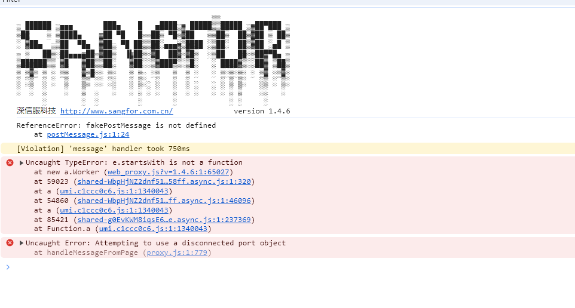
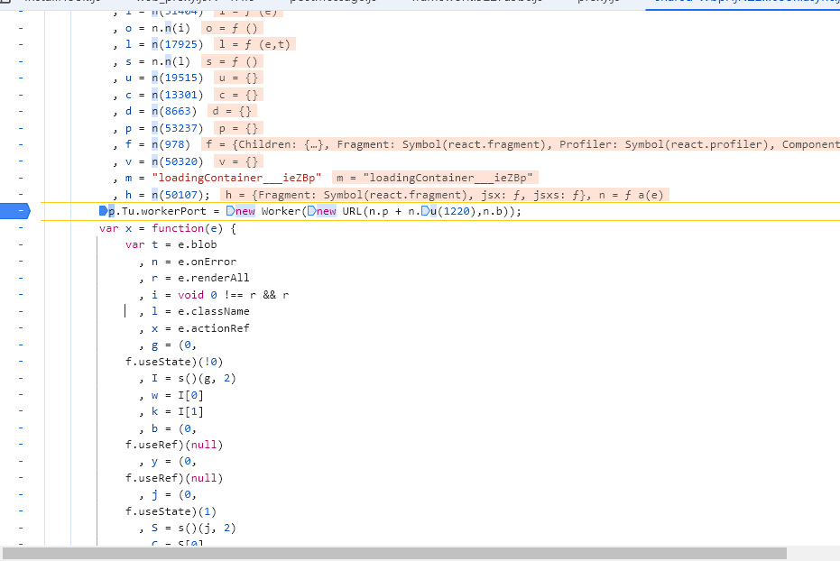
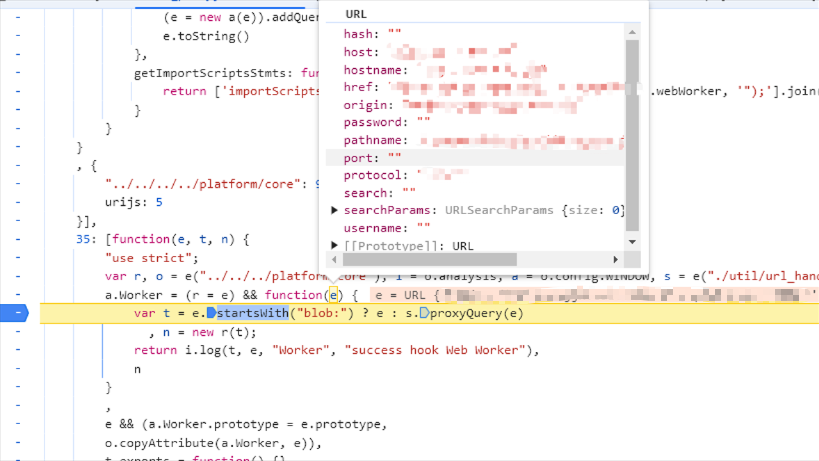

# 疑难杂症

## 锁文件不同步

在初次创建项目的时候未配置 npmrc 文件，生成的 yarn
lock 文件中的注册包地址为 yarnpkg 官方地址,而后续添加后来的包地址为淘宝镜像地址，在 Jenkins 打包的时候网络波动导致无法拉取包，导致打包失败。

如何解决

1. 删除 yarn.lock 文件 重新安装,注意一些包小版本不兼容会导致失败
2. 使用 pnpm 安装,lock 文件不会保存包地址

## umi request 拿到 response

```tsx
const res = await performancestatExportCollegeCoreScoreByGet(
	{
		params: {
			year: query.year!,
		},
	},
	{
		responseType: 'blob',
		getResponse: true,
	}
)
```

## 文件名未转义导致的问题

上传文件时,文件名未进行转义,导致文件名中包含特殊字符时,无法直接使用浏览器访问,直接下载无法使用使用 encodeURIComponent 进行转义即可

```js
const fileName = encodeURIComponent(
	res.headers['content-disposition'].split('filename=')[1]
)
```

## axios 在使用表单数据时会自动将 header 的 content-type 转换为 multipart/form-data

详见

1. <https://github.com/axios/axios#using-applicationx-www-form-urlencoded-format>
2. <https://stackoverflow.com/questions/71412976/axios-converts-x-www-form-urlencoded-to-multipart-form-data>

## 深信服劫持

被深信服劫持的 web worker 常规调用 web
worker 发现线上无法使用,在内网可以使用,排查发现是深信服的劫持

1. 报错 
2. 进行 debugger  
   
3. 实际代码 

**解决办法**

```ts
GlobalWorkerOptions.workerPort = new Worker(
	// fk 深信服 强制兼容
	new URL(
		// 不加后缀处理了webpack
		'pdfjs-dist/build/pdf.worker.min',
		import.meta.url
	).href,
	// fix new URL() 在new URL 添加为href webpack会将模块识别为静态资产, 为new url 则为模块web worker
	// 添加 type module解决
	{
		type: 'module',
	}
)
```

## 日志上报

日志上报,浏览器一些case

1. 首先是因为图片携带了 cookie 导致跨域问题,解决办法是将图片请求的 withCredentials 设置为 false
2. 如果实在需要cookie,发现虽然触发了跨域,但是实质上数据已经上报成功了.因为跨域请求不会阻止请求的发送,只是阻止了响应的读取.所以可以通过服务端日志确认数据是否上报成功. 但是在post请求中,如果浏览器发现跨域请求,会先发送一个options预检请求,如果预检请求失败,则不会发送实际的post请求.所以需要确保预检请求能够成功.
