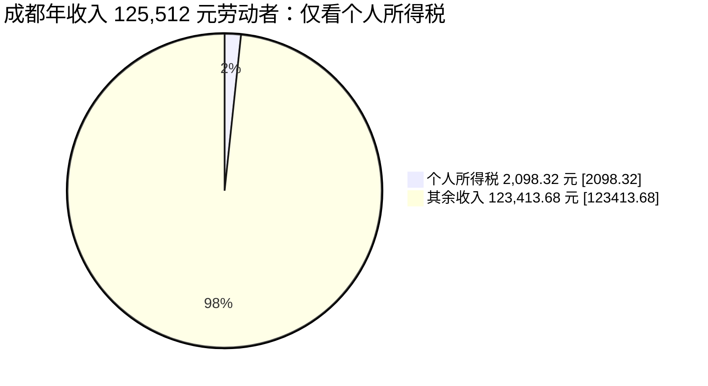
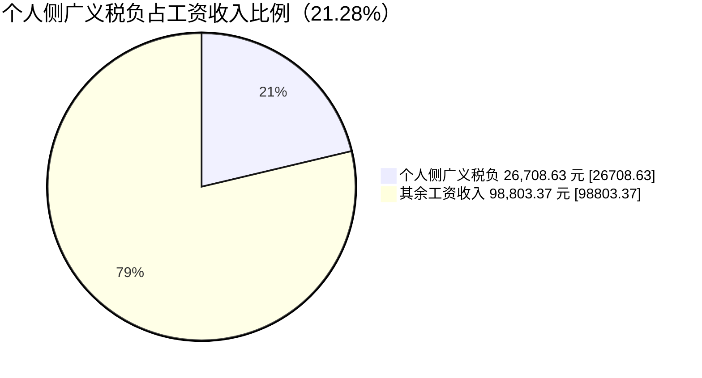
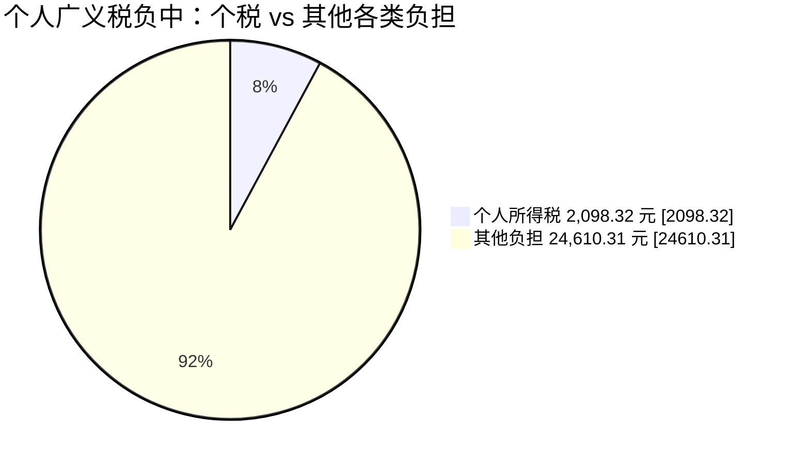
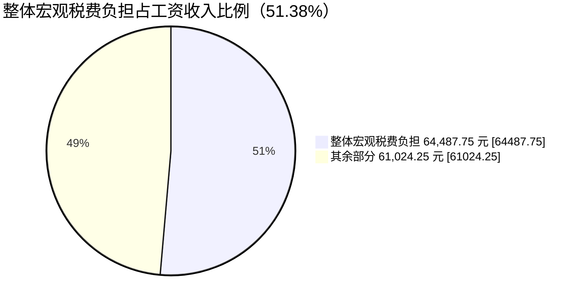
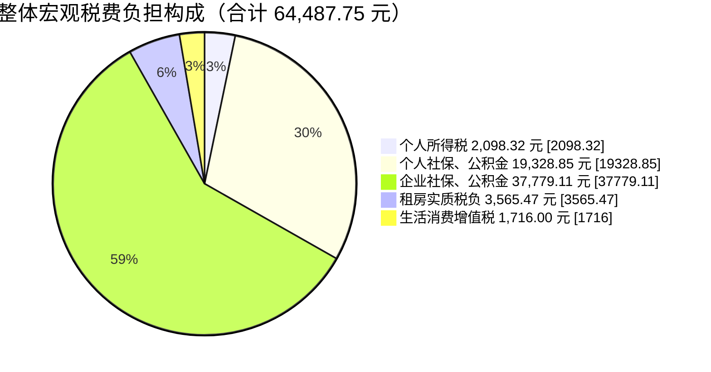
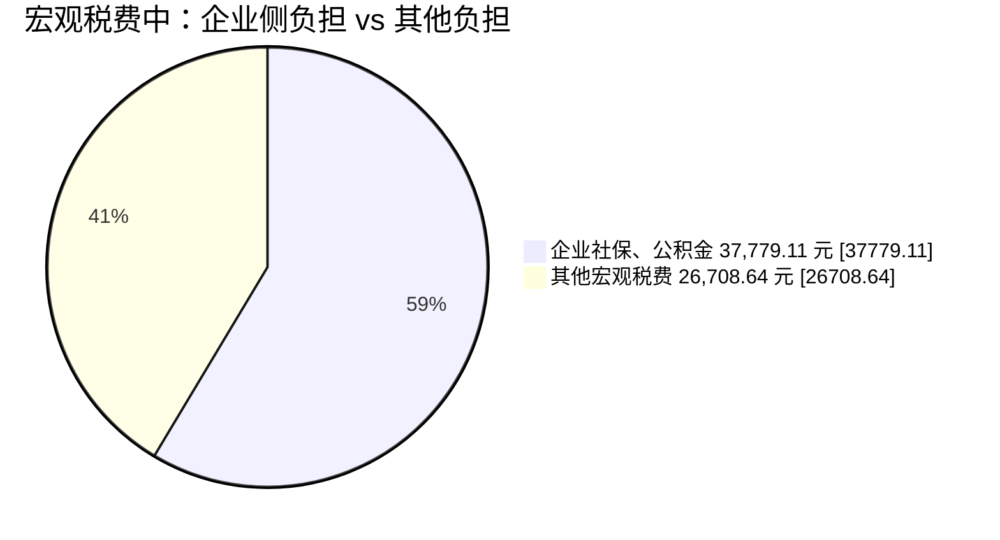

# 成都中产阶级需要承担的税收测算

本文以成都 2024 年非私营单位就业人员平均工资 **125,512 元/年** 为基础进行测算。

参考链接：  
<https://cdstats.chengdu.gov.cn/cdstjj/c154738/2025-07/01/content_05028358ad9c4ec0b28b0d30f5b93e61.shtml>

---

## 一、工资端税费测算

### 1. 基本假设

以 2024 年个人所得税法为基础，全年基本减除费用为：

```text
60,000 元/年
```

社保、公积金缴纳比例按以下口径估算。

参考链接：
[https://www.sc.gov.cn/10462/10464/10797/2025/9/22/078c785f2dcd407ba50e9a37121535fe.shtml?f_link_type=f_linkinlinenote&flow_extra=eyJkb2NfaWQiOiIzMDE5ZjRlODI0MDM4NjNmLTcyMTg1NjRiMDdkMDgzZmUiLCJpbmxpbmVfZGlzcGxheV9wb3NpdGlvbiI6MCwiZG9jX3Bvc2l0aW9uIjowfQ%3D%3D](https://www.sc.gov.cn/10462/10464/10797/2025/9/22/078c785f2dcd407ba50e9a37121535fe.shtml?f_link_type=f_linkinlinenote&flow_extra=eyJkb2NfaWQiOiIzMDE5ZjRlODI0MDM4NjNmLTcyMTg1NjRiMDdkMDgzZmUiLCJpbmxpbmVfZGlzcGxheV9wb3NpdGlvbiI6MCwiZG9jX3Bvc2l0aW9uIjowfQ%3D%3D)

公积金参考链接：
[https://cdzfgjj.chengdu.gov.cn/cdgjj/c1156360/2025-07/30/content_6b795176b53d4bc6a5661330470d14a0.shtml](https://cdzfgjj.chengdu.gov.cn/cdgjj/c1156360/2025-07/30/content_6b795176b53d4bc6a5661330470d14a0.shtml)

---

### 2. 社保及公积金缴纳比例

| 项目         | 单位缴纳比例 | 个人缴纳比例 |
| ------------ | -----------: | -----------: |
| 养老保险     |          16% |           8% |
| 失业保险     |         0.6% |         0.4% |
| 工伤保险     |    0.2%–1.9% |           0% |
| 基本医疗保险 |        6.75% |           2% |
| 生育保险     |         0.8% |           0% |
| 大病互助     |        0.75% |           0% |
| 公积金       |       5%–12% |       5%–12% |

本文以公积金 **5%**、工伤保险 **0.2%** 为例测算。

---

### 3. 个人缴纳金额

| 项目         |       计算过程 |         金额 |
| ------------ | -------------: | -----------: |
| 养老保险     |   125,512 × 8% | 10,040.96 元 |
| 失业保险     | 125,512 × 0.4% |   502.048 元 |
| 工伤保险     |       个人不缴 |         0 元 |
| 基本医疗保险 |   125,512 × 2% |  2,510.24 元 |
| 生育保险     |       个人不缴 |         0 元 |
| 大病互助     |       个人不缴 |         0 元 |
| 公积金       |   125,512 × 5% |  6,275.60 元 |

```text
个人缴纳总计
= 10040.96 + 502.048 + 2510.24 + 6275.60
= 19328.848 元
```

即：

**个人缴纳总计 = 19,328.848 元/年**

---

### 4. 公司缴纳金额

| 项目         |        计算过程 |         金额 |
| ------------ | --------------: | -----------: |
| 养老保险     |   125,512 × 16% | 20,081.92 元 |
| 失业保险     |  125,512 × 0.6% |   753.072 元 |
| 工伤保险     |  125,512 × 0.2% |   251.024 元 |
| 基本医疗保险 | 125,512 × 6.75% |  8,472.06 元 |
| 生育保险     |  125,512 × 0.8% | 1,004.096 元 |
| 大病互助     | 125,512 × 0.75% |    941.34 元 |
| 公积金       |    125,512 × 5% |  6,275.60 元 |

```text
公司缴纳总计
= 20081.92 + 753.072 + 251.024 + 8472.06 + 1004.096 + 941.34 + 6275.60
= 37779.112 元
```

即：

**公司缴纳总计 = 37,779.112 元/年**

---

## 二、个人所得税

### 1. 个人所得税税率表

| 级数 |   全年应纳税所得额 | 税率 | 速算扣除数 |
| ---: | -----------------: | ---: | ---------: |
|    1 |        ≤ 36,000 元 |   3% |          0 |
|    2 |  36,000–144,000 元 |  10% |      2,520 |
|    3 | 144,000–300,000 元 |  20% |     16,920 |
|    4 | 300,000–420,000 元 |  25% |     31,920 |
|    5 | 420,000–660,000 元 |  30% |     52,920 |
|    6 | 660,000–960,000 元 |  35% |     85,920 |
|    7 |      ＞ 960,000 元 |  45% |    181,920 |

---

### 2. 应纳税所得额

```text
应纳税所得额
= 年工资收入 - 基本减除费用 - 个人缴纳总计
= 125512 - 60000 - 19328.848
= 46183.152 元
```

即：

**应纳税所得额 = 46,183.152 元**

该金额适用 **10%** 税率，速算扣除数为 **2,520 元**。

---

### 3. 个人所得税

```text
个人所得税
= 46183.152 × 10% - 2520
= 4618.3152 - 2520
= 2098.3152 元
```

即：

**个人所得税 = 2,098.3152 元/年**

---

## 三、工资端宏观税负

### 1. 个人侧宏观税负

```text
个人侧宏观税负
= 个人所得税 + 个人缴纳总计
= 2098.3152 + 19328.848
= 21427.1632 元
```

即：

**个人侧宏观税负 = 21,427.1632 元/年**

---

### 2. 企业侧宏观税负

```text
企业侧宏观税负
= 公司缴纳社保及公积金总计
= 37779.112 元
```

即：

**企业侧宏观税负 = 37,779.112 元/年**

---

### 3. 工资端合计税负

```text
工资端合计税负
= 个人所得税 + 个人缴纳总计 + 公司缴纳总计
= 2098.3152 + 19328.848 + 37779.112
= 59206.2752 元
```

即：

**工资端合计税负 = 59,206.2752 元/年**

---

### 4. 工资端综合税负率

```text
工资端综合税负率
= 工资端合计税负 ÷ 年工资收入
= 59206.2752 ÷ 125512
≈ 47.17%
```

即：

**工资端综合税负率 ≈ 47.17%**

---

## 四、消费端税负测算

数据来源参考：成都住建局信息公示
[https://zw.cdzjryb.com/rent/#/mian/informationPublic](https://zw.cdzjryb.com/rent/#/mian/informationPublic)

---

### 1. 案例设定

以 **高新区中和街道** 一套接近“标准小户型套一”的房源为例。

标准小户型套一约为：

```text
40–55㎡
```

本文取以下参数：

| 项目                 |           数值 |
| -------------------- | -------------: |
| 面积                 |           40㎡ |
| 租金单价             | 38.38 元/㎡/月 |
| 土地占房价权重       |            45% |
| 土地摊销年限         |          70 年 |
| 个人出租住房综合税率 |             4% |
| 房价单价             |   11,000 元/㎡ |

其中，租金按成都住建局公示信息中 **高新区中和街道 38.38 元/㎡/月** 测算。

---

### 2. 租金基础测算

#### 月租金

```text
月租金
= 40 × 38.38
= 1535.2 元/月
```

即：

**月租金 = 1,535.20 元/月**

---

#### 年租金

```text
年租金
= 1535.2 × 12
= 18422.4 元/年
```

即：

**年租金 = 18,422.40 元/年**

---

### 3. 房价与土地出让金拆分

#### 房屋总价

```text
房屋总价
= 40 × 11000
= 440000 元
```

即：

**房屋总价 = 440,000 元**

---

#### 土地出让金总额

土地占房价权重按 **45%** 计算：

```text
土地出让金总额
= 440000 × 45%
= 198000 元
```

即：

**土地出让金总额 = 198,000 元**

---

#### 建筑物价值

建筑物价值按剔除土地后的 **55%** 计算：

```text
建筑物价值
= 440000 × 55%
= 242000 元
```

即：

**建筑物价值 = 242,000 元**

---

### 4. 土地出让金年化摊销

土地出让金按 **70 年** 摊销：

```text
土地出让金年化摊销
= 198000 ÷ 70
≈ 2828.57 元/年
```

即：

**土地出让金年化摊销成本 ≈ 2,828.57 元/年**

该部分可视为租金中隐含承担的土地成本，也可理解为一种隐性地租税负。

---

### 5. 租售比计算

#### 名义租售比

```text
名义租售比
= 年租金 ÷ 房屋总价
= 18422.4 ÷ 440000
≈ 4.19%
```

即：

**名义租售比 ≈ 4.19%**

---

#### 含土地摊销的真实加权租售比

```text
真实加权租售比
=（年租金 - 土地年摊销）÷ 建筑物价值
=（18422.4 - 2828.57）÷ 242000
= 15593.83 ÷ 242000
≈ 6.44%
```

即：

**真实加权租售比 ≈ 6.44%**

---

### 6. 实质租金税负测算

住房租金不仅承担房产税、个人所得税等显性税负，也承担土地出让金分摊形成的隐性地租税负。

#### 显性税负

个人出租住房综合税率按 **4%** 计算：

```text
显性税负
= 18422.4 × 4%
= 736.896 元/年
≈ 736.90 元/年
```

即：

**显性税负 ≈ 736.90 元/年**

---

#### 隐性税负

隐性税负按土地出让金年化摊销计算：

```text
隐性税负
= 198000 ÷ 70
≈ 2828.57 元/年
```

即：

**隐性税负 ≈ 2,828.57 元/年**

---

#### 年度总实质税负

```text
年度总实质税负
= 736.90 + 2828.57
= 3565.47 元/年
```

即：

**年度总实质税负 ≈ 3,565.47 元/年**

---

#### 实质租金综合税负率

```text
实质租金综合税负率
= 3565.47 ÷ 18422.4
≈ 19.35%
```

即：

**实质租金综合税负率 ≈ 19.35%**

---

## 五、水电及衣食住行成本中的增值税估算

### 1. 基本假设

| 项目     |  估算金额 |
| -------- | --------: |
| 水电     | 100 元/月 |
| 公共交通 | 100 元/月 |
| 餐饮     |  30 元/天 |

---

### 2. 月度生活成本

```text
月度生活成本
= 100 + 100 + 30 × 30
= 1100 元/月
```

即：

**月度生活成本 = 1,100 元/月**

---

### 3. 年度生活成本

```text
年度生活成本
= 1100 × 12
= 13200 元/年
```

即：

**年度生活成本 = 13,200 元/年**

---

### 4. 增值税估算

为方便计算，统一按 **13%** 增值税率估算：

```text
增值税税负
= 13200 × 13%
= 1716 元/年
```

即：

**生活消费增值税税负 = 1,716 元/年**

## 生活成本后的个人可支配测算

若从工资收入中扣除：

- 个人缴纳社保及公积金
- 个人所得税
- 年租金
- 日常生活成本

则剩余金额为：

```
年度剩余可支配金额
= 年工资收入 - 个人缴纳社保及公积金 - 个人所得税 - 年租金 - 日常生活成本
= 125512 - 19328.848 - 2098.3152 - 18422.4 - 13200
= 72462.4368 元
```

即：

**年度剩余可支配金额 ≈ 72,462.44 元**

折合每月：

```
72462.4368 ÷ 12 ≈ 6038.54 元/月
```

即：

**月均剩余可支配金额 ≈ 6,038.54 元/月**

## 总结

### 仅看个人所得税

成都年收入 **125,512 元** 的劳动者，表面上只直接缴纳了约 **2,098 元** 的个人所得税，单看个税负担并不高。




### 个人侧广义税负

但如果把个人承担的社保、公积金、租房中隐含的土地与房产相关税负，以及日常消费中的增值税一并纳入，个人侧实际承担的广义税负约为：26,708.63 元/年

约占工资收入的：21.28%







### 整体宏观税费负

如果进一步从劳动总成本角度看，把公司缴纳的社保、公积金也计入，则整体宏观税费负担约为：64,487.75 元/年.约占工资收入的：51.38%









