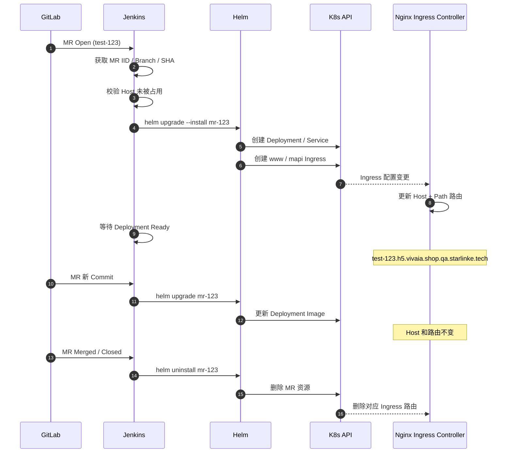
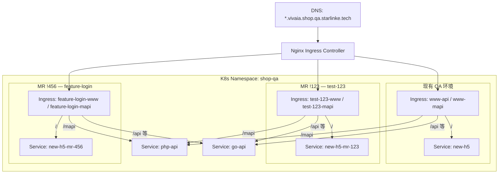

## 流程

加上公共前缀例如h5 更好?

```mermaid
sequenceDiagram
    autonumber
    participant GL as GitLab
    participant J as Jenkins
    participant H as Helm
    participant K as K8s API
    participant IC as Nginx Ingress Controller

    GL->>J: MR Open (test-123)
    J->>J: 获取 MR IID / Branch / SHA
    J->>J: 校验 Host 未被占用
    J->>H: helm upgrade --install mr-123
    H->>K: 创建 Deployment / Service
    H->>K: 创建 www / mapi Ingress
    K-->>IC: Ingress 配置变更
    IC->>IC: 更新 Host + Path 路由
    J->>J: 等待 Deployment Ready

    Note over IC: test-123.h5.vivaia.shop.qa.starlinke.tech

    GL->>J: MR 新 Commit
    J->>H: helm upgrade mr-123
    H->>K: 更新 Deployment Image
    Note over IC: Host 和路由不变

    GL->>J: MR Merged / Closed
    J->>H: helm uninstall mr-123
    H->>K: 删除 MR 资源
    K-->>IC: 删除对应 Ingress 路由
```

## Ingress

```mermaid

flowchart TB
    DNS["DNS: *.vivaia.shop.qa.starlinke.tech"]
    IC["Nginx Ingress Controller"]

    DNS --> IC

    subgraph NS["K8s Namespace: shop-qa"]
        direction TB

        subgraph Existing["现有 QA 环境"]
            I0["Ingress: www-api / www-mapi"]
            N0["Service: new-h5"]
        end

        subgraph MR1["MR !123 — test-123"]
            I1["Ingress: test-123-www / test-123-mapi"]
            N1["Service: new-h5-mr-123"]
        end

        subgraph MR2["MR !456 — feature-login"]
            I2["Ingress: feature-login-www / feature-login-mapi"]
            N2["Service: new-h5-mr-456"]
        end

        PHP["Service: php-api"]
        GO["Service: go-api"]
    end

    IC --> I0
    IC --> I1
    IC --> I2

    I0 -->|"/"| N0
    I1 -->|"/"| N1
    I2 -->|"/"| N2

    I0 -->|"/mapi"| PHP
    I1 -->|"/mapi"| PHP
    I2 -->|"/mapi"| PHP

    I0 -->|"/api 等"| GO
    I1 -->|"/api 等"| GO
    I2 -->|"/api 等"| GO

```
